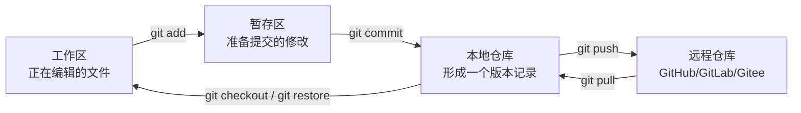

建议文件名：Git版本控制与新用户使用流程.md

# Git 版本控制与新用户使用流程

内容类型：主题知识介绍

## 摘要

本文介绍 Git 的核心概念、基本流程、常用命令、远程协作、分支管理和新手常见错误处理。

## 关键词

Git；版本控制；提交记录；分支管理；GitHub；远程仓库；冲突解决；新手流程

## 大纲

1. [Git 是什么：把文件修改过程保存成可追踪历史](#section-1)
2. [Git 解决什么问题：回退、协作、备份和并行开发](#section-2)
3. [Git 的核心概念：工作区、暂存区、本地仓库和远程仓库](#section-3)
4. [新用户安装与首次配置：让 Git 认识你的身份](#section-4)
5. [单人本地使用流程：从创建仓库到提交版本](#section-5)
6. [远程仓库使用流程：连接 GitHub、GitLab 或 Gitee](#section-6)
7. [分支的基本用法：在不破坏主线的情况下修改项目](#section-7)
8. [冲突解决：多人修改同一位置时如何处理](#section-8)
9. [`.gitignore` 文件：哪些内容不应该交给 Git 管理](#section-9)
10. [新手常用命令表：按场景记忆 Git 命令](#section-10)
11. [新手常见错误与恢复方法：不要害怕提交和回退](#section-11)
12. [7 天入门练习路径：从会用到习惯使用](#section-12)

## 正文

<a id="section-1"></a>

### 1. Git 是什么：把文件修改过程保存成可追踪历史

本节概要：本节说明 Git（分布式版本控制系统，Distributed Version Control System）的基本含义，重点是它如何记录文件变化，而不是简单保存文件副本。

Git 是一个版本控制工具。它的核心作用不是“存文件”，而是记录项目中每一次有意义的修改：谁改了什么、什么时候改的、为什么改、能否回到之前的状态。

可以把 Git 理解为“项目历史记录系统”。普通文件夹只能看到当前文件是什么样子，而 Git 可以看到文件从最初到现在经历了哪些变化。对于代码、论文、数据分析脚本、配置文件、项目文档，Git 都可以用于管理版本。

Git 与普通备份的区别在于：普通备份通常是复制多个文件夹，例如 `项目_最终版`、`项目_最终版2`、`项目_最终版_真的最终版`；Git 则是在同一个项目中保存一条清晰的历史线，每个版本都有说明和编号，可以精确回退。

Git 不是 GitHub。Git 是本地工具；GitHub、GitLab、Gitee 是远程代码托管平台。即使没有 GitHub，也可以在自己电脑上使用 Git；使用 GitHub 时，Git 负责版本控制，GitHub 负责远程存储、协作和展示。

<a id="section-2"></a>

### 2. Git 解决什么问题：回退、协作、备份和并行开发

本节概要：本节说明 Git 的主要使用价值，重点是为什么新用户需要学习 Git，而不是只依赖复制文件夹或网盘同步。

Git 最直接解决的是“改错了怎么办”。当你对代码、论文、脚本或配置文件做了修改，如果后面发现改错了，可以通过 Git 查看差异、回到旧版本，或者只恢复某个文件。

Git 也解决“多人协作混乱”的问题。多人同时修改项目时，如果每个人都通过微信、网盘、邮件互传文件，很容易出现版本混乱、覆盖别人修改、无法判断谁改了什么。Git 通过提交（commit）、分支（branch）、合并（merge）和远程仓库（remote repository）来管理协作过程。

Git 还能让项目修改更安全。你可以在一个新分支上尝试新的分析方法、修改代码或重构项目结构；如果失败，不影响主分支。如果成功，再把分支合并回主线。

Git 的典型使用场景包括：

- 管理代码项目：如 Python、R、Shell、JavaScript 项目。
- 管理科研分析脚本：如 WES、UKB、蛋白组学、机器学习分析流程。
- 管理论文和 Markdown 文档：尤其适合追踪文本变化。
- 管理配置文件：如 `.env.example`、`requirements.txt`、`environment.yml`、`Snakefile`。
- 团队协作开发：通过 GitHub、GitLab、Gitee 等平台共享项目。

不适合用 Git 管理的内容主要包括超大文件、频繁变化的二进制文件、隐私数据、数据库文件、原始测序数据、大型压缩包、模型权重文件等。这类文件通常应放在数据存储系统、对象存储、网盘、服务器路径或 Git LFS（Large File Storage）中，而不是直接提交到普通 Git 仓库。

<a id="section-3"></a>

### 3. Git 的核心概念：工作区、暂存区、本地仓库和远程仓库

本节概要：本节说明 Git 的基本工作模型，重点是理解文件从修改到提交再到上传远程仓库的路径。

Git 新手最容易混乱的地方，是不知道文件到底处在哪个阶段。Git 的基本流程可以理解为四个区域：工作区（working directory）、暂存区（staging area/index）、本地仓库（local repository）和远程仓库（remote repository）。



工作区就是你电脑里的项目文件夹。你打开 VSCode、RStudio、记事本或其他编辑器修改文件时，改动首先发生在工作区。

暂存区是 Git 用来准备提交的区域。你可以从多个修改文件中挑选一部分加入暂存区，这样下一次提交只包含你真正想记录的内容。对应命令是 `git add`。

本地仓库是你电脑上的 Git 版本库。执行 `git commit` 后，暂存区中的修改会形成一个正式版本记录。这个记录有提交编号、提交说明、作者和时间。

远程仓库是 GitHub、GitLab、Gitee 或服务器上的项目副本。执行 `git push` 可以把本地提交上传到远程仓库；执行 `git pull` 可以把远程仓库的新修改拉回本地。

几个核心概念需要先记住：

| 概念 | 英文 | 含义 | 常用命令 |
|---|---|---|---|
| 仓库 | repository / repo | 被 Git 管理的项目文件夹 | `git init`、`git clone` |
| 提交 | commit | 一次正式版本记录 | `git commit -m "说明"` |
| 分支 | branch | 一条独立修改线 | `git branch`、`git switch` |
| 合并 | merge | 把一个分支的修改合并到另一个分支 | `git merge` |
| 远程仓库 | remote repository | GitHub/GitLab/Gitee 上的仓库 | `git remote`、`git push` |
| 冲突 | conflict | 多个修改无法自动合并 | 手动修改后重新提交 |

<a id="section-4"></a>

### 4. 新用户安装与首次配置：让 Git 认识你的身份

本节概要：本节说明新用户开始使用 Git 前需要做的安装和身份配置，重点是 `user.name` 与 `user.email` 的作用。

安装 Git 后，第一件事不是立刻提交项目，而是确认 Git 是否安装成功。打开终端后输入：

```bash
git --version
```

如果能看到版本号，说明 Git 已经可以使用。Windows 用户可以使用 Git Bash、PowerShell、Windows Terminal 或 VSCode 终端。macOS 和 Linux 用户通常可以直接在系统终端中使用。

第一次使用 Git 需要设置用户名和邮箱。它们会写入每一次提交记录，用于标识“谁做了这次修改”。

```bash
git config --global user.name "你的名字"
git config --global user.email "你的邮箱"
```

查看配置是否成功：

```bash
git config --global --list
```

常见配置项如下：

```bash
git config --global init.defaultBranch main
git config --global core.editor "code --wait"
```

其中，`init.defaultBranch main` 表示以后新建仓库时默认主分支叫 `main`。`core.editor "code --wait"` 表示需要 Git 打开编辑器时使用 VSCode。

新手要特别注意：Git 的用户名和邮箱不等于 GitHub 登录账号，但最好与 GitHub、GitLab 或 Gitee 账户邮箱保持一致，这样平台更容易把提交记录关联到你的账户。

<a id="section-5"></a>

### 5. 单人本地使用流程：从创建仓库到提交版本

本节概要：本节说明一个人在本地使用 Git 的最小闭环，重点是 `init`、`status`、`add`、`commit`、`log` 的顺序。

假设你有一个项目文件夹，路径为 `my_project`。进入该文件夹后，可以用 `git init` 把它变成 Git 仓库。

```bash
cd my_project
git init
```

查看当前状态：

```bash
git status
```

如果你新建了一个文件 `README.md`，Git 会提示它是未跟踪文件（untracked file）。这表示 Git 看到了这个文件，但还没有把它纳入版本记录。

把文件加入暂存区：

```bash
git add README.md
```

如果你想把当前目录下所有改动加入暂存区：

```bash
git add .
```

提交版本：

```bash
git commit -m "Add README"
```

查看提交历史：

```bash
git log
```

查看简洁历史：

```bash
git log --oneline
```

查看文件修改差异：

```bash
git diff
```

查看暂存区中的修改差异：

```bash
git diff --staged
```

一个最小本地工作流是：

```bash
git status
git add .
git commit -m "Describe your change"
git log --oneline
```

新手需要养成一个习惯：每次提交只做一件清楚的事。不要把“改模型参数、删除文件、重写 README、修改数据路径、修复报错”全部塞进同一个 commit。好的提交历史应该让自己和别人能看懂每一步做了什么。

提交说明建议使用简短动词开头，例如：

```text
Add data cleaning script
Fix missing value handling
Update README usage section
Refactor model training function
Remove temporary output files
```

中文项目也可以使用中文提交说明，例如：

```bash
git commit -m "添加数据清洗脚本"
git commit -m "修复缺失值处理逻辑"
git commit -m "更新模型训练说明"
```

<a id="section-6"></a>

### 6. 远程仓库使用流程：连接 GitHub、GitLab 或 Gitee

本节概要：本节说明本地仓库如何与远程平台连接，重点是 `clone`、`remote`、`push`、`pull` 的使用顺序。

远程仓库是放在网络平台上的项目副本，常见平台包括 GitHub、GitLab 和 Gitee。新手最常见的两种方式是：从远程克隆一个仓库，或把已有本地仓库推送到远程。

第一种情况：远程仓库已经存在，直接克隆到本地。

```bash
git clone https://github.com/用户名/仓库名.git
cd 仓库名
```

克隆后，本地文件夹已经自动连接远程仓库。你可以查看远程地址：

```bash
git remote -v
```

第二种情况：本地已经有项目，现在想上传到远程。假设你已经在 GitHub、GitLab 或 Gitee 上创建了空仓库，可以在本地执行：

```bash
git remote add origin https://github.com/用户名/仓库名.git
git branch -M main
git push -u origin main
```

之后再提交新修改时，常用流程是：

```bash
git status
git add .
git commit -m "Update analysis script"
git push
```

如果远程仓库有别人提交的新内容，你需要先拉取：

```bash
git pull
```

远程协作的基本原则是：先 `pull` 获取远程最新内容，再修改、提交、`push`。如果你长时间不拉取远程更新，最后推送时更容易出现冲突。

HTTPS 和 SSH 是两种常见连接方式。HTTPS 通常更直观，但可能需要输入账户凭据或使用访问令牌。SSH 配置稍微复杂，但配置好之后日常推送更方便。新手可以先使用 HTTPS，熟悉后再配置 SSH。

<a id="section-7"></a>

### 7. 分支的基本用法：在不破坏主线的情况下修改项目

本节概要：本节说明 Git 分支的作用和基本命令，重点是如何用分支隔离实验性修改。

分支（branch）可以理解为一条独立的修改线。主分支通常叫 `main` 或 `master`，用于保存相对稳定的版本。当你要开发新功能、测试新分析方法、重构代码或尝试不确定修改时，应该新建分支，而不是直接在主分支上乱改。

查看当前分支：

```bash
git branch
```

创建新分支：

```bash
git branch feature-new-analysis
```

切换到新分支：

```bash
git switch feature-new-analysis
```

创建并切换到新分支：

```bash
git switch -c feature-new-analysis
```

在新分支上修改文件并提交：

```bash
git add .
git commit -m "Add new analysis workflow"
```

切回主分支：

```bash
git switch main
```

把新分支合并到主分支：

```bash
git merge feature-new-analysis
```

删除已经合并的分支：

```bash
git branch -d feature-new-analysis
```

分支的价值在于隔离风险。例如你正在做一个机器学习预测项目，可以把稳定代码放在 `main`，把随机森林模型放在 `feature-random-forest`，把 XGBoost 模型放在 `feature-xgboost`，把可视化修改放在 `feature-plotting`。每条分支完成后再合并，这样项目结构更清楚。

一个推荐的分支使用流程是：

```bash
git switch main
git pull
git switch -c feature-task-name
# 修改文件
git status
git add .
git commit -m "Finish task name"
git switch main
git pull
git merge feature-task-name
git push
```

<a id="section-8"></a>

### 8. 冲突解决：多人修改同一位置时如何处理

本节概要：本节说明 Git 冲突产生的原因和处理方法，重点是不要看到 conflict 就删除仓库或重新下载项目。

冲突（conflict）通常发生在合并分支或拉取远程更新时。原因是 Git 无法判断应该保留哪一方修改。例如，你和同学同时修改了同一个文件的同一行，Git 就需要人工决定最终内容。

发生冲突时，Git 会在文件中插入类似标记：

```text
<<<<<<< HEAD
这是你当前分支的内容
=======
这是另一个分支或远程仓库的内容
>>>>>>> other-branch
```

解决冲突的步骤是：

1. 打开冲突文件。
2. 找到 `<<<<<<<`、`=======`、`>>>>>>>` 标记。
3. 判断保留哪部分内容，或手动合并两边内容。
4. 删除冲突标记。
5. 保存文件。
6. 执行 `git add`。
7. 执行 `git commit` 完成合并。

示例命令：

```bash
git status
# 手动编辑冲突文件
git add 冲突文件名
git commit
```

如果你在 `git pull` 后出现冲突，处理完成并提交后，通常可以继续：

```bash
git push
```

新手处理冲突时最重要的原则是：先看 `git status`，再打开冲突文件，不要盲目删除文件夹。Git 的提示通常会告诉你哪些文件处于冲突状态。

<a id="section-9"></a>

### 9. `.gitignore` 文件：哪些内容不应该交给 Git 管理

本节概要：本节说明 `.gitignore` 的作用，重点是避免把临时文件、结果文件、隐私文件和大文件提交到仓库。

`.gitignore` 是 Git 的忽略规则文件。它告诉 Git：哪些文件或文件夹不需要追踪。这个文件通常放在项目根目录。

科研和编程项目中，很多文件不应该提交到 Git 仓库。例如：

- 临时文件：如 `*.tmp`、`*.log`。
- 系统文件：如 `.DS_Store`、`Thumbs.db`。
- Python 缓存：如 `__pycache__/`、`*.pyc`。
- R 临时文件：如 `.Rhistory`、`.RData`。
- 环境目录：如 `.venv/`、`env/`、`node_modules/`。
- 结果输出：如 `results/`、`output/`、`figures/temp/`。
- 隐私配置：如 `.env`、`config_private.yml`。
- 大型数据：如 `*.bam`、`*.fastq.gz`、`*.vcf.gz`、`*.h5`、`*.rds`。

一个适合 Python/R 数据分析项目的 `.gitignore` 示例：

```gitignore
# System files
.DS_Store
Thumbs.db

# Python cache
__pycache__/
*.pyc

# Virtual environments
.venv/
env/

# R files
.Rhistory
.RData
.Rproj.user/

# Logs and temporary files
*.log
*.tmp

# Local configuration
.env
config_private.yml

# Data and large outputs
data/raw/
data/interim/
results/
output/
*.bam
*.fastq.gz
*.vcf.gz
*.rds
```

需要注意：`.gitignore` 只对“尚未被 Git 追踪的文件”立即生效。如果某个文件已经被提交过，后来再加入 `.gitignore`，Git 仍然会继续追踪它。此时需要先从 Git 追踪中移除，但保留本地文件：

```bash
git rm --cached 文件名
git commit -m "Stop tracking ignored file"
```

<a id="section-10"></a>

### 10. 新手常用命令表：按场景记忆 Git 命令

本节概要：本节按实际使用场景整理 Git 常用命令，重点是帮助新用户形成命令记忆框架。

| 场景 | 命令 | 作用 |
|---|---|---|
| 查看 Git 版本 | `git --version` | 确认 Git 是否安装成功 |
| 设置用户名 | `git config --global user.name "Name"` | 设置提交作者名称 |
| 设置邮箱 | `git config --global user.email "email@example.com"` | 设置提交作者邮箱 |
| 初始化仓库 | `git init` | 把当前文件夹变成 Git 仓库 |
| 克隆远程仓库 | `git clone URL` | 下载远程仓库到本地 |
| 查看状态 | `git status` | 查看哪些文件被修改、暂存或未追踪 |
| 加入暂存区 | `git add 文件名` | 准备提交某个文件 |
| 暂存全部修改 | `git add .` | 准备提交当前目录下所有修改 |
| 提交版本 | `git commit -m "说明"` | 创建一次版本记录 |
| 查看历史 | `git log --oneline` | 简洁查看提交历史 |
| 查看修改差异 | `git diff` | 查看工作区修改 |
| 查看已暂存差异 | `git diff --staged` | 查看暂存区修改 |
| 查看分支 | `git branch` | 列出本地分支 |
| 新建并切换分支 | `git switch -c 分支名` | 创建新分支并进入 |
| 切换分支 | `git switch 分支名` | 进入已有分支 |
| 合并分支 | `git merge 分支名` | 把指定分支合并到当前分支 |
| 查看远程地址 | `git remote -v` | 查看本地仓库连接的远程仓库 |
| 添加远程仓库 | `git remote add origin URL` | 绑定远程仓库地址 |
| 推送到远程 | `git push` | 上传本地提交 |
| 首次推送 | `git push -u origin main` | 首次把 main 分支推送到 origin |
| 拉取远程更新 | `git pull` | 下载并合并远程更新 |
| 恢复文件修改 | `git restore 文件名` | 丢弃工作区中某个文件的修改 |
| 取消暂存 | `git restore --staged 文件名` | 把文件从暂存区移回工作区 |
| 删除已追踪文件 | `git rm 文件名` | 删除文件并记录删除操作 |
| 保留本地但取消追踪 | `git rm --cached 文件名` | 不再让 Git 追踪该文件 |

新手不要一开始追求记住所有命令。先熟练掌握以下 8 个命令，就能完成大部分个人项目管理：

```bash
git status
git add .
git commit -m "message"
git log --oneline
git diff
git clone URL
git pull
git push
```

<a id="section-11"></a>

### 11. 新手常见错误与恢复方法：不要害怕提交和回退

本节概要：本节说明新手常见错误的处理方法，重点是通过 `status`、`restore`、`reset` 和 `log` 找回可控状态。

新手最常见的问题不是 Git 本身难，而是不知道当前发生了什么。遇到任何问题，第一步都应该执行：

```bash
git status
```

如果你修改了文件但还没有 `git add`，想撤销某个文件的修改：

```bash
git restore 文件名
```

如果你已经执行了 `git add`，但还没有提交，想取消暂存：

```bash
git restore --staged 文件名
```

如果你提交说明写错了，并且还没有推送到远程，可以修改最近一次提交说明：

```bash
git commit --amend -m "新的提交说明"
```

如果你想查看最近提交历史：

```bash
git log --oneline
```

如果你想查看某次提交具体改了什么：

```bash
git show 提交编号
```

如果你把不该提交的文件提交进去了，可以先把它从 Git 追踪中移除，再提交一次：

```bash
git rm --cached 文件名
git commit -m "Remove wrongly tracked file"
```

对于新手，不建议随便使用以下命令，除非你明确知道后果：

```bash
git reset --hard
git push --force
git clean -fd
```

这些命令可能会丢弃本地修改、重写历史或删除未追踪文件。使用前应先确认当前状态，必要时复制一份项目备份。

常见错误与处理方式：

| 问题 | 可能原因 | 处理方式 |
|---|---|---|
| `nothing to commit` | 没有新修改，或修改未保存 | 保存文件后再 `git status` |
| `untracked files` | 新文件还没被 Git 管理 | `git add 文件名` |
| `changes not staged for commit` | 文件改了但没暂存 | `git add 文件名` |
| `rejected` 或无法 push | 远程有新提交，本地落后 | 先 `git pull`，解决后再 `git push` |
| 出现 conflict | 同一位置被不同版本修改 | 手动编辑冲突文件后 `git add` + `git commit` |
| `.gitignore` 不生效 | 文件之前已经被追踪 | `git rm --cached 文件名` |

<a id="section-12"></a>

### 12. 7 天入门练习路径：从会用到习惯使用

本节概要：本节给出适合新用户的练习路径，重点是通过小项目建立 Git 的真实使用习惯。

Git 学习不适合只看命令表。更有效的方法是用一个小项目反复练习“修改—查看状态—暂存—提交—查看历史—推送”的循环。

第 1 天：安装 Git，完成身份配置。

```bash
git --version
git config --global user.name "你的名字"
git config --global user.email "你的邮箱"
git config --global --list
```

第 2 天：创建一个本地练习项目。

```bash
mkdir git-practice
cd git-practice
git init
echo "# Git Practice" > README.md
git status
git add README.md
git commit -m "Add README"
git log --oneline
```

第 3 天：练习修改、查看差异和再次提交。

```bash
echo "This is my first Git practice project." >> README.md
git diff
git status
git add README.md
git diff --staged
git commit -m "Update README description"
git log --oneline
```

第 4 天：练习分支。

```bash
git switch -c feature-notes
echo "## Notes" >> README.md
git add README.md
git commit -m "Add notes section"
git switch main
git merge feature-notes
git branch -d feature-notes
```

第 5 天：创建远程仓库并推送。先在 GitHub、GitLab 或 Gitee 上创建空仓库，再在本地绑定远程地址。

```bash
git remote add origin 远程仓库URL
git branch -M main
git push -u origin main
```

第 6 天：练习克隆和拉取。

```bash
cd ..
git clone 远程仓库URL
cd 仓库名
git pull
```

第 7 天：练习 `.gitignore` 和错误恢复。

```bash
echo ".env" > .gitignore
echo "SECRET=123456" > .env
git status
git add .gitignore
git commit -m "Add gitignore"
```

完成这 7 天练习后，Git 的最小能力闭环已经建立：你能创建仓库、提交修改、查看历史、使用分支、连接远程、推送项目、拉取更新、忽略不该提交的文件，并能处理常见错误。

实际工作中可以固定使用下面这个日常流程：

```bash
git pull
git status
# 修改文件
git diff
git add .
git commit -m "清楚描述本次修改"
git push
```

对于科研项目，可以把 Git 用在代码和文档上，而不是直接管理大规模原始数据。一个更合理的项目结构示例是：

```text
project/
├── README.md
├── .gitignore
├── environment.yml
├── data/
│   ├── raw/          # 通常不提交
│   └── processed/    # 视情况提交
├── scripts/
│   ├── 01_clean_data.py
│   ├── 02_train_model.py
│   └── 03_plot_results.py
├── results/          # 通常不提交或只提交小型汇总表
└── docs/
    └── analysis_notes.md
```

在这个结构中，推荐提交 `README.md`、`.gitignore`、`environment.yml`、`scripts/` 和 `docs/`；不推荐提交大型原始数据、临时结果、隐私配置和模型中间文件。
