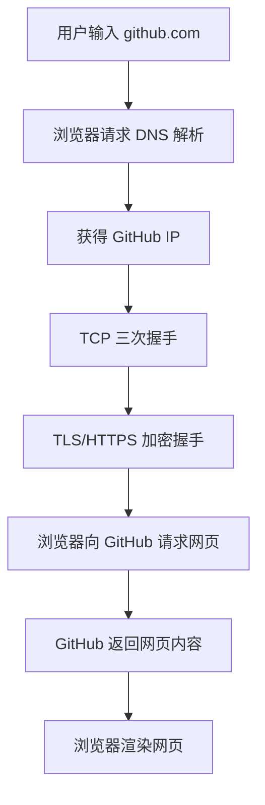
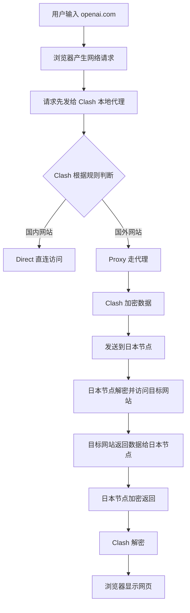

# 打开 Clash 后访问国外网站：网络是如何工作的？

> 场景：你在中国大陆打开 Clash，节点切到日本，然后访问 Google、GitHub、OpenAI 等国外网站。

核心结论：

> Clash 会先接管你的网络请求，然后根据规则判断是否需要代理。需要代理的流量会被加密发送到国外节点，例如日本服务器；国外节点再替你访问目标网站，最后把结果加密传回你的设备。

换句话说：

> 你不是直接访问国外网站，而是让一个位于国外的服务器“帮你访问”。

---

## 目录

- [一、不开 Clash 时，正常上网发生了什么](#一不开-clash-时正常上网发生了什么)
- [二、中国大陆访问部分国外网站为什么容易失败](#二中国大陆访问部分国外网站为什么容易失败)
- [三、打开 Clash 后，网络流程发生了什么变化](#三打开-clash-后网络流程发生了什么变化)
- [四、Clash 是怎么接管流量的](#四clash-是怎么接管流量的)
- [五、Clash 如何判断哪些网站走代理](#五clash-如何判断哪些网站走代理)
- [六、代理节点到底是什么](#六代理节点到底是什么)
- [七、运营商能看到什么，看不到什么](#七运营商能看到什么看不到什么)
- [八、Rule / Global / Direct 三种模式区别](#八rule--global--direct-三种模式区别)
- [九、为什么浏览器能上，但 VSCode / Git / 终端不一定能上](#九为什么浏览器能上但-vscode--git--终端不一定能上)
- [十、完整流程图](#十完整流程图)
- [十一、常见概念解释](#十一常见概念解释)
- [十二、和 VSCode / Codex 插件连接问题的关系](#十二和-vscode--codex-插件连接问题的关系)
- [十三、一句话总结](#十三一句话总结)

---

# 一、不开 Clash 时，正常上网发生了什么

例如你访问：

```text
https://github.com
```

浏览器一般会经历以下步骤。

---

## 1. DNS 解析：查询网站 IP 地址

浏览器先问 DNS 服务器：

```text
github.com 的 IP 地址是多少？
```

DNS 服务器返回类似：

```text
140.82.xxx.xxx
```

你可以把 DNS 理解为“查号台”。

- 域名：github.com
- IP 地址：140.82.xxx.xxx
- DNS：帮你把域名翻译成 IP 地址

类比：

> 你不知道 GitHub 大楼的门牌号，于是先问查号台，查号台告诉你 GitHub 在哪里。

---

## 2. TCP 三次握手：确认双方能通信

电脑拿到 IP 后，会和 GitHub 服务器建立连接。

大致过程是：

```text
你 → GitHub：SYN，你在吗？
GitHub → 你：SYN + ACK，我在，你也在吗？
你 → GitHub：ACK，我也在，开始通信。
```

这就是 TCP 三次握手。

作用：

> 确认你和服务器之间的网络是通的，双方都能发送和接收数据。

---

## 3. TLS 握手：建立 HTTPS 加密连接

如果你访问的是：

```text
https://github.com
```

那么浏览器还会和服务器建立 HTTPS 加密连接。

这个过程叫 TLS 握手。

它的目的：

> 让后续传输的网页内容、账号密码、Cookie 等数据被加密保护。

普通运营商通常看不到 HTTPS 里面的具体内容，但可能能看到：

- 你连接了哪个 IP
- 连接时间
- 流量大小
- 部分域名相关信息，取决于具体协议和配置

---

## 4. 正式请求网页内容

连接建立后，浏览器发送请求：

```http
GET /
Host: github.com
```

GitHub 服务器返回网页内容，浏览器把网页显示出来。

---

# 二、中国大陆访问部分国外网站为什么容易失败

在中国大陆访问一些国外网站时，可能遇到：

- DNS 污染
- IP 封锁
- SNI 检测
- TCP Reset
- 连接超时
- 国际出口拥堵或限速

因此你直接访问某些网站时，可能出现：

- 打不开
- 加载很慢
- 连接被重置
- TLS 握手失败
- 页面部分资源加载失败

这就是很多人使用 Clash、代理、VPN 或其他网络工具的原因。

---

# 三、打开 Clash 后，网络流程发生了什么变化

打开 Clash 后，网络流程会变成：

```text
浏览器 / VSCode / 终端
        ↓
Clash 本地代理
        ↓
国外节点，例如日本节点
        ↓
目标网站，例如 GitHub / OpenAI / Google
        ↓
国外节点
        ↓
Clash 本地代理
        ↓
浏览器 / VSCode / 终端
```

关键点：

> 你的设备不再直接访问 GitHub / OpenAI，而是先把请求交给 Clash；Clash 再把请求转发给国外节点，由国外节点替你访问目标网站。

---

# 四、Clash 是怎么接管流量的

Clash 通常会在你的本机开启一个本地代理端口，例如：

```text
127.0.0.1:7890
```

或者：

```text
127.0.0.1:7897
```

这里的含义是：

| 内容 | 含义 |
|---|---|
| 127.0.0.1 | 本机地址，也就是你自己的电脑 |
| 7890 / 7897 | Clash 在本机监听的代理端口 |

也就是说，浏览器不是直接把请求发到国外网站，而是先发给：

```text
127.0.0.1:7890
```

也就是你电脑上的 Clash。

---

## 简单类比

不开 Clash：

```text
你 → 直接去 GitHub
```

打开 Clash：

```text
你 → 先找 Clash → Clash 找日本节点 → 日本节点去 GitHub
```

Clash 像一个本地“交通调度员”。

它负责决定：

- 这个网站要不要走代理？
- 用哪个节点？
- 走直连还是走代理？
- DNS 怎么解析？
- 流量如何加密转发？

---

# 五、Clash 如何判断哪些网站走代理

Clash 不是所有网站都一定走代理，它通常根据规则判断。

这些规则叫：

```text
Rule
```

例如配置文件里可能有：

```yaml
DOMAIN-SUFFIX,openai.com,Proxy
DOMAIN-SUFFIX,google.com,Proxy
DOMAIN-SUFFIX,github.com,Proxy
GEOIP,CN,DIRECT
MATCH,Proxy
```

大致含义：

| 规则 | 含义 |
|---|---|
| openai.com → Proxy | 访问 OpenAI 走代理 |
| google.com → Proxy | 访问 Google 走代理 |
| github.com → Proxy | 访问 GitHub 走代理 |
| GEOIP,CN,DIRECT | 中国大陆 IP 直连 |
| MATCH,Proxy | 其他未匹配流量默认走代理 |

所以常见情况是：

| 网站 | 走法 |
|---|---|
| 百度 | 直连 |
| B 站 | 直连 |
| 淘宝 | 直连 |
| Google | 代理 |
| OpenAI | 代理 |
| GitHub | 代理或部分代理，取决于规则 |

---

# 六、代理节点到底是什么

所谓“日本节点”“美国节点”“香港节点”，本质上是一台位于对应地区的服务器。

例如你选择了日本节点，那么流程是：

```text
你的电脑
   ↓ 加密连接
日本服务器
   ↓ 普通访问
GitHub / Google / OpenAI
```

目标网站看到的访问者通常是：

```text
日本服务器的 IP
```

而不是你本地网络的真实出口 IP。

所以你访问 OpenAI 时，OpenAI 可能认为：

> 这个用户来自日本。

---

# 七、运营商能看到什么，看不到什么

使用 Clash 代理后，你的设备和国外节点之间通常会建立加密连接。

常见代理协议包括：

- Shadowsocks
- VMess
- VLESS
- Trojan
- Hysteria2
- TUIC

在这种情况下，运营商通常能看到：

- 你正在连接某个服务器 IP
- 连接持续时间
- 流量大小
- 数据包特征

但通常看不到加密隧道里面的具体内容，例如：

- 你具体访问的是哪个网页路径
- 页面内容
- 登录密码
- 聊天内容
- 请求正文

可以类比为：

> 运营商看到你寄了一个保险箱给日本服务器，但不知道保险箱里面装了什么。

不过需要注意：

> 加密不等于完全匿名。节点服务商、目标网站、浏览器指纹、账号登录状态等仍可能暴露身份线索。

---

# 八、Rule / Global / Direct 三种模式区别

Clash 常见有三种模式。

---

## 1. Rule 模式

这是最常用的模式。

特点：

> 根据规则自动分流。

例如：

- 国内网站直连
- 国外网站代理
- 特殊网站按规则处理

优点：

- 速度较快
- 国内网站不绕路
- 国外网站可代理
- 比较适合日常使用

---

## 2. Global 模式

Global 的意思是全局代理。

特点：

> 所有流量都走代理。

例如：

- 百度走日本节点
- B 站走日本节点
- 淘宝走日本节点
- Google 也走日本节点

优点：

- 简单粗暴
- 排查问题时方便

缺点：

- 国内网站可能变慢
- 某些国内服务可能异常
- 浪费代理流量

---

## 3. Direct 模式

Direct 的意思是全部直连。

特点：

> 不使用代理。

效果基本等于：

```text
关闭 Clash 代理功能
```

---

# 九、为什么浏览器能上，但 VSCode / Git / 终端不一定能上

这是你经常遇到 VSCode / Codex 插件连接问题的核心。

原因是：

> 不同软件读取代理的方式不一样。

浏览器可能会自动读取系统代理，所以浏览器能访问国外网站。

但是下面这些工具不一定自动读取系统代理：

- VSCode 插件
- Git
- npm
- Python requests
- pip
- curl
- WSL
- Docker
- Conda
- 某些 Electron 应用

因此会出现：

| 情况 | 原因 |
|---|---|
| 浏览器能上，VSCode 插件不能上 | VSCode 插件没有正确读取代理 |
| 浏览器能上，Git 不能 clone | Git 没有配置代理 |
| Windows 能上，WSL 不能上 | WSL 没有设置代理，或不能访问 Windows 本机代理端口 |
| 终端能上，插件不能上 | 插件网络栈不走终端环境变量 |
| 插件能上，终端不能上 | 终端没有设置 `http_proxy` / `https_proxy` |

---

## 常见终端代理环境变量

例如 Clash 的 HTTP 代理端口是：

```text
127.0.0.1:7890
```

那么在 Linux / macOS / WSL 里常见写法是：

```bash
export http_proxy=http://127.0.0.1:7890
export https_proxy=http://127.0.0.1:7890
export all_proxy=socks5://127.0.0.1:7890
```

在 Windows PowerShell 里常见写法是：

```powershell
$env:HTTP_PROXY="http://127.0.0.1:7890"
$env:HTTPS_PROXY="http://127.0.0.1:7890"
```

Git 也可以单独配置代理：

```bash
git config --global http.proxy http://127.0.0.1:7890
git config --global https.proxy http://127.0.0.1:7890
```

取消 Git 代理：

```bash
git config --global --unset http.proxy
git config --global --unset https.proxy
```

---

# 十、完整流程图

## 1. 不开 Clash 的直接访问流程



---

## 2. 打开 Clash 后的代理访问流程



---

## 3. 用一句话表示完整路径

```text
浏览器
  ↓
Clash 本地代理 127.0.0.1:7890
  ↓
加密隧道
  ↓
日本节点
  ↓
GitHub / OpenAI / Google
  ↓
日本节点
  ↓
Clash
  ↓
浏览器
```

---

# 十一、常见概念解释

| 概念        | 本质解释                   |
| --------- | ---------------------- |
| Clash     | 本地流量调度器 / 代理客户端        |
| 节点        | 位于国外或其他地区的服务器          |
| 代理        | 让其他服务器替你访问目标网站         |
| VPN       | 一种全局隧道式加密联网方式，和代理不完全一样 |
| DNS       | 把域名翻译成 IP 地址的系统        |
| TCP       | 负责建立可靠连接的网络协议          |
| 三次握手      | TCP 建立连接前的确认过程         |
| TLS       | HTTPS 背后的加密协议          |
| HTTPS     | 加密版 HTTP               |
| Rule      | Clash 的分流规则            |
| Global    | 所有流量都走代理               |
| Direct    | 所有流量都直连                |
| 127.0.0.1 | 本机地址，表示你自己的电脑          |
| 7890      | Clash 常见本地代理端口         |
| SNI       | TLS 握手中可能携带目标域名的信息     |
| DNS 污染    | DNS 返回错误 IP，导致访问失败     |
| TCP Reset | 连接被强制重置                |

---

# 十二、和 VSCode / Codex 插件连接问题的关系

你之前遇到的情况可以总结为：

> Clash 打开了，不代表所有软件都一定走 Clash。

尤其是 VSCode、Codex 插件、Git、WSL、npm、pip 等工具，它们可能有自己的网络设置。

所以排查时，要看三个层面：

---

## 1. Clash 本身是否可用

检查：

- 节点是否可用
- 是否能访问 Google / GitHub / OpenAI
- Clash 日志里有没有连接记录
- 代理端口是多少，例如 7890 或 7897

---

## 2. 系统代理是否打开

检查：

- Windows 系统代理是否被 Clash 设置
- 浏览器是否走系统代理
- Clash 是否开启 System Proxy

---

## 3. 具体软件是否读取代理

例如：

- VSCode 是否设置了 `http.proxy`
- Git 是否配置了代理
- WSL 是否能访问 Windows 的 Clash 端口
- 终端是否设置了环境变量
- 插件是否支持系统代理

这也是为什么有时会出现：

```text
Chrome 能访问 OpenAI，但 VSCode 插件一直 reconnecting
```

因为 Chrome 和 VSCode 插件不一定走同一套代理逻辑。

---

# 十三、一句话总结

打开 Clash 后访问国外网站，本质流程是：

> 你的请求先进入 Clash，Clash 根据规则判断是否代理；如果需要代理，就把请求加密发给国外节点，由国外节点替你访问目标网站，再把结果加密传回你的设备。

最核心的三个关键词是：

```text
本地接管 → 加密转发 → 境外出口
```

也就是：

```text
Clash 接管你的流量
Clash 加密发送到日本节点
日本节点替你访问国外网站
结果再返回给你
```

---

# 附：极简记忆版

```text
不开 Clash：
你 → 国外网站

开 Clash：
你 → Clash → 日本节点 → 国外网站
```

```text
Clash = 本地交通调度员
节点 = 国外代办员
规则 = 判断走哪条路
代理 = 让别人替你访问
加密 = 把内容装进保险箱
```

---
