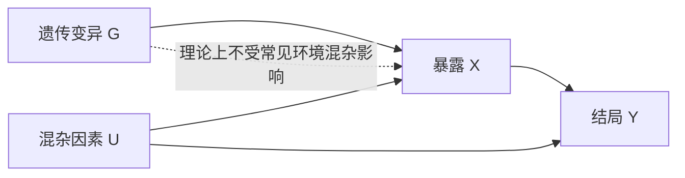
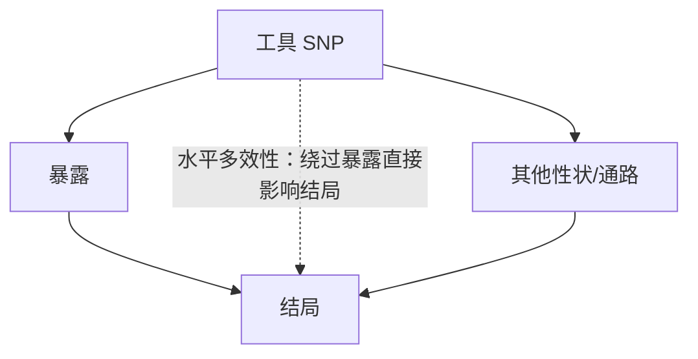
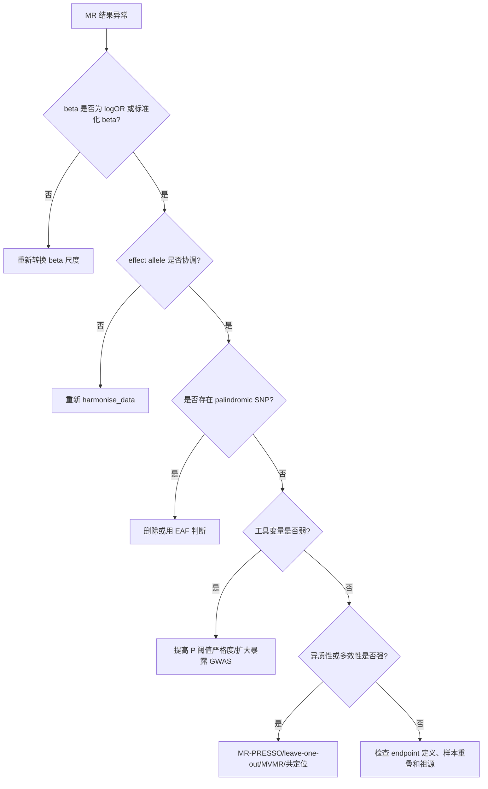

建议文件名：MR分析全流程与FinnGen模拟数据实战.md

# MR 分析全流程与 FinnGen 模拟数据实战

内容类型：主题知识介绍

## 摘要

本文介绍孟德尔随机化（MR）的核心假设、数据准备、FinnGen 摘要统计数据转换、工具变量筛选、协调、主分析、敏感性分析与结果报告，并用模拟数据演示完整流程。

## 关键词

孟德尔随机化（Mendelian Randomization, MR）；工具变量（Instrumental Variable, IV）；FinnGen；GWAS 摘要统计；TwoSampleMR；敏感性分析；水平多效性（Horizontal pleiotropy）

## 大纲

1. [MR 的核心思想：用遗传变异模拟自然随机试验](#section-1)
2. [MR 的三大假设：相关性、独立性、排除限制](#section-2)
3. [研究问题设计：从临床问题转成 MR 问题](#section-3)
4. [FinnGen 在 MR 中的常见角色](#section-4)
5. [FinnGen 摘要统计数据格式与字段转换](#section-5)
6. [模拟研究场景：遗传预测的 OSA 与 OA 风险](#section-6)
7. [工具变量筛选：显著性、LD clumping 与弱工具检查](#section-7)
8. [暴露数据与 FinnGen 结局数据的等位基因协调](#section-8)
9. [主分析方法：Wald ratio、IVW 与稳健 MR](#section-9)
10. [敏感性分析：异质性、多效性、离群 SNP 与方向性](#section-10)
11. [R 代码模板：从模拟数据到 MR 结果](#section-11)
12. [模拟结果解释：如何读 beta、OR、P 值与敏感性结果](#section-12)
13. [扩展分析：反向 MR、多变量 MR、共定位与多重检验](#section-13)
14. [论文写作与结果报告清单](#section-14)
15. [常见错误与排查路径](#section-15)
16. [参考资料](#section-16)

## 正文

<a id="section-1"></a>

### 1. MR 的核心思想：用遗传变异模拟自然随机试验

本节概要：本节说明孟德尔随机化（Mendelian Randomization, MR）的基本逻辑，重点是为什么遗传变异可以作为暴露的工具变量。

MR 是一种因果推断方法。它不是直接比较“有暴露的人”和“无暴露的人”，而是寻找与暴露显著相关的遗传变异，通常是单核苷酸多态性（Single Nucleotide Polymorphism, SNP），把这些 SNP 作为工具变量（Instrumental Variable, IV），再观察这些 SNP 是否也与结局相关。

它的基本因果链条是：



在传统观察性研究中，暴露 X 与结局 Y 的关联可能受到年龄、BMI、吸烟、社会经济状态、基础疾病等混杂因素影响。MR 的优势是：遗传变异在受精时大体随机分配，通常发生在疾病发生之前，因此在一定条件下可以减少反向因果（reverse causation）和未测量混杂（unmeasured confounding）的影响。

MR 不能简单理解为“证明因果”。更准确的表达是：在工具变量假设成立、数据质量可靠、敏感性分析支持的情况下，MR 可以为“暴露是否可能对结局存在因果效应”提供遗传流行病学证据。

<a id="section-2"></a>

### 2. MR 的三大假设：相关性、独立性、排除限制

本节概要：本节说明 MR 成立所依赖的三个核心假设，重点是每个假设在实际分析中如何被检查和削弱风险。

MR 的三大假设如下。

| 假设 | 英文 | 含义 | 常见检查方式 | 违反后的后果 |
|---|---|---|---|---|
| 相关性假设 | Relevance | SNP 必须与暴露显著相关 | GWAS 显著性；F 统计量；解释方差 R² | 弱工具偏倚，估计不稳定 |
| 独立性假设 | Independence | SNP 与暴露-结局关系中的混杂因素无关 | 查 PhenoScanner/GWAS Catalog；限制同一祖源；主成分校正 | 遗传变异通过混杂因素影响结局 |
| 排除限制假设 | Exclusion restriction | SNP 只能通过暴露影响结局，不能通过其他路径直接影响结局 | MR-Egger 截距；MR-PRESSO；异质性；共定位；多变量 MR | 水平多效性导致假阳性因果结论 |

三大假设中，最难被完全证明的是排除限制假设。一个 SNP 可能影响多个生物通路，这称为多效性（pleiotropy）。如果 SNP 影响结局的路径完全经过暴露，属于垂直多效性（vertical pleiotropy），通常不破坏 MR；如果 SNP 通过暴露之外的路径影响结局，属于水平多效性（horizontal pleiotropy），会威胁因果解释。



实际研究中，不要只报告一个 IVW 结果。更严谨的 MR 需要同时报告工具强度、异质性、多效性、leave-one-out、反向 MR 或方向性检验，并解释不同方法是否支持同一方向。

<a id="section-3"></a>

### 3. 研究问题设计：从临床问题转成 MR 问题

本节概要：本节说明如何把临床或流行病学问题转换为可执行的 MR 设计，重点是暴露、结局、数据来源和人群祖源的一致性。

MR 分析开始前，先把问题写成一个明确的因果问题，而不是直接下载数据。以你的 OSA-OA 方向为例，问题可以写成：

> 遗传预测的阻塞性睡眠呼吸暂停（Obstructive Sleep Apnea, OSA）风险是否会增加骨关节炎（Osteoarthritis, OA）的发生风险？

这个问题需要拆成四个要素。

| 要素 | 示例写法 | 说明 |
|---|---|---|
| 暴露 | OSA genetic liability | 通常来自外部 OSA GWAS，SNP 与 OSA 显著相关 |
| 结局 | OA diagnosis in FinnGen | 可使用 FinnGen 中 OA 相关 endpoint 的 GWAS 摘要统计 |
| 人群 | European ancestry | 暴露 GWAS 与 FinnGen 结局 GWAS 的祖源应尽量一致 |
| MR 类型 | Two-sample MR | 暴露和结局来自两个 GWAS 摘要统计数据集 |

如果暴露是二分类疾病，例如 OSA、糖尿病、白血病、OA，暴露 GWAS 的 beta 通常是每个等位基因对疾病 log(OR) 的影响。此时 MR 估计值不是“临床确诊 OSA vs 无 OSA”的风险比，而是“遗传预测的 OSA liability 增加”对结局风险的影响。这个尺度在论文中必须说明，否则容易被误解。

<a id="section-4"></a>

### 4. FinnGen 在 MR 中的常见角色

本节概要：本节说明 FinnGen 数据在 MR 中通常如何使用，重点是 FinnGen 更常作为结局 GWAS 摘要统计来源，而不是个体级数据来源。

FinnGen 是一个整合芬兰生物样本库、基因型数据和纵向健康登记数据的大型研究项目。公开层面最常用于 MR 的不是个体级数据，而是 GWAS summary statistics，即每个 SNP 与某个疾病 endpoint 的关联统计量。

在 MR 中，FinnGen 常见用法有三种。

| 用法 | 具体做法 | 适用场景 |
|---|---|---|
| FinnGen 作为结局 | 暴露 SNP 来自外部 GWAS；在 FinnGen 中提取这些 SNP 对结局的 beta/se | 最常见，例如 OSA → OA、BMI → OA、CRP → 白血病 |
| FinnGen 作为暴露 | 从 FinnGen 某疾病 GWAS 中筛选工具变量；在其他结局 GWAS 中提取对应 SNP | 例如遗传预测的某疾病风险 → 其他疾病 |
| FinnGen 用于验证 | 主分析用 UKB 或 consortia，FinnGen 做独立结局验证 | 提高结果稳健性 |

截至 2026 年 6 月 7 日，FinnGen 官方 access results 页面显示，DF13 结果于 2026 年 6 月 2 日公开，页面列出总样本量 500,186、分析变异数 21,311,644、疾病 endpoints 2,755。正式写论文时，不要只写“FinnGen 数据库”，而应写清楚具体 data freeze/release、endpoint 名称、病例数、对照数、祖源、模型和下载日期。

需要注意，FinnGen 的内部 Data Freeze、Data Release 和公开网页命名在不同页面中可能出现 DF/R 编号差异。论文或报告应以实际下载文件、release metadata 和 endpoint 页面为准。

<a id="section-5"></a>

### 5. FinnGen 摘要统计数据格式与字段转换

本节概要：本节说明 FinnGen GWAS summary statistics 的关键字段，重点是如何转换成 TwoSampleMR 可识别的 exposure/outcome 格式。

FinnGen 官方文档说明，GWAS summary statistics 是压缩的制表符分隔文件，常见字段包括 `#chrom`、`pos`、`ref`、`alt`、`rsids`、`nearest_genes`、`pval`、`mlogp`、`beta`、`sebeta`、`af_alt`、`af_alt_cases`、`af_alt_controls`。其中 `beta` 是 alternate allele 的效应值，`sebeta` 是效应标准误，`af_alt` 是 alternate allele frequency。

对 MR 来说，最关键的是把 FinnGen 字段转换为标准 MR 字段。

| FinnGen 字段 | 含义 | TwoSampleMR 中对应字段 | 备注 |
|---|---|---|---|
| `rsids` | rsID | `SNP` | 若缺失或一位点多 rsID，需要额外处理 |
| `alt` | alternate allele | `effect_allele.outcome` | FinnGen beta 对应 alt allele |
| `ref` | reference allele | `other_allele.outcome` | 与 alt 共同用于等位基因协调 |
| `beta` | alt allele effect size | `beta.outcome` | 二分类结局通常是 log(OR) |
| `sebeta` | standard error | `se.outcome` | MR 权重计算需要 |
| `pval` | association P value | `pval.outcome` | 用于记录 SNP-结局关联，不用于选择工具变量 |
| `af_alt` | alt allele frequency | `eaf.outcome` | 可辅助处理 palindromic SNP |

最容易犯的错误是把 FinnGen 的 `alt` 当作 minor allele。FinnGen 官方页面明确提示，allele frequency 字段提供的是人类参考基因组 alternate allele 的频率，不是 minor allele frequency；效应值和等位基因频率均按 alternate allele 报告。因此，在协调时应把 `alt` 作为 outcome effect allele，而不是自行改成频率较小的等位基因。

<a id="section-6"></a>

### 6. 模拟研究场景：遗传预测的 OSA 与 OA 风险

本节概要：本节构建一个 FinnGen 风格的模拟 MR 场景，重点是说明数据长什么样、字段如何对应、结果如何解释。

下面的例子只用于教学。数据不是 FinnGen 真实结果，不代表 OSA 与 OA 的真实因果关系。我们设定：

- 暴露：阻塞性睡眠呼吸暂停（Obstructive Sleep Apnea, OSA）的遗传易感性。
- 结局：骨关节炎（Osteoarthritis, OA）的 FinnGen 风格 GWAS endpoint。
- 分析类型：two-sample MR。
- 目标：判断遗传预测的 OSA 风险升高是否与 OA 风险升高存在因果方向一致的证据。

模拟暴露数据如下。这里的 `beta_exposure` 表示某 SNP 的 effect allele 对 OSA log(OR) 的影响。

| SNP | effect_allele | other_allele | beta_exposure | se_exposure | eaf_exposure | pval_exposure |
|---|---|---:|---:|---:|---:|---:|
| rs1001 | T | C | 0.12 | 0.018 | 0.31 | 2.6e-11 |
| rs1002 | A | G | 0.10 | 0.017 | 0.42 | 4.1e-09 |
| rs1003 | G | A | 0.15 | 0.020 | 0.27 | 6.2e-14 |
| rs1004 | C | T | 0.09 | 0.016 | 0.36 | 1.9e-08 |
| rs1005 | A | C | 0.08 | 0.015 | 0.22 | 9.5e-08 |
| rs1006 | G | T | 0.13 | 0.019 | 0.48 | 8.0e-12 |
| rs1007 | T | G | 0.11 | 0.017 | 0.33 | 1.0e-10 |
| rs1008 | C | A | 0.14 | 0.020 | 0.29 | 2.6e-12 |

模拟 FinnGen 原始结局数据如下。这里故意使用 FinnGen 风格字段名，`beta` 和 `sebeta` 是 SNP 对 OA 的效应和标准误，且方向对应 `alt` 等位基因。

| #chrom | pos | ref | alt | rsids | nearest_genes | pval | beta | sebeta | af_alt | af_alt_cases | af_alt_controls |
|---:|---:|---|---|---|---|---:|---:|---:|---:|---:|---:|
| 1 | 101001 | C | T | rs1001 | GENE1 | 0.0046 | 0.034 | 0.012 | 0.31 | 0.33 | 0.31 |
| 2 | 202002 | G | A | rs1002 | GENE2 | 0.0064 | 0.030 | 0.011 | 0.42 | 0.44 | 0.42 |
| 3 | 303003 | A | G | rs1003 | GENE3 | 0.0044 | 0.037 | 0.013 | 0.27 | 0.29 | 0.27 |
| 4 | 404004 | T | C | rs1004 | GENE4 | 0.1336 | 0.015 | 0.010 | 0.36 | 0.37 | 0.36 |
| 5 | 505005 | C | A | rs1005 | GENE5 | 0.1015 | 0.018 | 0.011 | 0.22 | 0.23 | 0.22 |
| 6 | 606006 | T | G | rs1006 | GENE6 | 0.0006 | 0.041 | 0.012 | 0.48 | 0.51 | 0.48 |
| 7 | 707007 | G | T | rs1007 | GENE7 | 0.0690 | 0.020 | 0.011 | 0.33 | 0.34 | 0.33 |
| 8 | 808008 | A | C | rs1008 | GENE8 | 0.0004 | 0.050 | 0.014 | 0.29 | 0.32 | 0.29 |

这个模拟数据满足一个基本教学场景：暴露端 SNP 均与 OSA 显著相关；结局端从 FinnGen 风格 OA 数据中提取相同 SNP；等位基因方向一致；可直接进入 harmonization 和 MR 主分析。

<a id="section-7"></a>

### 7. 工具变量筛选：显著性、LD clumping 与弱工具检查

本节概要：本节说明工具变量筛选的标准流程，重点是工具变量必须从暴露 GWAS 中筛选，而不是从结局 GWAS 中筛选。

工具变量筛选通常在暴露 GWAS 中完成。以 OSA 为暴露时，应从 OSA GWAS 中筛选与 OSA 显著相关的 SNP，而不是从 FinnGen OA 结局文件中选择与 OA 显著的 SNP。后者会造成选择偏倚，因为你用结局信息选择工具变量，MR 的方向性会被破坏。

常用筛选标准如下。

| 步骤 | 常用标准 | 目的 |
|---|---|---|
| GWAS 显著性 | `p < 5e-8` | 保证 SNP 与暴露强相关 |
| LD clumping | `r² < 0.001`，窗口 `10,000 kb` | 保留相互独立的 SNP |
| 弱工具检查 | F 统计量 > 10 | 降低弱工具偏倚 |
| 等位基因检查 | 删除无法协调或频率接近 0.5 的 palindromic SNP | 避免方向错误 |
| 混杂和多效性初筛 | 查 SNP 是否与明显混杂因素相关 | 降低违反独立性与排除限制假设的风险 |

单个 SNP 的简化 F 统计量可写作：

$$
F = \frac{\beta_X^2}{SE_X^2}
$$

其中 $\beta_X$ 是 SNP-暴露效应，$SE_X$ 是其标准误。模拟数据中，rs1001 的 F 统计量为：

$$
F = \frac{0.12^2}{0.018^2} = 44.44
$$

8 个模拟 SNP 的 F 统计量如下。

| SNP | beta_exposure | se_exposure | F statistic |
|---|---:|---:|---:|
| rs1001 | 0.12 | 0.018 | 44.44 |
| rs1002 | 0.10 | 0.017 | 34.60 |
| rs1003 | 0.15 | 0.020 | 56.25 |
| rs1004 | 0.09 | 0.016 | 31.64 |
| rs1005 | 0.08 | 0.015 | 28.44 |
| rs1006 | 0.13 | 0.019 | 46.81 |
| rs1007 | 0.11 | 0.017 | 41.87 |
| rs1008 | 0.14 | 0.020 | 49.00 |

在真实研究中，如果暴露是连续变量且已标准化，解释方差 R² 可用 allele frequency 和 beta 估算；如果暴露是二分类疾病，F 统计量和 R² 的解释更复杂，必要时应在 liability scale 上计算或至少作为近似工具强度指标报告。

<a id="section-8"></a>

### 8. 暴露数据与 FinnGen 结局数据的等位基因协调

本节概要：本节说明 harmonization 的作用，重点是让 SNP 对暴露和结局的效应方向都对应同一个 effect allele。

等位基因协调（harmonization）是 MR 中非常关键的一步。它的目标是保证同一个 SNP 的 `beta_exposure` 和 `beta_outcome` 方向对应同一个等位基因。

假设 rs1001 在暴露数据中：

| SNP | effect_allele.exposure | other_allele.exposure | beta.exposure |
|---|---|---|---:|
| rs1001 | T | C | 0.12 |

FinnGen 结局数据中：

| SNP | ref | alt | beta |
|---|---|---|---:|
| rs1001 | C | T | 0.034 |

因为 FinnGen 的 beta 对应 `alt=T`，而暴露数据 effect allele 也是 `T`，所以方向一致，`beta_outcome=0.034` 不需要翻转。

如果 FinnGen 中 rs1001 写成 `ref=T, alt=C, beta=-0.034`，则需要把 outcome beta 翻转成 `+0.034`，才能与暴露端的 T 等位基因方向一致。

对 palindromic SNP 需要额外谨慎。A/T 和 C/G 是回文等位基因组合，如果 effect allele frequency 接近 0.5，通常无法判断正链和反链方向，很多 MR 流程会直接删除这类 SNP。TwoSampleMR 的 `harmonise_data()` 默认会利用等位基因频率尝试判断方向，但对于高频率模糊 SNP 会删除。

<a id="section-9"></a>

### 9. 主分析方法：Wald ratio、IVW 与稳健 MR

本节概要：本节说明 MR 主分析的统计方法，重点是单 SNP 和多 SNP 情况下的估计方式。

如果只有一个工具 SNP，常用 Wald ratio：

$$
\hat\beta_{MR} = \frac{\beta_Y}{\beta_X}
$$

其中 $\beta_X$ 是 SNP 对暴露的效应，$\beta_Y$ 是 SNP 对结局的效应。以 rs1001 为例：

$$
\hat\beta_{MR} = \frac{0.034}{0.12} = 0.283
$$

如果有多个 SNP，常用逆方差加权法（Inverse-Variance Weighted, IVW）。IVW 可以理解为对多个 SNP 的 Wald ratio 做加权平均，权重通常来自 SNP-结局效应标准误。简化形式如下：

$$
\hat\beta_{IVW} = \frac{\sum_i w_i \hat\beta_i}{\sum_i w_i}
$$

其中 $\hat\beta_i = \beta_{Y_i}/\beta_{X_i}$，$w_i = 1/SE(\hat\beta_i)^2$。

常见 MR 方法的作用不同。

| 方法 | 适用角色 | 核心假设 | 结果解读 |
|---|---|---|---|
| Wald ratio | 单 SNP 工具变量 | 单个 SNP 有效 | 只能用于单工具变量场景 |
| IVW fixed/random | 主分析 | 所有 SNP 有效，或多效性整体平衡 | 最常用主结果 |
| MR-Egger | 敏感性分析 | InSIDE 假设成立 | 截距可提示方向性水平多效性 |
| Weighted median | 稳健分析 | 至少 50% 权重来自有效工具变量 | 方向一致可增强可信度 |
| Weighted mode | 稳健分析 | 最大同质工具组有效 | 对部分无效工具有一定鲁棒性 |
| MR-PRESSO | 多效性和离群点分析 | 有足够数量工具变量 | 检测 global pleiotropy、outlier 和校正后结果 |

对二分类结局，FinnGen 的 `beta_outcome` 通常是 log(OR)。MR 得到的 $\hat\beta_{MR}$ 也在 log odds 尺度上，常转换为 OR：

$$
OR = e^{\hat\beta_{MR}}
$$

如果 IVW beta = 0.264，则：

$$
OR = e^{0.264} = 1.30
$$

这表示在该模拟数据中，遗传预测的 OSA liability 增高与 OA 风险升高方向一致，OR 约为 1.30。真实研究中必须结合置信区间、敏感性分析、多效性检查和生物学合理性判断。

<a id="section-10"></a>

### 10. 敏感性分析：异质性、多效性、离群 SNP 与方向性

本节概要：本节说明 MR 结果不能只看 IVW，重点是如何用敏感性分析判断结果是否稳健。

敏感性分析的目的不是“让结果显著”，而是检验 MR 假设是否可能被严重违反。常见敏感性分析如下。

| 分析 | 常用函数 | 看什么 | 解释重点 |
|---|---|---|---|
| Cochran's Q 异质性 | `mr_heterogeneity()` | SNP 间 ratio estimate 是否差异过大 | 异质性高提示多效性或人群/测量差异 |
| MR-Egger intercept | `mr_pleiotropy_test()` | 截距是否偏离 0 | 截距显著提示方向性水平多效性 |
| Leave-one-out | `mr_leaveoneout()` | 删除任一 SNP 后 IVW 是否改变 | 判断结果是否由单个 SNP 驱动 |
| MR-PRESSO global test | `mr_presso()` | 是否存在整体水平多效性 | 若显著，可看 outlier 和校正结果 |
| Steiger directionality | `directionality_test()` | SNP 是否解释暴露多于结局 | 辅助判断方向是否从暴露到结局 |
| Scatter/funnel/forest plot | TwoSampleMR plot 函数 | 直观查看 SNP 效应分布 | 用于辅助判断，不替代统计检验 |

结果解释时常见组合如下。

| 结果模式 | 可能解释 | 写作策略 |
|---|---|---|
| IVW 显著，其他方法方向一致，Egger intercept 不显著 | 结果较稳健 | 可作为主要阳性发现 |
| IVW 显著，但 weighted median/MR-Egger 方向不一致 | 稳健性不足 | 降低结论强度，强调证据不稳定 |
| IVW 显著，MR-PRESSO 有 outlier，删除后不显著 | 结果可能由离群 SNP 驱动 | 以校正后结果为主，报告 outlier |
| IVW 不显著，但方向一致且置信区间宽 | 可能功效不足 | 不应写成“无因果关系”，只能写“未发现明确证据” |
| Egger intercept 显著 | 方向性多效性风险 | 不能只依赖 IVW，应进一步查 SNP 功能和共定位 |

<a id="section-11"></a>

### 11. R 代码模板：从模拟数据到 MR 结果

本节概要：本节给出一套可直接改写的 R 代码，重点是模拟 FinnGen 风格数据、转换字段、协调等位基因并运行 MR。

下面代码用于教学模拟。真实项目中，需要把模拟数据替换为你的 OSA 暴露 GWAS 文件和 FinnGen OA endpoint 文件。

```r
# ============================================================
# 0. 安装与加载 R 包
# ============================================================
# install.packages(c("data.table", "dplyr"))
# remotes::install_github("MRCIEU/TwoSampleMR")
# remotes::install_github("rondolab/MR-PRESSO")

library(data.table)
library(dplyr)
library(TwoSampleMR)
# library(MRPRESSO)

# ============================================================
# 1. 构造模拟暴露数据：OSA GWAS instruments
#    beta 表示 effect allele 对 OSA log(OR) 的影响
# ============================================================
exp_raw <- data.frame(
  SNP = c("rs1001", "rs1002", "rs1003", "rs1004", "rs1005", "rs1006", "rs1007", "rs1008"),
  effect_allele = c("T", "A", "G", "C", "A", "G", "T", "C"),
  other_allele  = c("C", "G", "A", "T", "C", "T", "G", "A"),
  beta = c(0.12, 0.10, 0.15, 0.09, 0.08, 0.13, 0.11, 0.14),
  se   = c(0.018, 0.017, 0.020, 0.016, 0.015, 0.019, 0.017, 0.020),
  eaf  = c(0.31, 0.42, 0.27, 0.36, 0.22, 0.48, 0.33, 0.29),
  pval = c(2.6e-11, 4.1e-09, 6.2e-14, 1.9e-08, 9.5e-08, 8.0e-12, 1.0e-10, 2.6e-12),
  samplesize = rep(200000, 8)
)

# 工具强度检查：简化 F 统计量
exp_raw <- exp_raw %>%
  mutate(F_stat = beta^2 / se^2)

print(exp_raw[, c("SNP", "beta", "se", "F_stat")])

# 转成 TwoSampleMR exposure 格式
exposure_dat <- format_data(
  exp_raw,
  type = "exposure",
  snp_col = "SNP",
  beta_col = "beta",
  se_col = "se",
  effect_allele_col = "effect_allele",
  other_allele_col = "other_allele",
  eaf_col = "eaf",
  pval_col = "pval",
  samplesize_col = "samplesize"
)

exposure_dat$exposure <- "Genetically predicted OSA"

# ============================================================
# 2. 构造模拟 FinnGen 结局数据：OA endpoint summary statistics
#    注意：FinnGen beta/sebeta 对应 alt allele
# ============================================================
fg_oa_raw <- data.frame(
  chrom = 1:8,
  pos = c(101001, 202002, 303003, 404004, 505005, 606006, 707007, 808008),
  ref = c("C", "G", "A", "T", "C", "T", "G", "A"),
  alt = c("T", "A", "G", "C", "A", "G", "T", "C"),
  rsids = c("rs1001", "rs1002", "rs1003", "rs1004", "rs1005", "rs1006", "rs1007", "rs1008"),
  nearest_genes = paste0("GENE", 1:8),
  pval = c(0.0046, 0.0064, 0.0044, 0.1336, 0.1015, 0.0006, 0.0690, 0.0004),
  beta = c(0.034, 0.030, 0.037, 0.015, 0.018, 0.041, 0.020, 0.050),
  sebeta = c(0.012, 0.011, 0.013, 0.010, 0.011, 0.012, 0.011, 0.014),
  af_alt = c(0.31, 0.42, 0.27, 0.36, 0.22, 0.48, 0.33, 0.29),
  af_alt_cases = c(0.33, 0.44, 0.29, 0.37, 0.23, 0.51, 0.34, 0.32),
  af_alt_controls = c(0.31, 0.42, 0.27, 0.36, 0.22, 0.48, 0.33, 0.29)
)

# 将 FinnGen 风格字段转成 TwoSampleMR outcome 格式
out_raw <- fg_oa_raw %>%
  transmute(
    SNP = rsids,
    beta = beta,
    se = sebeta,
    effect_allele = alt,
    other_allele = ref,
    eaf = af_alt,
    pval = pval,
    samplesize = 500186,
    ncase = 30000,
    ncontrol = 470186
  )

outcome_dat <- format_data(
  out_raw,
  type = "outcome",
  snp_col = "SNP",
  beta_col = "beta",
  se_col = "se",
  effect_allele_col = "effect_allele",
  other_allele_col = "other_allele",
  eaf_col = "eaf",
  pval_col = "pval",
  samplesize_col = "samplesize",
  ncase_col = "ncase",
  ncontrol_col = "ncontrol"
)

outcome_dat$outcome <- "FinnGen-style OA endpoint"

# ============================================================
# 3. 等位基因协调 harmonization
# ============================================================
dat <- harmonise_data(
  exposure_dat = exposure_dat,
  outcome_dat = outcome_dat,
  action = 2
)

print(dat[, c("SNP", "effect_allele.exposure", "effect_allele.outcome",
              "beta.exposure", "beta.outcome", "mr_keep")])

# ============================================================
# 4. 主分析：IVW、MR-Egger、weighted median、weighted mode
# ============================================================
mr_res <- mr(
  dat,
  method_list = c(
    "mr_ivw",
    "mr_egger_regression",
    "mr_weighted_median",
    "mr_weighted_mode"
  )
)

mr_res_or <- generate_odds_ratios(mr_res)
print(mr_res_or)

# ============================================================
# 5. 敏感性分析
# ============================================================
heterogeneity_res <- mr_heterogeneity(dat)
pleiotropy_res <- mr_pleiotropy_test(dat)
leaveoneout_res <- mr_leaveoneout(dat)

print(heterogeneity_res)
print(pleiotropy_res)
print(leaveoneout_res)

# 可视化：真实分析时建议保存为 PDF/PNG
p1 <- mr_scatter_plot(mr_res, dat)
p2 <- mr_forest_plot(mr_singlesnp(dat))
p3 <- mr_leaveoneout_plot(leaveoneout_res)
p4 <- mr_funnel_plot(mr_singlesnp(dat))

# ============================================================
# 6. 方向性检验：Steiger filtering
# ============================================================
steiger_res <- directionality_test(dat)
print(steiger_res)
```

真实 FinnGen 文件读取时，一般是：

```r
library(data.table)
library(dplyr)

# 真实文件示意：endpoint 文件名需要替换成你下载的 FinnGen 文件
fg <- fread("FINNGEN_OA_ENDPOINT.gz")

# 只提取暴露工具 SNP
snps <- exposure_dat$SNP
fg_sub <- fg %>% filter(rsids %in% snps)

# 转换为 outcome 格式
out_raw <- fg_sub %>%
  transmute(
    SNP = rsids,
    beta = beta,
    se = sebeta,
    effect_allele = alt,
    other_allele = ref,
    eaf = af_alt,
    pval = pval
  )
```

如果 FinnGen 文件中的 `rsids` 为空、一个位点对应多个 rsID，或暴露 GWAS 使用的是 `chr:pos:ref:alt` 形式，就不能只靠 `rsids` 合并。此时应统一 genome build，优先按 `chrom-pos-ref-alt` 精确匹配，必要时进行 liftover 或使用同一参考面板重新注释。

<a id="section-12"></a>

### 12. 模拟结果解释：如何读 beta、OR、P 值与敏感性结果

本节概要：本节用模拟数值演示结果解读，重点是区分统计显著、方向一致和因果解释强度。

根据上面的模拟数据，8 个 SNP 的 Wald ratio 约为：

| SNP | beta_outcome / beta_exposure | ratio estimate |
|---|---:|---:|
| rs1001 | 0.034 / 0.12 | 0.283 |
| rs1002 | 0.030 / 0.10 | 0.300 |
| rs1003 | 0.037 / 0.15 | 0.247 |
| rs1004 | 0.015 / 0.09 | 0.167 |
| rs1005 | 0.018 / 0.08 | 0.225 |
| rs1006 | 0.041 / 0.13 | 0.315 |
| rs1007 | 0.020 / 0.11 | 0.182 |
| rs1008 | 0.050 / 0.14 | 0.357 |

用简化 IVW 计算，得到：

| 方法 | beta | SE | 95% CI | OR | OR 95% CI | 解释 |
|---|---:|---:|---|---:|---|---|
| IVW | 0.264 | 0.036 | 0.193–0.334 | 1.30 | 1.21–1.40 | 模拟数据提示遗传预测 OSA liability 升高与 OA 风险升高相关 |
| MR-Egger | 0.424 | 0.108 | 约 0.212–0.636 | 1.53 | 约 1.24–1.89 | 方向一致，但精度较低 |
| Weighted median | 0.283 | - | - | 1.33 | - | 与 IVW 方向一致 |

MR 结果读法如下。

第一，看方向。IVW beta 为正，OR > 1，说明遗传预测 OSA 风险升高与 OA 风险升高方向一致。第二，看置信区间。IVW OR 95% CI 不跨 1，模拟结果统计学显著。第三，看稳健性。MR-Egger 和 weighted median 方向也为正，支持方向一致。第四，看多效性。如果 MR-Egger intercept 不显著、MR-PRESSO 没有明显 outlier、leave-one-out 后结果仍稳定，因果解释强度更高。

写论文时不要写成“OSA 导致 OA”这种过强表述。更稳妥的表达是：

> Two-sample MR analysis suggested that genetically predicted OSA liability was associated with increased risk of OA. Sensitivity analyses showed broadly consistent effect directions, although potential pleiotropy and population specificity should be considered.

中文写法可以是：

> 双样本孟德尔随机化分析提示，遗传预测的 OSA 易感性升高与 OA 风险增加相关。多种敏感性分析方向基本一致，但仍需结合多效性检验、人群祖源差异和外部验证谨慎解释。

<a id="section-13"></a>

### 13. 扩展分析：反向 MR、多变量 MR、共定位与多重检验

本节概要：本节说明主分析之外的扩展设计，重点是如何提高结果可信度和解释深度。

如果主分析发现 OSA → OA 有阳性结果，后续不应只停留在一个 IVW 表格。可以考虑以下扩展分析。

| 扩展分析 | 目的 | 适用场景 |
|---|---|---|
| 反向 MR | 检验 OA 遗传易感性是否反向影响 OSA | 排除反向因果方向可能性 |
| 多变量 MR（Multivariable MR, MVMR） | 同时纳入 BMI、吸烟、教育、代谢指标等遗传预测暴露 | 判断 OSA 是否独立于共同风险因素 |
| 共定位分析（Colocalization） | 判断同一区域暴露和结局信号是否共享因果变异 | cis-pQTL、cis-eQTL、单基因区域 MR 尤其重要 |
| Steiger filtering | 判断 SNP 更可能解释暴露还是结局 | 辅助方向性判断 |
| 分层或重复验证 | 换 endpoint、换数据源、换祖源或去除 MHC 区域 | 检查结果是否依赖单一数据集 |
| 多重检验校正 | 控制多个暴露或多个结局带来的假阳性 | 多 endpoint 或多暴露 MR 必须考虑 |

在你的 OSA-OA 课题中，MVMR 可能尤其重要。因为 OSA、BMI、代谢异常、炎症、运动受限和 OA 之间存在复杂关系。如果遗传预测 OSA 的 SNP 同时强烈关联 BMI，而 BMI 又影响 OA，那么单变量 MR 的 OSA → OA 结果可能部分来自 BMI 通路。此时可以构建：

```text
暴露 1：OSA genetic liability
暴露 2：BMI
暴露 3：smoking initiation / smoking heaviness
结局：FinnGen OA endpoint
方法：Multivariable MR
```

如果 MVMR 后 OSA 的效应明显减弱，说明原结果可能部分由 BMI 或其他共同风险因素解释；如果 OSA 仍保持方向一致且显著，说明其独立遗传因果证据更强。

<a id="section-14"></a>

### 14. 论文写作与结果报告清单

本节概要：本节给出 MR 论文写作时应报告的关键内容，重点是避免只报告显著结果而忽略数据、假设和敏感性分析。

MR 报告建议参考 STROBE-MR。它是专门用于 MR 研究透明报告的清单，包含标题、摘要、研究设计、数据来源、工具变量选择、统计方法、敏感性分析、局限性等项目。

论文方法部分至少应写清楚：

| 模块 | 必须报告内容 |
|---|---|
| 研究设计 | one-sample MR、two-sample MR、bidirectional MR 或 MVMR |
| 暴露数据 | GWAS 名称、样本量、祖源、单位、是否二分类、是否与结局样本重叠 |
| 结局数据 | FinnGen release/data freeze、endpoint 名称、病例数、对照数、下载日期 |
| 工具变量筛选 | P 值阈值、LD clumping 阈值、参考面板、F 统计量 |
| 数据协调 | effect allele、other allele、palindromic SNP 处理策略 |
| 主分析 | IVW fixed/random、Wald ratio 或其他主方法 |
| 敏感性分析 | MR-Egger、weighted median、MR-PRESSO、heterogeneity、leave-one-out、Steiger |
| 多重检验 | Bonferroni 或 FDR，尤其是多暴露/多结局场景 |
| 结果呈现 | beta、SE、95% CI、P 值、OR 和 OR 95% CI |
| 局限性 | 多效性、弱工具、样本重叠、祖源限制、二分类暴露尺度解释 |

结果表可以设计如下。

| Exposure | Outcome | Method | SNPs | Beta | SE | OR | 95% CI | P value |
|---|---|---|---:|---:|---:|---:|---|---:|
| OSA liability | FinnGen OA | IVW | 8 | 0.264 | 0.036 | 1.30 | 1.21–1.40 | 2.8e-13 |
| OSA liability | FinnGen OA | MR-Egger | 8 | 0.424 | 0.108 | 1.53 | 1.24–1.89 | 0.008 |
| OSA liability | FinnGen OA | Weighted median | 8 | 0.283 | - | 1.33 | - | - |

敏感性分析表可以设计如下。

| Test | Statistic | P value | Interpretation |
|---|---:|---:|---|
| Cochran's Q | 待计算 | 待计算 | 检查 SNP 间异质性 |
| MR-Egger intercept | 待计算 | 待计算 | 检查方向性水平多效性 |
| MR-PRESSO global test | 待计算 | 待计算 | 检查整体水平多效性 |
| Leave-one-out | 稳定/不稳定 | - | 判断是否由单个 SNP 驱动 |
| Steiger directionality | TRUE/FALSE | 待计算 | 判断方向是否更支持暴露到结局 |

<a id="section-15"></a>

### 15. 常见错误与排查路径

本节概要：本节整理 MR 初学者最容易犯的错误，重点是数据方向、工具变量选择和结果解释。

常见错误如下。

| 错误 | 后果 | 正确做法 |
|---|---|---|
| 从结局 GWAS 中筛选 SNP 作为工具变量 | 方向性错误，选择偏倚 | 工具变量必须从暴露 GWAS 中选 |
| 忘记把 OR 转成 log(OR) | beta 尺度错误，MR 结果完全失真 | 使用 `log(OR)` 作为 beta |
| 把 FinnGen `alt` 当 minor allele | 等位基因方向错误 | FinnGen beta 对应 alternate allele |
| 不做 harmonization | 暴露和结局 beta 可能方向相反 | 必须协调 effect allele |
| 不处理 palindromic SNP | A/T、C/G SNP 可能方向无法判断 | 利用 EAF 判断或删除模糊 SNP |
| 只报告 IVW | 无法判断多效性和稳健性 | 同时报告敏感性分析 |
| 把不显著写成“没有因果关系” | 过度解释阴性结果 | 写“未发现明确 MR 证据” |
| 二分类暴露按临床诊断直接解释 | 尺度解释错误 | 写 genetic liability 或 log odds scale |
| 暴露和结局样本大量重叠 | 可能向观察性关联方向偏倚 | 尽量选择独立样本，或讨论样本重叠 |
| 不考虑祖源差异 | LD 结构和等位基因频率不同 | 暴露和结局尽量使用同一或相近祖源 |

如果 MR 结果异常，可以按以下路径排查。



<a id="section-16"></a>

### 16. 参考资料

本节概要：本节列出本文使用的主要资料来源，重点是 FinnGen 数据格式、TwoSampleMR 流程、MR-PRESSO 和 STROBE-MR 报告规范。

1. FinnGen. Access results. 官方页面显示 FinnGen summary statistics 的访问方式、最新公开 release、样本量、变异数和 endpoint 数量。https://www.finngen.fi/en/access_results
2. FinnGen Handbook. GWAS results format. 说明 FinnGen summary statistics 的字段，包括 `#chrom`、`pos`、`ref`、`alt`、`rsids`、`pval`、`beta`、`sebeta`、`af_alt` 等。https://docs.finngen.fi/finngen-data-specifics/green-library-data-aggregate-data/core-analysis-results-files/gwas-results-format
3. FinnGen Handbook. Data Freezes and Releases. 说明 FinnGen data freeze/release 的组织方式和数据发布流程。https://docs.finngen.fi/finngen-data-specifics/finngen-data-freezes-and-releases
4. TwoSampleMR documentation. Exposure data. 说明 MR 分析中 exposure 数据至少需要 SNP、beta、se、effect allele 等字段。https://mrcieu.github.io/TwoSampleMR/articles/exposure.html
5. TwoSampleMR documentation. Harmonise data. 说明 exposure 与 outcome 数据需要协调到同一个 effect allele，并解释 palindromic SNP 处理策略。https://mrcieu.github.io/TwoSampleMR/articles/harmonise.html
6. STROBE-MR. Transparent reporting of Mendelian randomization studies. 说明 MR 研究透明报告清单和推荐报告项目。https://www.strobe-mr.org/
7. Verbanck M, Chen CY, Neale B, Do R. Detection of widespread horizontal pleiotropy in causal relationships inferred from Mendelian randomization between complex traits and diseases. Nature Genetics. 2018.
8. Yavorska OO, Burgess S. MendelianRandomization: an R package for performing Mendelian randomization analyses using summarized data. International Journal of Epidemiology. 2017.
