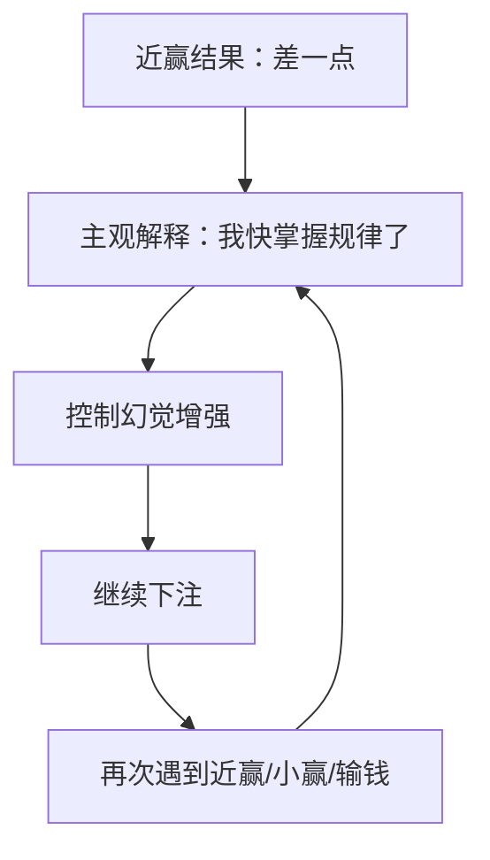
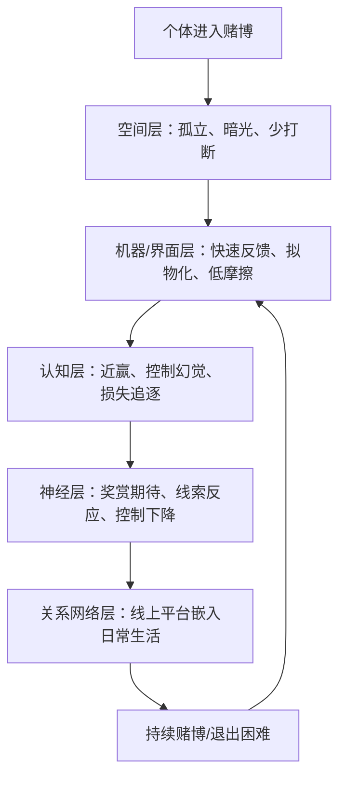
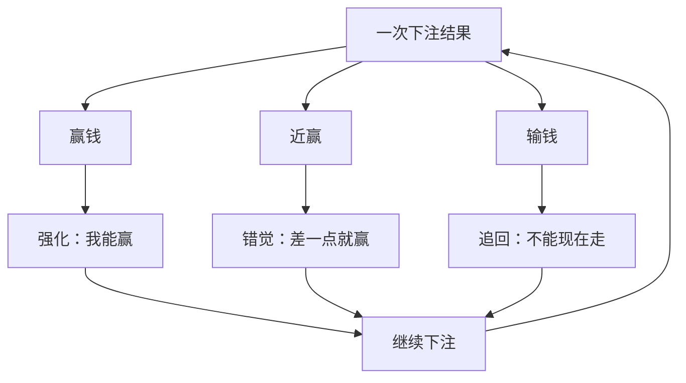

# 为什么进了赌场，就出不来了？——基于 7 篇文献的机制整理

> 主题：赌博成瘾、赌场/赌博机设计、近赢效应、奖赏神经机制、线下空间、线上赌博场域、拟物化界面与新型赌博形式。  
> 核心问题：为什么很多人明知赌博长期期望收益为负，仍然会不断下注、延长停留、难以及时退出？

---

## 0. 一句话总论

“进了赌场就出不来”并不只是因为赌徒“意志力差”，而是因为赌博系统把**机器节奏、空间布局、界面反馈、近赢错觉、奖赏神经环路、控制幻觉、社交隔离、线上可及性**组合成了一个持续强化的闭环。人不是单独面对一次“是否下注”的理性选择，而是被放进一个会不断重塑注意力、时间感、身体节奏和期待感的环境中。

可以概括为：

这 7 篇文献共同构成一个解释链条：

1. **Schüll** 解释机器赌博如何通过设计制造“机器区”（machine zone）。  
2. **Dores 等** 解释“近赢”为什么会像奖励一样刺激人继续玩。  
3. **Clark 等** 从神经影像学角度总结赌博障碍中的奖赏、动机与控制机制。  
4. **Adams & Wiles** 说明赌场/赌博机区域如何通过空间设计制造孤立、连续、低干扰的沉浸环境。  
5. **Törrönen 等** 将线上赌博场所看作“关系性行动者”，强调平台、手机、支付、生活情境一起推动成瘾。  
6. **Meng & Leary** 说明数字赌博界面的拟物化设计会增强“我能控制结果”的错觉。  
7. **Casu 等** 总结新型赌博形式及临床心理干预建议，提示现代赌博已经从赌场扩展到手机、游戏、体育、虚拟空间等多种场景。

---

## 1. 文献矩阵：7 篇文献各自回答了什么问题？

| 编号  | 文献                            | 研究对象/方法               | 关键概念                          | 对“为什么出不来”的贡献                                 |
| --- | ----------------------------- | --------------------- | ----------------------------- | -------------------------------------------- |
| [1] | Schüll, *Addiction by Design* | 拉斯维加斯机器赌博的长期人类学田野研究   | 机器区、连续下注、设计成瘾                 | 赌博机不是中性工具，而是通过速度、反馈、界面、空间与奖励结构，把人带入沉浸性的“机器区” |
| [2] | Dores et al., 2024/2025       | 近赢效应的 ERP 系统综述        | near-win/near-miss，反馈相关脑电     | 近赢虽是输钱，却被大脑加工为“差一点就赢”，增强继续下注动机               |
| [3] | Clark et al., 2018/2019       | 赌博障碍奖赏机制的神经影像综述       | 奖赏环路、多巴胺、纹状体、前额叶控制            | 赌博障碍涉及奖赏敏感性、期待加工、线索反应和自控功能的改变                |
| [4] | Adams & Wiles, 2017           | 赌博机附属空间/annex 的空间分析   | enabling space、孤立、暗光、低社交监督    | 赌博空间会主动“帮助”人持续玩：减少打断、减少旁观压力、增加沉浸             |
| [5] | Törrönen et al., 2020         | 34 位线上赌徒生命史访谈；行动者网络理论 | online gambling venues，关系性行动者 | 线上平台让赌博突破时间和地点限制，嵌入日常生活，随时触发赌博行为             |
| [6] | Meng & Leary, 2020/2021       | 预实验与 3 项实验            | 拟物化界面、控制幻觉                    | 数字界面用“发牌的手”“赛马画面”等非必要视觉元素，增强玩家对随机结果的控制错觉     |
| [7] | Casu et al., 2023             | 新型赌博形式综述与临床建议         | 新型赌博、线上赌博、心理临床建议              | 现代赌博形态不断更新，风险从赌场转移到手机、游戏化、体育博彩和数字平台          |

---

## 2. 第一层机制：赌场不是“摆几台机器”，而是一个行为工程系统

### 2.1 从“赌博游戏”到“机器赌博”

传统理解中，赌博像是人和概率之间的游戏：下注、等待、赢钱或输钱。但 Schüll 的核心贡献在于指出，现代机器赌博已经不只是“概率游戏”，而是一种被精细设计的**行为调节系统**。

在机器赌博中，玩家面对的不只是“输赢结果”，还包括：

- 按钮、屏幕、音效、灯光、座椅、支付系统；
- 快速下注、快速反馈、快速再下注；
- 小额连续投入，而不是一次性大额决策；
- 让人忘记外部世界的节奏和界面；
- 让赢钱、输钱、近赢都转化为继续玩的理由。

Schüll 所说的“machine zone”非常关键。这个状态并不等于兴奋地想赢钱，而更接近一种**被机器节奏吸进去的恍惚状态**：玩家的注意力缩窄，只剩下屏幕、按钮、下注、反馈、再下注。赌博不再是为了某个明确终点，而变成了维持某种状态。

### 2.2 “出不来”的第一个原因：机器把退出动作变得很困难

赌场/赌博机的设计并不是只让人“想赢钱”，而是让人**不容易停下来**。停下来意味着：

- 要重新意识到已经过去了多久；
- 要面对已经输了多少钱；
- 要承认自己可能无法追回损失；
- 要从沉浸状态中脱离出来；
- 要重新承担现实世界的情绪和压力。

因此，继续下注反而成了更省力的动作。退出需要清醒、总结、止损、离开；继续只需要按下一个按钮。

---

## 3. 第二层机制：近赢效应让“输钱”也变成继续下注的理由

### 3.1 什么是 near-win / near-miss？

近赢就是“差一点就赢”。例如：

-老虎机上两个图案已经对齐，第三个差一点；  
-彩票号码只差一个数字；  
-体育竞猜中最后一场差一点猜中；  
-线上抽奖中指针停在大奖旁边。

从经济结果看，近赢和普通输钱一样，都是输钱；但从心理和神经加工看，近赢不是普通输钱。它会被解释为：

> “我快成功了。”  
> “再来一次可能就中了。”  
> “刚才不是完全没希望，只是差一点。”

### 3.2 近赢为什么危险？

Dores 等的系统综述聚焦近赢的神经生理相关机制，尤其是事件相关电位（ERP）研究。它说明近赢不是单纯的认知误解，而是会在反馈加工阶段引起特殊的神经反应。换句话说，人的大脑并不只是冷静地记录“输了”，而是会对“差点赢”进行额外加工。

这导致一个重要后果：

| 真实结果 | 主观解释 | 行为后果 |
|---|---|---|
| 普通输钱 | 我输了 | 可能想停 |
| 近赢输钱 | 我差一点赢 | 更可能继续 |
| 小额赢钱 | 机器有效/我有机会 | 继续 |
| 大额输钱 | 已经投入太多，要追回 | 继续 |

于是赌场最厉害的地方在于：**赢钱让人继续，近赢也让人继续，输钱还可能因为追回损失而让人继续。**

### 3.3 近赢制造的是“进步错觉”

在真正的技能任务中，“差一点成功”可能意味着你确实正在进步，比如投篮、考试、跑步训练。但在纯随机赌博中，“差一点”并不说明下一次更有可能赢。老虎机第三个图案差一点停在目标位置，并不代表你掌握了规律。

但人的大脑容易把随机事件误读为技能反馈。这就是近赢效应与控制幻觉结合后最危险的地方：

---

## 4. 第三层机制：奖赏系统不是只对“赢钱”反应，也会对“期待”和“线索”反应

### 4.1 赌博的奖赏不只发生在赢的瞬间

Clark、Boileau 与 Zack 的综述从神经影像学角度整合赌博障碍中的奖赏机制。对“为什么出不来”而言，最关键的不是“赢钱令人开心”这个常识，而是：赌博行为中存在多个能驱动继续下注的奖赏相关环节。

包括：

1. **下注前的期待**：下一把可能中奖。  
2. **下注中的紧张**：结果还没出现，注意力高度集中。  
3. **结果揭晓的刺激**：赢、输、近赢都会引发情绪波动。  
4. **赌博线索反应**：灯光、声音、图案、筹码、手机推送都能重新激活赌博欲望。  
5. **损失后的追回动机**：输钱不是终点，而被解释为下一轮行动的理由。

因此，赌场不是单靠“赢钱”留住人，而是用一整套**奖赏期待—反馈—再期待**循环留住人。

### 4.2 为什么输钱也能继续？

从理性角度看，输钱应该让人停止。但赌博环境会把输钱重新包装成几种继续理由：

- “刚才只是运气不好”；
- “已经输了这么多，现在走太亏”；
- “下一把可能回本”；
- “刚才差一点就赢了”；
- “我已经摸到规律了”；
- “再玩一会儿就停”。

这里涉及几个心理机制：

| 机制 | 表现 | 结果 |
|---|---|---|
| 损失追逐 | 输了后加注，希望追回 | 输得越多，越难停 |
| 沉没成本 | 已经投入的钱和时间变成继续理由 | 退出变成承认失败 |
| 控制幻觉 | 觉得自己能影响随机结果 | 更愿意继续下注 |
| 奖赏期待 | 关注下一次可能赢钱 | 忽视长期负期望 |
| 线索诱发 | 灯光、音效、推送触发欲望 | 离开后也可能复赌 |

---

## 5. 第四层机制：赌场空间本身就是“促成成瘾的空间”

### 5.1 gambling machine annex：被隔离出来的赌博区域

Adams 与 Wiles 研究的是赌博机附属空间，即一些场所中专门摆放赌博机的隔离区域。它们往往与主要社交空间不同：主厅可能是吃饭、聊天、社交的地方，而赌博机附属区域则更封闭、昏暗、缺少社交家具，机器排列紧密，入口也可能减少他人的注视。

这种空间不是被动背景，而是会主动塑造行为。

### 5.2 空间如何让人“出不来”？

| 空间特征 | 对玩家的影响 | 对持续赌博的作用 |
|---|---|---|
| 昏暗灯光 | 降低外界时间感 | 更难意识到玩了多久 |
| 机器密集排列 | 强化沉浸和连续性 | 从一台机器转到另一台机器很容易 |
| 缺少社交桌椅 | 减少聊天、停顿和他人打断 | 玩家的注意力更集中在机器上 |
| 入口隐蔽/低可见性 | 降低被熟人看到的压力 | 问题赌博者更容易独自停留 |
| 现金/票据/电子支付便利 | 降低继续下注的摩擦 | 钱更容易转化为下注额度 |

因此，赌场/赌博机区域并不是简单地“提供赌博机会”，而是在制造一种特殊的行为环境：**少打断、少监督、少停顿、强反馈、强连续。**

---

## 6. 第五层机制：线上赌博让“赌场”从一个地点变成一种随身关系

### 6.1 线上赌博场所不是普通网站

Törrönen 等的研究使用行动者网络理论和 assemblage thinking，把线上赌博场所看作一种“关系性行动者”。这意味着线上赌场不是静态网页，而是一个会与玩家、手机、支付、广告、算法、家庭生活、工作压力、酒精使用、夜间独处等因素连接起来的网络。

线下赌场至少还需要“走进去”；线上赌博则不需要。

### 6.2 线上赌博的危险在于突破边界

| 线下赌场 | 线上赌博 |
|---|---|
| 需要到达特定地点 | 手机随时可进入 |
| 有开门关门、交通、现金等摩擦 | 24 小时、即时支付、低摩擦 |
| 离开场所后刺激减少 | 推送、广告、余额、赛事提醒持续存在 |
| 周围人可能看到 | 私密性强，隐藏性高 |
| 行为相对集中 | 可嵌入睡前、通勤、饮酒、压力时刻 |

线上赌博的关键变化是：赌场不再只是一个地点，而变成了一个**随身携带、随时召唤、反复侵入生活节奏的系统**。

这也解释了为什么“出不来”在数字时代变得更复杂：

线下赌场的问题是“进入后难以离开”；线上赌博的问题是“你离开了，它也可能继续跟着你”。

---

## 7. 第六层机制：拟物化界面增强“我能控制结果”的错觉

### 7.1 什么是 skeuomorphic digital interfaces？

Meng 与 Leary 研究的是数字赌博界面的拟物化设计。拟物化指数字界面模仿现实物件或传统场景，即使这些元素对实际功能没有必要。

例如：

- 线上纸牌游戏中出现“发牌的手”；
- 数字赛马界面中出现马匹奔跑动画；
- 线上老虎机模仿实体老虎机的拉杆、滚轴、灯光；
- 手机博彩 App 模仿实体赌场桌面、筹码、荷官动作。

这些元素表面上只是美术设计，但研究指出，它们可能增强玩家对随机结果的控制幻觉。

### 7.2 为什么拟物化界面会让人更想赌？

拟物化界面的危险在于：它把随机系统伪装成更像现实世界的互动任务。现实世界中，如果你参与发牌、观察赛马、按下按钮、选择时机，你会感觉自己正在参与并影响结果。数字界面利用这种熟悉感，让人觉得：

- 我不是被动等待随机结果；
- 我的选择、时机、感觉可能有用；
- 我能观察出某种规律；
- 我可以凭经验提高胜率。

但在许多赌博游戏中，这种控制感并不对应真实控制力。于是界面设计把随机性包装成互动性，把偶然性包装成技能性。

---

## 8. 第七层机制：新型赌博把风险扩散到游戏、体育、社交与日常娱乐

Casu、Belfiore 与 Caponnetto 对新型赌博形式和临床心理建议进行了综述。对当前研究和科普写作来说，它提醒我们：现代赌博已经不只是传统赌场或老虎机。

常见的新型或扩展形式包括：

- 线上赌场；
- 体育博彩；
- 手机赌博 App；
- 直播/赛事即时投注；
- 游戏化抽奖、开箱、皮肤博彩；
- 社交赌场游戏；
- 加密货币或高波动数字资产投机与赌博化交叉场景。

这些形式的共同特点是：

1. **门槛更低**：小额即可开始。  
2. **速度更快**：下注—反馈—再下注周期缩短。  
3. **边界更模糊**：娱乐、游戏、投资、社交和赌博混在一起。  
4. **隐蔽性更强**：外人不容易发现。  
5. **平台触达更强**：广告、推送、奖励、活动反复召回用户。

因此，“赌场”已经不一定有门、筹码和大厅。很多时候，赌场就在手机里。

---

## 9. 综合机制模型：为什么人会一步步陷进去？

### 9.1 阶段 1：进入——好奇、娱乐、社交或逃避压力

一开始，赌博往往被包装成娱乐：朋友邀请、旅游体验、赛事竞猜、游戏活动、手机 App 小额下注。此时玩家通常认为自己可控：

- “我只是玩玩”；
- “我有预算”；
- “我知道概率低”；
- “我不会上瘾”。

但赌场/平台真正等待的是玩家进入反馈循环。

### 9.2 阶段 2：沉浸——机器节奏接管注意力

一旦进入连续下注，人的注意力会被结果反馈不断抓住。特别是机器赌博和线上赌博，它们都有共同特点：

- 单次决策成本低；
- 反馈速度快；
- 视觉和声音刺激强；
- 可连续重复；
- 每次都给人“下一次可能不同”的期待。

此时玩家不再像进入前那样进行整体预算，而是在一个个局部决策中被推进。

### 9.3 阶段 3：强化——赢、近赢、输都能推动继续

| 结果 | 玩家心理 | 对继续下注的影响 |
|---|---|---|
| 赢 | “我运气来了/策略有效” | 想扩大收益 |
| 近赢 | “差一点，再来一次” | 增强继续动机 |
| 小输 | “损失不大，可以追回” | 延长停留 |
| 大输 | “现在走就彻底亏了” | 损失追逐 |

这就是赌场循环的强大之处：它让几乎所有反馈都能被解释成继续的理由。

### 9.4 阶段 4：退出困难——停下比继续更痛苦

当损失增加后，退出不再只是“停止娱乐”，而变成一种心理上很痛苦的动作：

- 退出意味着承认输钱；
- 退出意味着放弃回本机会；
- 退出意味着从沉浸状态回到现实；
- 退出意味着面对自责、羞耻或焦虑；
- 退出意味着需要解释时间和金钱的去向。

因此，继续下注短期内反而能避免痛苦。这就是成瘾行为的重要特征：短期缓解痛苦，长期制造更大痛苦。

### 9.5 阶段 5：迁移——赌博从场所进入生活

当赌博从线下赌场迁移到线上平台后，问题进一步加重。玩家不必再进入赌场，平台会进入玩家生活：

- 夜里睡不着时；
- 工作压力大时；
- 饮酒后；
- 刷赛事新闻时；
- 收到平台优惠或推送时；
- 想“只玩一把”时。

于是赌博从一次外出行为，变成一种反复出现的日常应对方式。

---

## 10. “出不来”的七个关键词

| 关键词 | 含义 | 对应文献 |
|---|---|---|
| 机器区 | 玩家进入高度沉浸、时间感下降、只剩机器节奏的状态 | [1] |
| 近赢效应 | 输了但感觉“差一点赢”，从而继续下注 | [2] |
| 奖赏环路 | 期待、线索、反馈和中奖共同激活动机系统 | [3] |
| 促成空间 | 空间布局减少打断和监督，鼓励独自连续下注 | [4] |
| 关系性行动者 | 线上平台与手机、支付、生活情境共同推动成瘾 | [5] |
| 控制幻觉 | 玩家误以为自己能控制随机结果 | [6] |
| 新型赌博 | 赌博向手机、体育、游戏、社交和数字平台扩散 | [7] |

---

## 11. 逐篇文献详解

### [1] Schüll, Natasha Dow. *Addiction by Design: Machine Gambling in Las Vegas*. Princeton University Press, 2012/2014.

#### 研究定位

这是一部关于拉斯维加斯机器赌博的人类学经典著作。它不只是研究赌徒心理，而是研究赌博产业、机器设计、赌场环境和玩家体验如何共同制造成瘾。

#### 核心观点

- 机器赌博的关键不只是赢多少钱，而是让玩家进入“机器区”。
- 现代老虎机/电子赌博机通过快速、连续、低间隔反馈延长游戏时间。
- 玩家常常不是为了社交和炫耀，而是为了维持一种与机器同步的状态。
- 赌博机设计会降低玩家对时间、金钱和身体疲劳的感知。

#### 对本问题的贡献

Schüll 提供了总框架：赌博成瘾不是单纯来自个体冲动，而是来自一种“被设计出来的连续沉浸结构”。这解释了为什么“进了赌场出不来”不是偶然，而是设计逻辑的一部分。

---

### [2] Dores AR, Peixoto M, Fernandes C, et al. Neurophysiological Correlates of Near-Wins in Gambling: A Systematic Literature Review. *Journal of Gambling Studies*, 2024/2025, 41(1): 5–35.

#### 研究定位

这是一篇关于赌博近赢效应神经生理基础的系统综述，重点关注 ERP 等研究。它试图回答：为什么“差一点赢”会有如此强的行为推动作用？

#### 核心观点

- 近赢不是普通输钱，而是一种高度显著的反馈事件。
- 近赢可能引发与奖赏、注意、结果评估有关的神经加工。
- 问题赌博者和非问题赌博者对近赢的加工可能不同。
- 近赢会增强继续下注的主观动机。

#### 对本问题的贡献

该文献解释了赌场最常见的心理陷阱：玩家不是只被“赢”吸引，也会被“差一点赢”吸引。近赢把失败伪装成接近成功，从而削弱退出意愿。

---

### [3] Clark L, Boileau I, Zack M. Neuroimaging of reward mechanisms in Gambling disorder: an integrative review. *Molecular Psychiatry*, 2018/2019, 24(5): 674–693.

#### 研究定位

这是一篇关于赌博障碍奖赏机制的整合性神经影像综述，关注赌博障碍中大脑奖赏系统、动机系统、线索反应和认知控制的改变。

#### 核心观点

- 赌博障碍与奖赏加工异常相关。
- 赌博线索、奖励期待、近赢和赢钱反馈都可能参与持续赌博。
- 前额叶控制系统与冲动、决策、抑制控制有关。
- 赌博障碍与物质成瘾在奖赏和线索反应方面存在相似之处。

#### 对本问题的贡献

该文献提供神经机制层面的解释：赌博之所以难停，不只是因为人“想赢”，而是因为奖赏期待、线索诱发和控制能力下降共同维持赌博行为。

---

### [4] Adams PJ, Wiles J. Gambling machine annexes as enabling spaces for addictive engagement. *Health & Place*, 2017, 43: 1–7.

#### 研究定位

该研究关注赌博机所在空间，尤其是一些场所中与主厅分开的赌博机附属区。作者强调空间本身可以“促成”成瘾参与。

#### 核心观点

- 赌博机区域常与社交主厅分离。
- 这类区域往往光线较暗、机器密集、社交设施少。
- 空间设计减少他人监督与社交打断。
- 这种环境鼓励孤独、连续、沉浸式赌博。

#### 对本问题的贡献

这篇文献解释了“赌场为什么让人坐得住”：不仅机器会诱导人继续，空间也在帮助机器完成这件事。

---

### [5] Törrönen J, Samuelsson E, Gunnarsson M. Online gambling venues as relational actors in addiction: Applying the actor-network approach to life stories of online gamblers. *International Journal of Drug Policy*, 2020, 85: 102928.

#### 研究定位

这篇文章通过线上赌徒生命史访谈，使用行动者网络理论分析线上赌博场所如何参与成瘾形成。

#### 核心观点

- 线上赌博场所不是被动工具，而是参与成瘾关系网络的行动者。
- 手机、平台、支付系统、广告、生活压力、酒精/药物使用等会互相连接。
- 线上赌博突破空间限制，可以在任何地点发生。
- 线上赌博突破时间限制，可以 24 小时进入。

#### 对本问题的贡献

这篇文献把“赌场”从建筑空间扩展为数字平台。它说明现代人不是“进赌场出不来”，而是“赌场进入生活后更难摆脱”。

---

### [6] Meng MD, Leary RB. The Effect of Skeuomorphic Digital Interfaces on the Illusion of Control over Gambling Outcomes. *Journal of Gambling Studies*, 2020/2021, 37(2): 623–642.

#### 研究定位

该研究通过实验考察数字赌博界面中的拟物化设计如何影响控制幻觉和赌博行为。

#### 核心观点

- 拟物化界面会模仿现实物体或传统赌博场景。
- 这些元素未必有功能必要性，但会增强互动感。
- 当玩家存在控制幻觉时，拟物化界面可能进一步增加下注金额。
- 随机游戏被包装得越像可操控任务，玩家越容易高估自身影响力。

#### 对本问题的贡献

该文献解释了为什么线上赌博界面并不是“长得好看”这么简单。界面设计会改变玩家对随机性的理解，使其感觉自己更有控制力，从而更愿意继续玩。

---

### [7] Casu M, Belfiore CI, Caponnetto P. Rolling the Dice: A Comprehensive Review of the New Forms of Gambling and Psychological Clinical Recommendations. *Psychiatry International*, 2023, 4(2): 105–125.

#### 研究定位

这是一篇关于新型赌博形式及心理临床建议的综合综述，关注现代赌博如何随着数字技术、线上娱乐和新平台而变化。

#### 核心观点

- 赌博形式正在从传统赌场扩展到线上平台、体育博彩、游戏化环境和移动端。
- 新型赌博更容易与娱乐、社交、游戏和消费融合。
- 隐蔽性、即时性和可及性提高了成瘾风险。
- 临床干预需要关注心理评估、认知扭曲、情绪调节、共病问题和复发预防。

#### 对本问题的贡献

该文献提供现代背景：今天的“赌场”已经不局限于赌场建筑，而是扩散到数字娱乐生态中。因此，预防和干预也不能只盯着线下赌场。

---

## 12. 可以用于课堂/汇报的核心图示

### 12.1 五层解释框架

### 12.2 “赢钱、近赢、输钱”三种反馈如何都导向继续

---

## 13. 写作时可以使用的综合论述段落

> 赌场之所以让人“进了就出不来”，并不是因为玩家不知道赌博有风险，而是因为现代赌博系统把多个层面的成瘾机制叠加在一起。机器赌博通过快速、连续、低间隔的反馈使玩家进入“机器区”；空间布局通过昏暗、隔离和低社交监督减少退出机会；近赢效应把失败伪装成接近成功；奖赏神经环路对期待、线索和反馈持续反应；数字平台则进一步通过拟物化界面和 24 小时可及性，把赌博从特定场所扩展到日常生活。由此，赌博不再是一次次独立的理性选择，而是一个由机器、空间、界面、神经反应和社会技术网络共同维持的行为循环。

---

## 14. 对科研选题/论文写作的启发

如果要围绕“为什么赌场让人出不来”写综述或课程论文，可以把这 7 篇文献组织成以下结构：

1. **引言**：提出问题——赌博成瘾不能只用“个人自控失败”解释。  
2. **机器设计**：以 Schüll 为核心，说明机器区和连续下注。  
3. **认知机制**：以 Dores 等与 Meng & Leary 为核心，讲近赢和控制幻觉。  
4. **神经机制**：以 Clark 等为核心，讲奖赏、线索反应和控制系统。  
5. **空间机制**：以 Adams & Wiles 为核心，讲赌博空间如何促成沉浸。  
6. **数字平台机制**：以 Törrönen 等和 Casu 等为核心，讲线上赌博如何突破时间地点边界。  
7. **总结**：赌博成瘾是“个体—机器—空间—平台—神经奖赏系统”的耦合结果。  
8. **干预建议**：从个体治疗、环境限制、界面监管、平台责任、公共卫生政策多层面提出建议。

---

## 15. 实践启示：如何降低“出不来”的风险？

> 以下内容仅作公共健康和教育用途，不替代专业诊疗。

### 15.1 个体层面

- 不把“差一点赢”解释为进步；
- 预先设定严格预算和时间上限；
- 不在饮酒、情绪低落、压力大、睡眠不足时赌博；
- 避免使用信用卡、借贷或高额电子支付参与赌博；
- 发现自己开始“追回损失”时立即停止；
- 删除赌博 App，关闭推送，减少触发线索。

### 15.2 家庭/同伴层面

- 不用简单责骂替代帮助；
- 关注隐藏性线上赌博；
- 帮助建立财务边界；
- 鼓励寻求心理咨询、成瘾医学或精神卫生专业支持。

### 15.3 平台/政策层面

- 限制近赢和误导性反馈设计；
- 限制拟物化诱导和控制幻觉强化；
- 提供明确损失提醒和强制冷静期；
- 降低连续下注速度；
- 限制面向高风险用户的广告和奖励；
- 提供自我排除、限额、家属协助等工具。

---

## 16. 最终总结

“进了赌场就出不来”可以被理解为一个多层系统问题：

- **机器层面**：快速、连续、强反馈，让人进入机器区。  
- **认知层面**：近赢、控制幻觉和损失追逐，让失败也变成继续的理由。  
- **神经层面**：奖赏期待、赌博线索和反馈加工反复激活动机系统。  
- **空间层面**：昏暗、隔离、少打断的赌博区域延长停留。  
- **数字层面**：线上平台突破时间地点边界，把赌场装进口袋。  
- **社会技术层面**：平台、支付、广告、生活压力和孤独感共同组成成瘾网络。

所以，真正的问题不是“为什么他不走”，而是：

> 当一个环境被设计成让人更少停顿、更少反思、更少退出，并且把赢钱、输钱、近赢都转化为继续下注的理由时，离开本身就变成了一件困难的事。

---

## 17. 参考文献与核对备注

[1] Schüll, N. D. *Addiction by Design: Machine Gambling in Las Vegas*. Princeton University Press, 2012/2014.  
说明：该书基于作者长期拉斯维加斯田野研究，核心概念包括 machine zone、机器赌博、设计成瘾等。

[2] Dores, A. R., Peixoto, M., Fernandes, C., et al. Neurophysiological Correlates of Near-Wins in Gambling: A Systematic Literature Review. *Journal of Gambling Studies*, 41, 5–35, 2025. DOI: 10.1007/s10899-024-10327-1.  
说明：在线发表时间为 2024-08-05；正式卷期为 2025 年 41 卷第 1 期，页码 5–35。

[3] Clark, L., Boileau, I., & Zack, M. Neuroimaging of reward mechanisms in Gambling disorder: an integrative review. *Molecular Psychiatry*, 24, 674–693, 2019. DOI: 10.1038/s41380-018-0230-2.  
说明：文章在线发表时间为 2018 年，正式卷期页码为 2019 年 24(5): 674–693。

[4] Adams, P. J., & Wiles, J. Gambling machine annexes as enabling spaces for addictive engagement. *Health & Place*, 43, 1–7, 2017. DOI: 10.1016/j.healthplace.2016.11.001.

[5] Törrönen, J., Samuelsson, E., & Gunnarsson, M. Online gambling venues as relational actors in addiction: Applying the actor-network approach to life stories of online gamblers. *International Journal of Drug Policy*, 85, 102928, 2020. DOI: 10.1016/j.drugpo.2020.102928.

[6] Meng, M. D., & Leary, R. B. The Effect of Skeuomorphic Digital Interfaces on the Illusion of Control over Gambling Outcomes. *Journal of Gambling Studies*, 37(2), 623–642, 2021. DOI: 10.1007/s10899-020-09973-2.  
说明：文章在线发表时间为 2020 年，卷期页码对应 2021 年。

[7] Casu, M., Belfiore, C. I., & Caponnetto, P. Rolling the Dice: A Comprehensive Review of the New Forms of Gambling and Psychological Clinical Recommendations. *Psychiatry International*, 4(2), 105–125, 2023. DOI: 10.3390/psychiatryint4020014.
