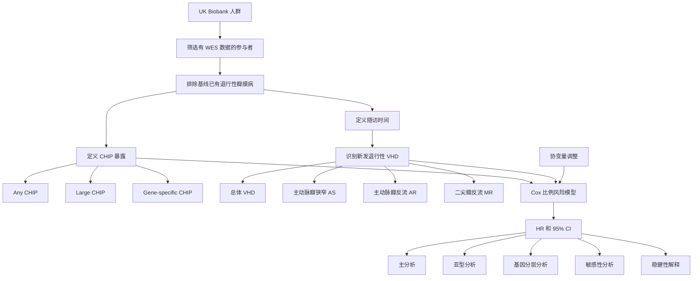

建议文件名：CHIP与退行性瓣膜病风险研究框架.md

# CHIP 与退行性瓣膜病风险：JACC 研究方法学与研究框架

来源：JACC 文章页面与题图信息  
论文题名：Clonal Hematopoiesis of Indeterminate Potential and Risk of Degenerative Valvular Heart Diseases  
期刊：Journal of the American College of Cardiology, 2026  
DOI：10.1016/j.jacc.2026.01.073

## 摘要

本文梳理该 JACC 研究的方法学框架：基于 UK Biobank WES 数据识别 CHIP，排除基线退行性瓣膜病后，采用 Cox 模型评估 CHIP 与新发退行性瓣膜病及其亚型的风险关联。

## 关键词

克隆性造血（CHIP）；全外显子组测序（WES）；UK Biobank；退行性瓣膜病（degenerative VHD）；Cox 比例风险模型；主动脉瓣狭窄（AS）；二尖瓣反流（MR）

## 大纲

1. [研究核心问题](#section-1)
2. [总体研究设计](#section-2)
3. [数据来源与研究对象筛选](#section-3)
4. [暴露变量：CHIP 的识别](#section-4)
5. [结局变量：退行性瓣膜病及其亚型](#section-5)
6. [统计模型与主分析逻辑](#section-6)
7. [分层分析、敏感性分析与稳健性检验](#section-7)
8. [可复用的研究框架](#section-8)
9. [对你自己 UKB 课题的借鉴](#section-9)

---

<a id="section-1"></a>

## 1. 研究核心问题

本节概要：本节说明这篇文章试图回答的主要科学问题，重点是 CHIP 是否与未来退行性瓣膜病风险升高有关。

这篇文章的核心研究问题是：

> 携带克隆性造血（Clonal Hematopoiesis of Indeterminate Potential, CHIP）的人群，未来发生退行性瓣膜性心脏病（degenerative valvular heart diseases, degenerative VHDs）的风险是否更高？

该问题属于典型的前瞻性队列风险关联问题。它不是在做机制实验，也不是在做机器学习预测，而是利用 UK Biobank 的大样本人群数据和全外显子组测序（Whole-Exome Sequencing, WES）数据，观察基线 CHIP 状态与随访期间新发瓣膜病之间的关系。

从研究性质看，它回答的是：

```text
基线 CHIP 暴露状态
        ↓
长期随访
        ↓
新发退行性瓣膜病风险
```

因此，文章最终能够支持的结论主要是“CHIP 与退行性瓣膜病风险升高相关”，而不是直接证明“CHIP 导致退行性瓣膜病”。

---

<a id="section-2"></a>

## 2. 总体研究设计

本节概要：本节说明该研究的基本设计类型，重点是 UK Biobank 前瞻性队列、WES 暴露识别和 Cox 生存分析。

这篇文章的方法学框架可以概括为：

```text
UK Biobank 人群
    ↓
筛选具有 WES 数据的参与者
    ↓
排除基线已有退行性瓣膜病者
    ↓
根据 WES 数据识别 CHIP 状态
    ↓
随访新发退行性瓣膜病
    ↓
使用 Cox 比例风险模型计算 HR 和 95% CI
```

它的研究设计是：

| 模块 | 内容 |
|---|---|
| 数据来源 | UK Biobank |
| 研究类型 | 前瞻性队列研究 |
| 暴露 | CHIP 状态 |
| 暴露测量方式 | WES 数据识别体细胞突变 |
| 结局 | 新发退行性瓣膜性心脏病及其亚型 |
| 统计模型 | Cox proportional hazards model |
| 效应指标 | Hazard ratio, HR；95% confidence interval, 95% CI |

这类研究的关键优势在于：暴露在基线或随访早期通过遗传测序数据定义，结局在后续医疗记录中被捕获，因此时间顺序比较清楚。但它仍然是观察性研究，需要控制混杂因素，并通过敏感性分析验证稳健性。

---

<a id="section-3"></a>

## 3. 数据来源与研究对象筛选

本节概要：本节说明研究对象如何从 UK Biobank 中筛选出来，重点是 WES 数据、基线排除和随访队列构建。

该研究使用 UK Biobank 数据。UK Biobank 是一个大型前瞻性队列，包含参与者的基线信息、生活方式、疾病诊断、死亡登记、住院记录、手术记录以及部分人群的组学数据。

该研究的核心入组逻辑大致如下：

```text
UK Biobank 全体参与者
    ↓
保留有 WES 数据者
    ↓
排除基线已有退行性瓣膜病者
    ↓
排除血液系统恶性肿瘤或相关不符合 CHIP 定义者
    ↓
排除关键变量缺失者
    ↓
形成最终分析队列
```

其中最重要的是两点。

第一，研究需要 WES 数据。因为 CHIP 不是普通问卷变量，而是要通过测序数据识别体细胞突变。没有 WES 数据的人无法进入 CHIP 暴露分析。

第二，研究要排除基线已有退行性瓣膜病的人。因为文章研究的是 incident degenerative VHDs，即新发退行性瓣膜病。如果基线时已经患病，就无法用于分析“未来发病风险”。

可以将队列构建理解为：

| 步骤         | 目的             |
| ---------- | -------------- |
| 选择 UKB 参与者 | 获得大样本人群和长期随访数据 |
| 限定 WES 数据  | 识别 CHIP 暴露     |
| 排除基线已有 VHD | 保证分析的是新发疾病     |
| 处理缺失协变量    | 保证多变量模型可以运行    |
| 构建随访时间     | 用于 Cox 生存分析    |

---

<a id="section-4"></a>

## 4. 暴露变量：CHIP 的识别

本节概要：本节说明 CHIP 如何作为主要暴露变量被定义，重点是 WES、体细胞突变、驱动基因和 VAF 阈值。

文章的核心暴露是 CHIP。CHIP 通常指在没有明确血液系统恶性肿瘤的情况下，造血细胞中出现与血液肿瘤相关的体细胞驱动突变，并发生克隆性扩增。

在这种研究中，CHIP 的识别通常依赖以下信息：

| 识别要素 | 含义 |
|---|---|
| WES 数据 | 用于检测外显子区域突变 |
| CHIP driver genes | 常见包括 DNMT3A、TET2、ASXL1 等 |
| Variant allele frequency, VAF | 突变等位基因频率，用于衡量克隆大小 |
| 血液系统疾病排除 | 避免把血液肿瘤患者误定义为 CHIP |
| 体细胞突变筛选 | 区分 CHIP 相关突变与普通遗传变异 |

常见 CHIP 定义中，VAF ≥ 2% 是常用阈值。部分研究还会进一步分析大克隆 CHIP，例如 VAF ≥ 10%。因此，该研究的暴露可以分为多个层次：

| 暴露层级 | 解释 |
|---|---|
| Any CHIP | 是否存在任意符合标准的 CHIP 突变 |
| Large CHIP | 是否存在较大克隆负荷的 CHIP |
| Gene-specific CHIP | 按突变基因分组，例如 DNMT3A、TET2、ASXL1 |
| Clone size | 将 VAF 作为克隆大小指标，分析是否存在风险梯度 |

这一步是整篇文章的核心，因为 CHIP 定义的准确性直接影响后续风险估计。如果 CHIP 识别不准，后面的 Cox 分析即使模型复杂，也会产生暴露错分问题。

---

<a id="section-5"></a>

## 5. 结局变量：退行性瓣膜病及其亚型

本节概要：本节说明研究结局如何定义，重点是总体退行性瓣膜病和主要瓣膜病亚型。

该研究的主要结局是新发退行性瓣膜性心脏病（incident degenerative valvular heart diseases）。根据题目和文章页面信息，结局重点包括总体退行性 VHD 及其主要亚型。

常见亚型包括：

| 结局类型 | 英文名称 | 缩写 |
|---|---|---|
| 总体退行性瓣膜病 | degenerative valvular heart diseases | degenerative VHDs |
| 主动脉瓣狭窄 | aortic valve stenosis | AS |
| 主动脉瓣反流 | aortic valve regurgitation | AR |
| 二尖瓣反流 | mitral regurgitation | MR |

在 UK Biobank 中，这类结局通常不是逐个做超声复查获得，而是通过医疗记录系统识别，包括：

| 数据来源                       | 用途             |
| -------------------------- | -------------- |
| Hospital inpatient records | 住院诊断记录         |
| Death registry             | 死亡登记           |
| ICD codes                  | 疾病诊断编码         |
| Procedure codes            | 瓣膜手术、介入治疗等操作编码 |

结局定义的关键点是“新发”。也就是说，参与者从基线开始随访，直到第一次发生退行性瓣膜病、死亡、失访或随访结束。

随访时间可以表示为：

```text
随访时间 = 事件日期 / 死亡日期 / 失访日期 / 随访结束日期 - 基线日期
```

在 Cox 模型中，每个参与者贡献的不是简单的“是否患病”，而是“随访了多久，以及是否在随访期间发生事件”。

---

<a id="section-6"></a>

## 6. 统计模型与主分析逻辑

本节概要：本节说明文章如何估计 CHIP 与退行性瓣膜病风险之间的关联，重点是 Cox 模型、HR 和协变量调整。

该研究的核心统计方法是 Cox 比例风险模型（Cox proportional hazards model）。Cox 模型适合处理“随访时间 + 是否发生结局”的数据结构。

主分析可以抽象为：

```text
退行性 VHD 发病风险 ~ CHIP 状态 + 协变量
```

如果写成更接近统计模型的形式：

```text
h(t) = h0(t) × exp(β1 × CHIP + β2 × age + β3 × sex + ... + βk × covariates)
```

其中：

| 符号 | 含义 |
|---|---|
| h(t) | 某个时间点的发病风险 |
| h0(t) | 基线风险函数 |
| β1 | CHIP 对结局风险的回归系数 |
| exp(β1) | CHIP 对应的 HR |
| HR > 1 | CHIP 组风险高于非 CHIP 组 |
| HR < 1 | CHIP 组风险低于非 CHIP 组 |
| 95% CI | 估计不确定性范围 |

主分析通常包括：

```text
模型 1：调整年龄、性别等基础人口学变量
模型 2：进一步调整生活方式因素
模型 3：进一步调整心血管危险因素、合并症和其他潜在混杂因素
```

可能纳入的协变量包括：

| 协变量类别 | 示例 |
|---|---|
| 人口学因素 | 年龄、性别、种族 |
| 社会经济因素 | Townsend deprivation index、教育水平 |
| 生活方式 | 吸烟、饮酒、体力活动 |
| 体格指标 | BMI |
| 心血管危险因素 | 高血压、糖尿病、血脂异常 |
| 药物或合并症 | 根据文章具体方法确定 |

主分析的解释方式是：

```text
在控制多种混杂因素后，CHIP 阳性者相对于 CHIP 阴性者发生退行性瓣膜病的风险是否升高。
```

需要注意，HR 不是患病率比，也不是风险差。它表示在随访过程中，某一时刻 CHIP 组相对于非 CHIP 组发生结局的瞬时风险比。

---

<a id="section-7"></a>

## 7. 分层分析、敏感性分析与稳健性检验

本节概要：本节说明文章如何验证主分析结果是否稳定，重点是亚型分析、基因特异分析、克隆大小分析和敏感性分析。

一篇合格的 UKB 风险关联研究通常不会只做一个 Cox 主模型。它会围绕主问题做多个扩展分析，以证明结果不是偶然或由某个特殊亚组驱动。

该文章可能包含以下分析模块：

| 分析模块 | 目的 |
|---|---|
| 总体 VHD 分析 | 评估 CHIP 与总体退行性瓣膜病风险 |
| 亚型分析 | 分别分析 AS、AR、MR |
| 大克隆分析 | 判断克隆负荷更大时风险是否更高 |
| 基因特异分析 | 判断 DNMT3A、TET2、ASXL1 等基因是否存在差异 |
| 年龄分层 | 检查老年人与年轻人中关联是否一致 |
| 性别分层 | 检查男性与女性中关联是否一致 |
| 敏感性分析 | 检验主结果是否稳健 |
| 竞争风险处理 | 在死亡风险较高时考虑是否影响结局估计 |

其中，最有信息量的是三类分析。

第一类是结局亚型分析。因为退行性瓣膜病不是单一疾病，主动脉瓣狭窄、主动脉瓣反流和二尖瓣反流的病理过程并不完全一样。如果 CHIP 只与 AS 或 MR 明显相关，而与 AR 不明显，这会提示其潜在机制可能更接近钙化、炎症或瓣膜退变过程。

第二类是 CHIP 克隆大小分析。如果大克隆 CHIP 的 HR 高于普通 CHIP，说明可能存在剂量反应关系。剂量反应关系会增强结果的生物学可信度。

第三类是基因特异性分析。不同 CHIP 驱动基因可能对应不同免疫炎症表型。比如 DNMT3A、TET2、ASXL1 等基因突变不一定产生完全相同的心血管风险模式。

敏感性分析可以包括：

```text
1. 排除随访早期发生结局者
2. 排除既往重大心血管疾病者
3. 更换 CHIP 定义阈值
4. 进一步调整炎症指标或心血管危险因素
5. 使用不同结局定义
6. 对死亡竞争风险进行处理
```

这些分析的目的不是产生更多“显著结果”，而是回答一个问题：

> 主结果是否稳定，是否容易被混杂、反向因果、结局定义或特殊亚组影响？

---

<a id="section-8"></a>

## 8. 可复用的研究框架

本节概要：本节将该文章的方法学抽象成可复用模板，重点是暴露、结局、协变量和统计分析路径。

这篇文章的框架可以抽象为一个非常标准的 UKB 队列研究模板：



如果进一步压缩成一句话：

```text
基线分子暴露 → 排除既往结局 → 长期随访新发疾病 → Cox 模型估计风险 → 亚型和敏感性分析验证稳健性
```

这个框架可以迁移到很多 UKB 课题中。

例如：

| 暴露 | 结局 | 方法 |
|---|---|---|
| CHIP | OA | Cox 模型 |
| CHIP | RA | Cox 模型 |
| OSA | OA | Cox 模型 |
| 代谢综合评分 | OA | Cox 模型 |
| OSA 相关代谢物 | OA | Cox / 机器学习 |
| 蛋白组学特征 | 疾病发生 | Cox / ML |

---

<a id="section-9"></a>

## 9. 对你自己 UKB 课题的借鉴

本节概要：本节说明这篇文章对 UKB 代谢组学、蛋白组学、OSA、OA、RA 等课题的借鉴价值，重点是如何模仿其研究路线。

你正在做的 UKB 代谢组学、蛋白组学、OSA、OA、RA、CHIP 相关课题，可以直接借鉴这篇文章的研究逻辑。

最值得学的不是它研究了 CHIP，而是它的结构：

```text
一个清晰暴露
一个明确疾病结局
一个可解释的生存模型
多个亚型或分层分析
一组稳健性分析
谨慎解释相关性而非因果性
```

如果对应到你的 OSA-代谢物-OA 方向，可以写成：

```text
UKB 人群
    ↓
排除基线 OA
    ↓
定义 OSA 暴露
    ↓
筛选 OSA 相关代谢物
    ↓
分析代谢物与 incident OA 的关联
    ↓
构建 OA 预测模型
    ↓
做亚组分析、敏感性分析和模型解释
```

如果对应到 CHIP-omega-6-RA 方向，可以写成：

```text
UKB WES 人群
    ↓
定义 CHIP 状态
    ↓
定义 omega-6 水平
    ↓
排除基线 RA
    ↓
随访 incident RA
    ↓
Cox 主分析
    ↓
CHIP × omega-6 交互分析
    ↓
RA 亚型分析：M05 / M06
    ↓
敏感性分析
```

这篇文章对你最有用的地方是：它展示了如何把一个“分子暴露”放进 UKB 队列研究中，并用非常清楚的流行病学框架回答疾病风险问题。

你写自己课题时，不要把所有方法混在一起。应该先分清楚：

| 目的 | 方法 |
|---|---|
| 证明暴露与结局有关 | Cox 回归 |
| 找候选代谢物/蛋白 | 线性模型、Cox 模型、FDR 校正 |
| 做预测 | 机器学习模型 |
| 解释模型 | SHAP、变量重要性 |
| 做机制推测 | 富集分析、通路分析 |
| 证明中介 | 中介分析 |
| 强化稳健性 | 亚组分析、敏感性分析 |

因此，这篇 JACC 文章的方法学主线可以作为你写论文“Methods”和“Study design figure”的参考模板。

---

## 参考来源

1. Journal of the American College of Cardiology. *Clonal Hematopoiesis of Indeterminate Potential and Risk of Degenerative Valvular Heart Diseases*. DOI: 10.1016/j.jacc.2026.01.073.  
2. JACC Just Accepted 页面：`https://www.jacc.org/doi/10.1016/j.jacc.2026.01.073`  
3. DOI 页面：`https://doi.org/10.1016/j.jacc.2026.01.073`

---

## 方法学一句话模板

```text
We conducted a prospective cohort study using UK Biobank participants with available whole-exome sequencing data to examine the association between clonal hematopoiesis of indeterminate potential and incident degenerative valvular heart diseases. CHIP status was defined based on somatic mutations detected from WES data, and incident outcomes were ascertained through linked health records. Cox proportional hazards models were used to estimate hazard ratios and 95% confidence intervals after adjustment for demographic, lifestyle, socioeconomic, and clinical covariates.
```

中文对应写法：

```text
本研究基于 UK Biobank 中具有全外显子组测序数据的参与者构建前瞻性队列，评估克隆性造血与新发退行性瓣膜性心脏病之间的关联。CHIP 状态根据 WES 数据检测到的体细胞突变进行定义，结局事件通过关联医疗记录识别。研究采用 Cox 比例风险模型估计风险比及其 95% 置信区间，并调整人口学、生活方式、社会经济和临床相关协变量。
```

---
