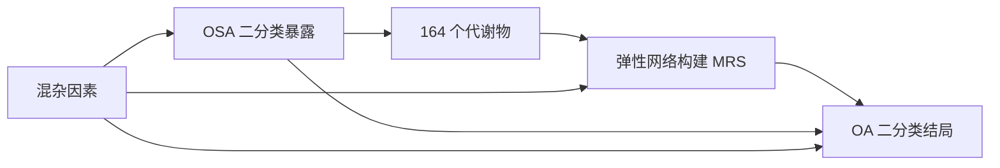

# OSA—代谢综合评分—OA 中介分析研究方案

**研究主题**：阻塞性睡眠呼吸暂停（obstructive sleep apnea, OSA）是否通过代谢改变影响骨关节炎（osteoarthritis, OA）风险。  
**暴露变量**：OSA，二分类。  
**候选中介变量**：164 个连续代谢物。  
**结局变量**：OA，二分类。  
**核心方法**：用弹性网络（elastic net）在 164 个代谢物中构建代谢综合评分（metabolic risk score, MRS），主分析使用 `lambda.1se`；随后将 MRS 作为单一连续中介变量，评估 OSA 对 OA 的总效应、自然直接效应、自然间接效应和中介比例。

---

## 1. 研究目的与假设

### 1.1 主要研究问题

在控制基础混杂因素后，OSA 与 OA 的关联是否部分由代谢综合评分（MRS）所中介？

### 1.2 主要假设

1. OSA 与 OA 风险升高相关。
2. OSA 与代谢综合评分升高相关。
3. 代谢综合评分与 OA 风险升高相关。
4. 代谢综合评分在 OSA 与 OA 之间存在统计学意义上的中介效应。

### 1.3 次要问题

1. 弹性网络在 `lambda.1se` 下选择的关键代谢物有哪些？
2. 用 `lambda.min`、不同 `alpha`、不同缺失值处理策略构建的 MRS 是否得到一致结论？
3. OSA × MRS 是否存在暴露—中介交互作用？
4. 中介效应是否在性别、BMI 分层或年龄分层中存在异质性？

---

## 2. 研究设计

### 2.1 研究类型

根据数据结构选择：

- **横断面或病例对照数据**：以 OA 二分类状态作为结局，采用 logistic 回归和反事实框架中介分析。
- **队列数据但仅使用二分类 OA 状态**：仍可按二分类结局处理。
- **若有 OA 发病时间**：可将主分析扩展为 Cox 模型或离散时间生存模型；本方案先按二分类 OA 结局设计。

### 2.2 推荐分析流程概览



实际中介分析使用的是：

```text
OSA -> MRS -> OA
OSA -> OA
```

其中 MRS 是 164 个代谢物的加权线性组合。

---

## 3. 研究对象

### 3.1 纳入标准

1. 有明确 OSA 状态记录。
2. 有明确 OA 状态记录。
3. 至少有可用的代谢组数据。
4. 具有主要协变量信息，例如年龄、性别、BMI 等。

### 3.2 排除标准

1. 缺失 OSA 或 OA 状态。
2. 代谢组整体质量控制不合格。
3. 代谢物缺失比例过高的个体，例如 >20% 或 >30%，阈值应在分析前预先设定。
4. 关键混杂变量缺失且无法通过多重插补处理。
5. 如为队列研究，可排除基线已有 OA 的个体后做 incident OA 敏感性分析。

### 3.3 分析样本定义

建议形成三个样本集：

| 样本集 | 用途 | 定义 |
|---|---|---|
| 样本 A | 描述性分析 | 有 OSA、OA 和基本人口学信息 |
| 样本 B | 弹性网络建模 | 有 OA 和 164 个代谢物，且通过代谢组 QC |
| 样本 C | 中介分析主样本 | 有 OSA、OA、MRS 和协变量 |

主分析应使用样本 C。样本 A、B、C 的人数变化需要用流程图报告。

---

## 4. 变量定义

### 4.1 暴露变量：OSA

变量名建议：`OSA`

编码：

```text
OSA = 1：有 OSA
OSA = 0：无 OSA
```

可能来源：

- 医院诊断；
- ICD 编码；
- 自我报告；
- 睡眠监测；
- 药物或治疗记录辅助定义，例如 CPAP 使用。

建议主分析使用最可靠定义；若存在多种定义，做敏感性分析。

### 4.2 结局变量：OA

变量名建议：`OA`

编码：

```text
OA = 1：有 OA
OA = 0：无 OA
```

可能来源：

- ICD 诊断；
- 自我报告；
- 影像学诊断；
- 关节置换记录；
- 医院住院或门诊记录。

如可区分部位，可进行次要分析：

- 膝 OA；
- 髋 OA；
- 手 OA；
- 任意部位 OA。

### 4.3 候选中介变量：164 个代谢物

变量名建议：

```text
met_001, met_002, ..., met_164
```

要求：

1. 均为连续变量。
2. 进行质量控制、缺失值处理、异常值处理和标准化。
3. 构建 MRS 前，应先明确每个代谢物的单位、批次、检测平台和缺失比例。

### 4.4 最终中介变量：代谢综合评分 MRS

MRS 是弹性网络模型输出的线性预测值：

\[
\text{MRS}_i = \sum_{j=1}^{p} \hat{\beta}_j Z_{ij}
\]

其中：

- \(Z_{ij}\)：第 \(i\) 个个体第 \(j\) 个代谢物标准化后的值；
- \(\hat{\beta}_j\)：弹性网络在 `lambda.1se` 下估计的代谢物系数；
- \(p=164\)；
- 未被选择的代谢物系数为 0。

为了便于解释，建议将 MRS 再标准化为均值 0、标准差 1：

\[
\text{MRS-z}_i = \frac{\text{MRS}_i - \overline{\text{MRS}}}{SD(\text{MRS})}
\]

中介分析中使用 `MRS_z` 作为连续中介变量。

---

## 5. 混杂因素选择

### 5.1 基础混杂因素

建议最小调整集：

| 类别 | 变量示例 |
|---|---|
| 人口学 | 年龄、性别、种族/民族、教育程度或社会经济状态 |
| 体型 | BMI、腰围或体脂率 |
| 生活方式 | 吸烟、饮酒、体力活动、饮食质量 |
| 代谢健康 | 糖尿病、高血压、血脂异常 |
| 临床因素 | 心血管疾病、慢性肾病、炎症性疾病 |
| 药物 | 降糖药、降脂药、降压药、激素类药物、镇痛药 |
| 技术因素 | 代谢组检测批次、检测平台、采血时间、空腹状态、样本储存时间 |

### 5.2 分层调整模型

建议预设三个模型：

| 模型 | 调整变量 |
|---|---|
| Model 1 | 年龄、性别、种族/中心 |
| Model 2 | Model 1 + BMI、吸烟、饮酒、体力活动、社会经济状态 |
| Model 3 | Model 2 + 糖尿病、高血压、血脂异常、心血管疾病、药物、代谢组技术批次 |

**主模型建议使用 Model 2 或 Model 3。**

注意：如果某些变量可能是 OSA 影响 OA 的下游变量，例如炎症指标、后续体重变化，应避免在主分析中过度调整；可放入敏感性分析。

---

## 6. 数据预处理

### 6.1 代谢物质量控制

对 164 个代谢物逐一检查：

1. 缺失比例；
2. 分布形态；
3. 极端值；
4. 批次效应；
5. 与技术变量的相关性。

建议规则：

| 项目 | 推荐处理 |
|---|---|
| 代谢物缺失率 >20% | 主分析剔除，敏感性分析可改为 >30% |
| 个体代谢物缺失率 >20% | 主分析剔除 |
| 偏态分布 | log2 或 rank-based inverse normal transformation |
| 极端值 | winsorize 至 P1/P99 或 P0.5/P99.5 |
| 批次效应 | 在标准化前回归调整批次，或使用 ComBat |
| 标准化 | 每个代谢物转为 Z-score |

### 6.2 缺失值处理

优先级：

1. 若缺失比例很低，例如 <5%，可用中位数插补。
2. 若缺失比例中等，建议多重插补或 KNN 插补。
3. 如果代谢物存在检测下限，低于检测下限值可用 LOD/2 或基于分布的插补。
4. 所有插补参数必须只在训练集估计，并应用到测试集，避免数据泄露。

### 6.3 标准化原则

弹性网络前必须标准化代谢物。若采用交叉拟合：

- 在每个训练折中估计均值和标准差；
- 用训练折的均值和标准差转换验证折；
- 不能用全样本均值和标准差提前标准化再做交叉验证。

---

## 7. 弹性网络构建代谢综合评分

### 7.1 建模目标

主分析采用 **OA 监督型 MRS**：

```text
响应变量：OA（二分类）
预测变量：164 个标准化代谢物
模型：binomial elastic net
选择规则：lambda.1se
```

即构建一个与 OA 风险相关的代谢综合评分，再评估该评分是否位于 OSA 与 OA 的路径中。

### 7.2 为什么需要交叉拟合

如果直接在全样本中用 OA 训练 MRS，然后又在同一批个体中检验 MRS 与 OA 的关系，容易产生过拟合和乐观偏倚。因此建议主分析使用 **K 折交叉拟合**：

1. 将样本随机分成 K 折，例如 K=5 或 K=10。
2. 每次用 K-1 折训练弹性网络。
3. 在留出折中预测 MRS。
4. 合并所有留出折预测值，得到每个个体的 out-of-fold MRS。
5. 用 out-of-fold MRS 做中介分析。

这样，每个个体的 MRS 都不是由该个体自己的 OA 状态训练得到的。

### 7.3 弹性网络参数

弹性网络惩罚项：

\[
\lambda \left[(1-\alpha)\frac{1}{2}\sum_{j=1}^{p}\beta_j^2 + \alpha\sum_{j=1}^{p}|\beta_j|\right]
\]

其中：

- \(\lambda\)：整体惩罚强度；
- \(\alpha=1\)：LASSO；
- \(\alpha=0\)：Ridge；
- \(0<\alpha<1\)：Elastic net。

推荐方案：

| 参数 | 主分析设置 |
|---|---|
| family | `binomial` |
| type.measure | `deviance`；敏感性分析用 `auc` |
| nfolds | 内层 10-fold CV |
| alpha | 网格搜索，例如 0.1, 0.2, ..., 0.9；也可预设 0.5 |
| lambda | 使用 `lambda.1se` |
| 标准化 | 已手动标准化时设 `standardize = FALSE`；否则设 `TRUE` |
| 类别不平衡 | 可考虑 observation weights，敏感性分析中使用 |

### 7.4 lambda.1se 的解释

`lambda.min` 是交叉验证误差最小的 \(\lambda\)。  
`lambda.1se` 是在最小误差 1 个标准误范围内的最大 \(\lambda\)。  

因此，`lambda.1se` 通常产生更稀疏、更稳定、可解释性更强的模型，适合作为主分析。

### 7.5 alpha 的选择

推荐两种可选策略：

#### 策略 A：预设 alpha = 0.5

适合样本量不大、希望方案简单稳定时使用。

```text
alpha = 0.5
lambda = lambda.1se
```

#### 策略 B：alpha 网格搜索

适合样本量较大时使用。

1. 设置 `alpha_grid = seq(0.1, 0.9, by = 0.1)`。
2. 对每个 alpha 进行内层交叉验证。
3. 对每个 alpha 取 `lambda.1se`。
4. 选择交叉验证误差最低，或误差在 1SE 内且非零代谢物更少的 alpha。
5. 用该 alpha 和 `lambda.1se` 生成 MRS。

主方案推荐策略 B；若结果不稳定，使用 alpha = 0.5 作为固定参数敏感性分析。

### 7.6 MRS 的生成

在每个外层折中：

```text
训练集：拟合 elastic net，获得 beta_j
验证集：MRS_i = sum(beta_j * standardized_metabolite_ij)
```

合并所有验证集预测后，得到：

```text
MRS_raw：out-of-fold 线性预测值
MRS_z：标准化后的 MRS_raw
```

中介分析使用 `MRS_z`。

### 7.7 弹性网络输出

需要报告：

1. 最优 alpha；
2. `lambda.1se`；
3. `lambda.min`；
4. 被选择的代谢物数量；
5. 被选择代谢物的名称、方向和系数；
6. out-of-fold AUC；
7. out-of-fold Brier score；
8. 校准图或校准斜率；
9. MRS 在 OSA 与非 OSA 人群中的分布差异。

---

## 8. 描述性分析

### 8.1 基线特征表

按 OSA 分组报告：

| 变量 | 非 OSA | OSA | P 值或 SMD |
|---|---:|---:|---:|
| 年龄 |  |  |  |
| 女性比例 |  |  |  |
| BMI |  |  |  |
| OA 患病率 |  |  |  |
| 糖尿病 |  |  |  |
| 高血压 |  |  |  |
| MRS_z |  |  |  |

建议优先报告标准化均差（standardized mean difference, SMD），而不仅是 P 值。

### 8.2 代谢评分分布

1. 绘制 MRS_z 的直方图或密度图；
2. 按 OSA 状态比较 MRS_z；
3. 按 OA 状态比较 MRS_z；
4. 报告 MRS_z 与主要协变量的相关性。

---

## 9. 总效应分析

先检验 OSA 与 OA 的总关联。

### 9.1 Logistic 回归

\[
\text{logit}\{P(OA=1)\} = \gamma_0 + \gamma_1 OSA + \gamma_C C
\]

其中 \(C\) 为协变量。

报告：

- OR；
- 95% CI；
- P 值；
- 模型调整变量。

### 9.2 R 代码示例

```r
fit_total <- glm(
  OA ~ OSA + age + sex + BMI + smoking + alcohol + physical_activity + diabetes + hypertension + batch,
  data = dat,
  family = binomial()
)

summary(fit_total)
exp(cbind(OR = coef(fit_total), confint(fit_total)))
```

---

## 10. OSA 与 MRS 的关联

### 10.1 线性回归

\[
MRS_z = \beta_0 + \beta_1 OSA + \beta_C C + \epsilon
\]

报告：

- OSA 对 MRS_z 的回归系数；
- 95% CI；
- P 值。

### 10.2 R 代码示例

```r
fit_a_m <- lm(
  MRS_z ~ OSA + age + sex + BMI + smoking + alcohol + physical_activity + diabetes + hypertension + batch,
  data = dat
)

summary(fit_a_m)
```

---

## 11. MRS 与 OA 的关联

### 11.1 Logistic 回归

\[
\text{logit}\{P(OA=1)\} = \theta_0 + \theta_1 OSA + \theta_2 MRS_z + \theta_C C
\]

报告：

- 每升高 1 SD MRS_z 对 OA 的 OR；
- OSA 调整后的 OR；
- 95% CI；
- P 值。

### 11.2 暴露—中介交互

进一步拟合：

\[
\text{logit}\{P(OA=1)\} = \theta_0 + \theta_1 OSA + \theta_2 MRS_z + \theta_3(OSA \times MRS_z) + \theta_C C
\]

若交互项显著，主中介分析应保留交互项；即使交互不显著，也建议在敏感性分析中比较包含和不包含交互项的结果。

---

## 12. 中介分析主方案

### 12.1 中介模型

\[
MRS_z = \beta_0 + \beta_1 OSA + \beta_C C + \epsilon
\]

### 12.2 结局模型

\[
\text{logit}\{P(OA=1)\} = \theta_0 + \theta_1 OSA + \theta_2 MRS_z + \theta_3(OSA \times MRS_z) + \theta_C C
\]

### 12.3 效应分解

基于反事实框架估计：

| 指标 | 含义 |
|---|---|
| TE | 总效应：OSA 对 OA 的总体影响 |
| NDE | 自然直接效应：不经过 MRS 的路径 |
| NIE | 自然间接效应：经过 MRS 的路径 |
| PM | 中介比例：间接效应占总效应的比例 |

对二分类结局，建议同时报告：

1. OR 尺度的 NDE、NIE、TE；
2. 风险差尺度的 NDE、NIE、TE；
3. 中介比例及其 95% CI；
4. bootstrap 置信区间。

若 OA 不是罕见结局，OR 尺度的中介比例可能不直观，应优先解释风险差尺度或边际风险尺度结果。

### 12.4 推荐软件

主分析推荐使用 `CMAverse::cmest()`，因为其支持：

- 二分类暴露；
- 连续中介；
- 二分类结局；
- 暴露—中介交互；
- bootstrap 推断；
- 敏感性分析。

### 12.5 R 代码示例

```r
library(CMAverse)

base_covars <- c(
  "age", "sex", "BMI", "smoking", "alcohol",
  "physical_activity", "diabetes", "hypertension", "batch"
)

med_fit <- cmest(
  data = dat,
  model = "rb",
  outcome = "OA",
  exposure = "OSA",
  mediator = "MRS_z",
  basec = base_covars,
  EMint = TRUE,
  yreg = "logistic",
  mreg = list("linear"),
  astar = 0,
  a = 1,
  estimation = "imputation",
  inference = "bootstrap",
  nboot = 1000,
  boot.ci.type = "per"
)

summary(med_fit)
```

建议正式分析将 `nboot` 提高到 2000 或 5000。

---

## 13. 完整 R 分析框架

以下代码为模板，需要根据实际变量名修改。

```r
# =========================================================
# 0. 环境准备
# =========================================================

library(dplyr)
library(glmnet)
library(pROC)
library(CMAverse)
library(caret)

set.seed(20260528)

# dat: 一行一个个体
# OSA: 0/1
# OA: 0/1
# met_vars: 164 个代谢物变量名
# covars: 协变量名

met_vars <- paste0("met_", sprintf("%03d", 1:164))

covars <- c(
  "age", "sex", "BMI", "smoking", "alcohol",
  "physical_activity", "diabetes", "hypertension", "batch"
)

# =========================================================
# 1. 数据检查
# =========================================================

dat <- dat %>%
  filter(!is.na(OSA), !is.na(OA))

# 确保二分类变量编码正确
dat$OSA <- as.integer(dat$OSA)
dat$OA  <- as.integer(dat$OA)

# =========================================================
# 2. 代谢物缺失率过滤
# =========================================================

met_missing <- sapply(dat[, met_vars], function(x) mean(is.na(x)))

keep_met <- names(met_missing[met_missing <= 0.20])
length(keep_met)

# 个体代谢物缺失率过滤
dat$met_miss_rate <- apply(dat[, keep_met], 1, function(x) mean(is.na(x)))
dat <- dat %>% filter(met_miss_rate <= 0.20)

# =========================================================
# 3. 简单插补 + 转换 + winsorize 函数
#    正式分析建议在每个训练折内估计参数
# =========================================================

winsorize <- function(x, probs = c(0.01, 0.99)) {
  qs <- quantile(x, probs = probs, na.rm = TRUE)
  x[x < qs[1]] <- qs[1]
  x[x > qs[2]] <- qs[2]
  x
}

for (v in keep_met) {
  # 中位数插补
  med <- median(dat[[v]], na.rm = TRUE)
  dat[[v]][is.na(dat[[v]])] <- med

  # 如全部为正且偏态，可 log 转换
  if (all(dat[[v]] > 0, na.rm = TRUE)) {
    dat[[v]] <- log2(dat[[v]])
  }

  dat[[v]] <- winsorize(dat[[v]])
}

# =========================================================
# 4. K 折交叉拟合构建 out-of-fold MRS
# =========================================================

K <- 5
foldid_outer <- createFolds(dat$OA, k = K, list = FALSE)
alpha_grid <- seq(0.1, 0.9, by = 0.1)

dat$MRS_oof <- NA_real_
selected_info <- list()

for (k in 1:K) {

  train_idx <- which(foldid_outer != k)
  test_idx  <- which(foldid_outer == k)

  train_dat <- dat[train_idx, ]
  test_dat  <- dat[test_idx, ]

  # 训练折标准化参数
  mu <- sapply(train_dat[, keep_met], mean, na.rm = TRUE)
  sdv <- sapply(train_dat[, keep_met], sd, na.rm = TRUE)
  sdv[sdv == 0] <- 1

  x_train <- scale(as.matrix(train_dat[, keep_met]), center = mu, scale = sdv)
  x_test  <- scale(as.matrix(test_dat[, keep_met]), center = mu, scale = sdv)

  y_train <- train_dat$OA

  cv_list <- list()
  perf <- data.frame(alpha = alpha_grid, cvm_1se = NA_real_, nzero_1se = NA_integer_)

  for (a_i in seq_along(alpha_grid)) {
    a <- alpha_grid[a_i]

    cvfit <- cv.glmnet(
      x = x_train,
      y = y_train,
      family = "binomial",
      alpha = a,
      nfolds = 10,
      type.measure = "deviance",
      standardize = FALSE
    )

    idx_1se <- which.min(abs(cvfit$lambda - cvfit$lambda.1se))

    cv_list[[as.character(a)]] <- cvfit
    perf$cvm_1se[a_i] <- cvfit$cvm[idx_1se]
    perf$nzero_1se[a_i] <- cvfit$nzero[idx_1se]
  }

  # 选择 cvm_1se 最小的 alpha；若并列，可选 nzero 更少者
  best_row <- perf %>%
    arrange(cvm_1se, nzero_1se) %>%
    slice(1)

  best_alpha <- best_row$alpha
  best_cvfit <- cv_list[[as.character(best_alpha)]]

  # 留出折预测线性预测值，作为 MRS
  dat$MRS_oof[test_idx] <- as.numeric(
    predict(best_cvfit, newx = x_test, s = "lambda.1se", type = "link")
  )

  coefs <- coef(best_cvfit, s = "lambda.1se")
  selected_info[[k]] <- list(
    fold = k,
    alpha = best_alpha,
    lambda_1se = best_cvfit$lambda.1se,
    lambda_min = best_cvfit$lambda.min,
    coefficients = coefs
  )
}

# 标准化 MRS
dat$MRS_z <- as.numeric(scale(dat$MRS_oof))

# =========================================================
# 5. out-of-fold 预测性能
# =========================================================

auc_mrs <- pROC::auc(dat$OA, dat$MRS_oof)
auc_mrs

# =========================================================
# 6. 全样本拟合一次，用于报告最终入选代谢物
#    注意：中介分析使用 out-of-fold MRS；全样本模型仅用于展示权重
# =========================================================

x_all <- scale(as.matrix(dat[, keep_met]))
y_all <- dat$OA

final_cv <- cv.glmnet(
  x = x_all,
  y = y_all,
  family = "binomial",
  alpha = 0.5,
  nfolds = 10,
  type.measure = "deviance",
  standardize = FALSE
)

final_coef <- as.matrix(coef(final_cv, s = "lambda.1se"))
final_coef_df <- data.frame(
  metabolite = rownames(final_coef),
  coefficient = as.numeric(final_coef[, 1])
) %>%
  filter(coefficient != 0, metabolite != "(Intercept)") %>%
  arrange(desc(abs(coefficient)))

write.csv(final_coef_df, "selected_metabolites_lambda_1se.csv", row.names = FALSE)

# =========================================================
# 7. 总效应：OSA -> OA
# =========================================================

form_total <- as.formula(
  paste("OA ~ OSA +", paste(covars, collapse = " + "))
)

fit_total <- glm(form_total, data = dat, family = binomial())
summary(fit_total)
exp(cbind(OR = coef(fit_total), confint(fit_total)))

# =========================================================
# 8. OSA -> MRS
# =========================================================

form_am <- as.formula(
  paste("MRS_z ~ OSA +", paste(covars, collapse = " + "))
)

fit_am <- lm(form_am, data = dat)
summary(fit_am)

# =========================================================
# 9. OSA + MRS -> OA
# =========================================================

form_my <- as.formula(
  paste("OA ~ OSA * MRS_z +", paste(covars, collapse = " + "))
)

fit_my <- glm(form_my, data = dat, family = binomial())
summary(fit_my)
exp(cbind(OR = coef(fit_my), confint(fit_my)))

# =========================================================
# 10. 反事实中介分析
# =========================================================

med_fit <- cmest(
  data = dat,
  model = "rb",
  outcome = "OA",
  exposure = "OSA",
  mediator = "MRS_z",
  basec = covars,
  EMint = TRUE,
  yreg = "logistic",
  mreg = list("linear"),
  astar = 0,
  a = 1,
  estimation = "imputation",
  inference = "bootstrap",
  nboot = 1000,
  boot.ci.type = "per"
)

summary(med_fit)
```

---

## 14. 敏感性分析

### 14.1 弹性网络相关敏感性分析

| 敏感性分析 | 目的 |
|---|---|
| `lambda.min` 替代 `lambda.1se` | 检验更复杂模型下结论是否一致 |
| 固定 `alpha=0.5` | 避免 alpha 选择带来的不稳定 |
| `type.measure="auc"` | 检验以区分度为目标时结果是否一致 |
| 不同外层 K 值，例如 K=5 vs K=10 | 检验交叉拟合稳定性 |
| bootstrap 重复构建 MRS | 评估入选代谢物稳定性 |
| 不同代谢物缺失阈值，例如 10%、20%、30% | 检验 QC 规则影响 |
| 不同转换方式，例如 log2 vs rank inverse normal | 检验分布处理影响 |

### 14.2 中介分析相关敏感性分析

1. 不包含 OSA × MRS 交互项。
2. 包含 OSA × MRS 交互项。
3. 使用风险差尺度解释中介效应。
4. 使用 robust Poisson 或 log-binomial 估计风险比尺度结果。
5. 使用 `nboot=5000` 验证主结果稳定性。
6. 对中介—结局未测量混杂进行敏感性分析。
7. 在 BMI、性别、年龄层中分层估计。
8. 排除糖尿病、严重心血管疾病或慢性炎症性疾病个体。
9. 调整或不调整 BMI 比较结果，因为 BMI 可能既是混杂因素，也可能参与 OSA 与 OA 的部分因果路径。
10. 若有时间顺序数据，限制为 OSA 发生在 OA 前，代谢物测量在 OA 前。

### 14.3 替代评分构建策略

作为次要分析，可构建 **OSA 监督型代谢评分**：

```text
响应变量：OSA
预测变量：164 个代谢物
模型：binomial elastic net
lambda：lambda.1se
```

然后评估该 OSA-related MRS 与 OA 的关系及其中介作用。  
该分析可回答：“OSA 相关代谢模式是否解释 OSA—OA 关联？”

主方案仍建议使用 OA 监督型 MRS，并通过交叉拟合减少过拟合。

---

## 15. 多重检验与解释原则

1. 主检验为 MRS 的中介效应，主要关注 NIE 和 PM。
2. 164 个单个代谢物的结果属于探索性分析，应进行 FDR 校正。
3. 弹性网络选择的代谢物不应直接解释为显著代谢物；它们是预测模型中的稳定特征。
4. 若要对单个代谢物作推断，需要另行进行单代谢物中介分析，并控制 FDR。
5. 代谢物通路富集分析应作为解释性辅助，而不是主要因果证据。

---

## 16. 结果呈现模板

### 16.1 Table 1：基线特征

| 变量 | 总体 | 非 OSA | OSA | SMD |
|---|---:|---:|---:|---:|
| N |  |  |  |  |
| 年龄 |  |  |  |  |
| 女性，n (%) |  |  |  |  |
| BMI |  |  |  |  |
| OA，n (%) |  |  |  |  |
| MRS_z |  |  |  |  |

### 16.2 Table 2：弹性网络模型表现

| 指标 | 结果 |
|---|---:|
| 外层交叉验证 K |  |
| alpha 选择策略 |  |
| 最优 alpha |  |
| lambda.1se |  |
| 入选代谢物数 |  |
| out-of-fold AUC |  |
| Brier score |  |

### 16.3 Table 3：入选代谢物

| 代谢物 | 系数 | 方向 |
|---|---:|---|
| metabolite_1 |  | 正向 |
| metabolite_2 |  | 负向 |

### 16.4 Table 4：关联分析

| 模型 | 暴露/预测变量 | OR 或 β | 95% CI | P 值 |
|---|---|---:|---:|---:|
| OSA -> OA | OSA |  |  |  |
| OSA -> MRS | OSA |  |  |  |
| MRS -> OA | MRS_z |  |  |  |
| OSA × MRS -> OA | 交互项 |  |  |  |

### 16.5 Table 5：中介效应

| 效应 | 估计值 | 95% CI | P 值 |
|---|---:|---:|---:|
| TE |  |  |  |
| NDE |  |  |  |
| NIE |  |  |  |
| PM |  |  |  |

---

## 17. 图形展示

建议至少包含：

1. 研究流程图；
2. 代谢物 QC 流程图；
3. 弹性网络交叉验证曲线；
4. 入选代谢物系数条形图；
5. MRS 在 OSA 分组中的箱线图；
6. MRS 在 OA 分组中的箱线图；
7. 中介效应森林图；
8. 敏感性分析森林图；
9. 若做通路富集，展示通路气泡图。

---

## 18. 因果假设与局限性

### 18.1 中介分析识别假设

需要满足：

1. OSA 与 OA 之间无未测量混杂；
2. OSA 与 MRS 之间无未测量混杂；
3. MRS 与 OA 之间无未测量混杂；
4. 不存在受 OSA 影响、同时混杂 MRS 与 OA 的变量，除非使用能处理 post-exposure confounding 的方法；
5. OSA 发生在 MRS 改变之前，MRS 发生在 OA 之前；
6. 模型形式正确，或使用足够稳健的建模策略。

### 18.2 主要局限性

1. 若数据为横断面，时间顺序不能完全确认，不能强因果解释。
2. MRS 是由 OA 监督训练得到，虽使用交叉拟合减少过拟合，但仍属于 outcome-informed mediator score。
3. 弹性网络选择的代谢物可能受样本、批次、平台影响。
4. OA 和 OSA 若来自自我报告，可能存在误分类。
5. BMI 既可能是混杂因素，也可能位于部分因果路径中，需谨慎解释。
6. 如果 OA 患病率较高，OR 尺度的中介比例可能不直观，应结合风险差尺度解释。

---

## 19. 预注册式主分析定义

建议在正式分析前写明：

1. 暴露：`OSA`，0/1。
2. 结局：`OA`，0/1。
3. 候选代谢物：164 个连续代谢物。
4. 主中介：out-of-fold `MRS_z`。
5. MRS 构建方法：binomial elastic net。
6. λ 选择：`lambda.1se`。
7. alpha：0.1–0.9 网格搜索；若不稳定则主分析固定 alpha=0.5。
8. 外层交叉拟合：5-fold 或 10-fold。
9. 内层调参：10-fold CV。
10. 主中介模型：`CMAverse::cmest(model="rb", yreg="logistic", mreg=list("linear"))`。
11. 推断：bootstrap，至少 1000 次；正式报告建议 2000–5000 次。
12. 主调整变量：年龄、性别、BMI、吸烟、饮酒、体力活动、糖尿病、高血压、批次等。
13. 主报告指标：TE、NDE、NIE、PM 及 95% CI。
14. 显著性标准：双侧 P<0.05；单代谢物探索结果 FDR<0.05。

---

## 20. 推荐论文结果表述

### 20.1 方法部分示例

> We constructed an OA-related metabolic risk score using elastic-net penalized logistic regression with 164 standardized metabolites as predictors and OA status as the binary outcome. To reduce optimism and avoid reusing individual outcome information for score construction, we generated out-of-fold predictions using K-fold cross-fitting. Within each training fold, the elastic-net model was tuned by 10-fold cross-validation, and the penalty parameter was selected using the one-standard-error rule (`lambda.1se`). The resulting linear predictor was standardized and used as the metabolic mediator in counterfactual mediation analysis.

### 20.2 结果部分示例

> The elastic-net model selected XX metabolites at `lambda.1se`. The out-of-fold MRS showed an AUC of XX for OA. OSA was associated with higher MRS after adjustment for covariates. In mediation analysis, the natural indirect effect through MRS was XX, corresponding to a mediated proportion of XX%, suggesting that metabolic alterations may partially explain the association between OSA and OA.

---

## 21. 参考资料

1. Friedman J, Hastie T, Tibshirani R. Regularization Paths for Generalized Linear Models via Coordinate Descent. *Journal of Statistical Software*. 2010;33(1):1–22. doi:10.18637/jss.v033.i01  
2. `glmnet` 官方介绍：elastic net 可用于 logistic、multinomial、Poisson、Cox 等模型，并支持交叉验证。https://glmnet.stanford.edu/articles/glmnet.html  
3. `cv.glmnet` 文档：`lambda.1se` 定义为交叉验证误差在最小值 1 个标准误范围内的最大 lambda。https://www.rdocumentation.org/packages/glmnet/versions/5.0/topics/cv.glmnet  
4. Valeri L, VanderWeele TJ. Mediation analysis allowing for exposure–mediator interactions and causal interpretation. *Psychological Methods*. 2013;18(2):137–150. doi:10.1037/a0031034  
5. Shi B, Choirat C, Coull BA, VanderWeele TJ, Valeri L. CMAverse: A Suite of Functions for Reproducible Causal Mediation Analyses. *Epidemiology*. 2021;32(5):e20–e22. doi:10.1097/EDE.0000000000001378  
6. `CMAverse::cmest` 文档：支持 regression-based、weighting-based、IORW、natural effect model、MSM 和 g-formula 等中介分析方法。https://bs1125.github.io/CMAverse/reference/cmest  
7. VanderWeele TJ. *Explanation in Causal Inference: Methods for Mediation and Interaction*. Oxford University Press; 2015.

---

## 22. 一句话总结

本研究将 164 个代谢物通过 `lambda.1se` 弹性网络压缩为一个 OA 相关代谢综合评分，并使用交叉拟合生成个体 MRS，再在反事实中介分析框架下评估 MRS 是否中介 OSA 与 OA 的关联；主结果报告总效应、自然直接效应、自然间接效应和中介比例，并通过 `lambda.min`、不同 alpha、不同缺失处理和不同协变量模型验证稳健性。
