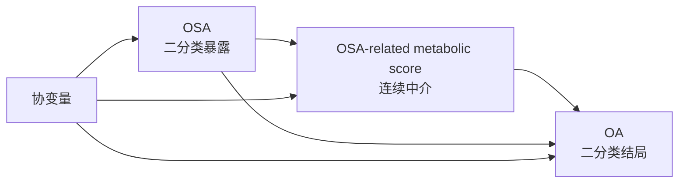
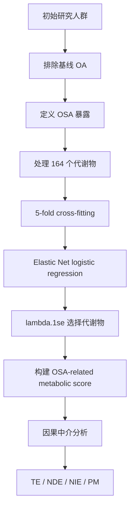

# OSA 相关代谢综合评分中介 OSA 与 OA 关系的研究方案

> **研究主题**：使用 Elastic Net 构建 OSA-related metabolic score，并评估该代谢综合评分在 OSA 与 OA 之间的中介作用  
> **暴露变量**：OSA，二分类，0=无 OSA，1=有 OSA  
> **中介变量**：Elastic Net 构建的代谢综合评分，连续变量  
> **候选代谢物**：164 个连续代谢物  
> **结局变量**：OA，二分类，0=无 OA，1=有 OA  
> **核心方法**：Elastic Net logistic regression + lambda.1se + counterfactual causal mediation analysis

---

## 1. 研究目标

本研究拟评估：

1. OSA 是否与 OA 风险升高相关；
2. OSA 是否与整体代谢异常相关；
3. OSA 相关代谢异常是否在 OSA 与 OA 之间发挥中介作用；
4. 使用 Elastic Net 构建的代谢综合评分能否作为一个稳定、可解释、可重复的整体代谢中介指标。

核心假设为：

> OSA 可能通过诱导系统性代谢异常，从而部分增加 OA 发生风险。

用因果路径表示为：



---

## 2. 为什么使用 Elastic Net 构建代谢综合评分

本研究共有 164 个代谢物，代谢物之间通常存在明显相关性。如果逐个代谢物做中介分析，容易出现多重检验、假阳性、解释困难和结果不稳定。如果直接把 164 个代谢物同时放入普通回归模型，又容易出现共线性和过拟合。

Elastic Net 同时包含 LASSO 和 Ridge 的正则化思想：

- LASSO 部分有助于变量选择，使部分代谢物系数变为 0；
- Ridge 部分有助于处理高度相关的代谢物；
- Elastic Net 适合代谢组学这类高相关、多变量的评分构建场景。

本方案采用 `lambda.1se`，即在交叉验证误差位于最小误差 1 个标准误以内时选择最强正则化的 lambda。相比 `lambda.min`，`lambda.1se` 通常得到更稀疏、更保守、更稳定的模型。

---

## 3. 评分构建的核心原则

### 3.1 主分析评分应为 OSA-related metabolic score

本研究的中介路径是：

```text
OSA → 代谢综合评分 → OA
```

因此，代谢综合评分应反映 **OSA 相关代谢扰动模式**，而不是直接反映 OA 预测风险。

推荐评分构建方向：

```text
164 个代谢物 + 协变量 → 预测 OSA
```

不推荐主分析使用：

```text
164 个代谢物 → 预测 OA
```

原因是，如果用 OA 训练代谢评分，再用该评分做 OSA 与 OA 的中介分析，会把结局信息带入中介变量，形成 outcome leakage，可能夸大中介效应。

---

### 3.2 协变量不应与代谢物一样被惩罚

Elastic Net 模型中建议同时纳入协变量，但协变量不应参与变量筛选，而应作为调整项保留。也就是说：

- 164 个代谢物：参与惩罚，`penalty.factor = 1`；
- 年龄、性别、BMI 等协变量：不参与惩罚，`penalty.factor = 0`。

这样做的逻辑是：

> 我们希望选择 OSA 相关代谢物，但这个选择应在控制基础混杂因素后完成。

最终代谢评分只使用代谢物系数计算，不把协变量系数纳入评分。

---

## 4. 研究对象与队列定义

### 4.1 推荐的队列设计

如果数据中有随访时间，最严谨的设计为前瞻性队列：

```text
基线 OSA 状态 + 基线代谢物水平 → 随访期间新发 OA
```

推荐步骤：

1. 纳入有 OSA 状态、代谢物数据、OA 信息和协变量信息的研究对象；
2. 排除基线已有 OA 的个体；
3. 排除代谢物测量时间晚于 OA 发生时间的个体；
4. 将随访中新发 OA 定义为结局。

如果当前 OA 只是横断面二分类变量，也可以进行分析，但论文表述应更谨慎：

> 本研究评估代谢综合评分在 OSA 与 OA 关联中的统计中介作用。

不要过度写成：

> OSA 通过代谢异常导致 OA。

---

## 5. 变量定义

### 5.1 暴露变量：OSA

```text
OSA = 0：无 OSA
OSA = 1：有 OSA
```

OSA 可来自自我报告、住院诊断、死亡登记或综合疾病定义。最终需要明确 OSA 的定义来源和时间点。

---

### 5.2 候选中介变量：164 个代谢物

所有代谢物应作为连续变量处理，建议统一标准化为 Z-score。

```text
Z_metabolite_j = (metabolite_j - mean_j) / SD_j
```

---

### 5.3 结局变量：OA

```text
OA = 0：未发生 OA
OA = 1：发生 OA
```

如果有随访时间，建议进一步定义：

```text
incident OA = 基线无 OA，随访期间首次发生 OA
```

---

### 5.4 协变量

建议分层调整：

#### Model 1：基础人口学模型

```text
年龄 + 性别 + 种族/民族 + 评估中心 + 代谢物检测批次
```

#### Model 2：社会经济与生活方式模型

```text
Model 1 + 教育水平 + Townsend deprivation index/收入 + 吸烟 + 饮酒 + 体力活动
```

#### Model 3：完全模型

```text
Model 2 + BMI
```

BMI 是 OSA 与 OA 之间非常重要的混杂因素，但也可能位于代谢通路附近。因此推荐：

- 主分析调整 BMI；
- 敏感性分析不调整 BMI；
- 比较中介效应是否明显变化。

不建议在主模型中调整糖尿病、高血脂、高血压等代谢性疾病，因为它们可能本身就是 OSA → 代谢异常 → OA 路径的一部分。可以把这些变量放入敏感性分析。

---

## 6. 数据预处理

### 6.1 样本层面处理

建议排除：

1. 缺失 OSA 信息的个体；
2. 缺失 OA 信息的个体；
3. 缺失大部分代谢物数据的个体；
4. 基线已有 OA 的个体，若研究新发 OA；
5. 代谢物测量时间晚于 OA 发生时间的个体，若有时间信息。

---

### 6.2 代谢物缺失值处理

建议流程：

1. 删除缺失率过高的代谢物，例如缺失率 >20%；
2. 对剩余代谢物进行插补；
3. 插补方法可选：
   - 中位数插补；
   - KNN 插补；
   - 多重插补；
4. 主分析可使用中位数插补，敏感性分析使用其他插补方法。

如果 164 个代谢物都已通过平台质控，且缺失很少，可以保留全部 164 个代谢物。

---

### 6.3 极端值处理

建议对每个代谢物进行缩尾处理：

```text
低于第 1 百分位数的值设为第 1 百分位数
高于第 99 百分位数的值设为第 99 百分位数
```

即：

```text
winsorization at 1st and 99th percentiles
```

敏感性分析可使用 0.5% 和 99.5% 缩尾。

---

### 6.4 分布转换

对于明显右偏的代谢物，可以进行 log 转换：

```text
log_metabolite = log(metabolite + small constant)
```

如果平台已经提供标准化或正态化后的代谢物数据，可直接使用平台处理后的值，但应在方法中说明。

---

### 6.5 标准化

所有代谢物必须标准化：

```text
metabolite_z = scale(metabolite)
```

原因：

1. Elastic Net 对变量尺度敏感；
2. 不同代谢物单位不同；
3. 标准化后系数可作为权重进行加权求和。

---

## 7. Elastic Net 评分构建方案

## 7.1 主分析：5 折 cross-fitting + lambda.1se

为了避免在同一批样本中同时训练评分并估计中介效应，本方案推荐使用 5 折 cross-fitting 构建 out-of-fold metabolic score。

流程如下：

```text
将样本按 OSA 状态分层随机分为 5 折
↓
第 1 次：用 4 折训练 Elastic Net，用剩余 1 折计算评分
↓
第 2 次：换另一折作为验证折，重复训练和评分
↓
循环 5 次
↓
每个个体都获得一个 out-of-fold metabolic score
↓
将 out-of-fold metabolic score 标准化
↓
作为中介变量进入因果中介分析
```

这种方案的优点是：

> 每个个体的代谢评分都由不包含该个体的训练集模型计算得到，从而减少过拟合和选择偏倚。

---

### 7.2 Elastic Net 模型设定

在每个训练集中建立模型：

```text
OSA ~ 164 metabolites + covariates
```

由于 OSA 是二分类变量，使用 logistic Elastic Net：

```text
family = "binomial"
```

推荐参数：

```text
alpha = 0.5
lambda = lambda.1se
nfolds = 10
```

含义：

| 参数 | 含义 | 本研究选择 |
|---|---|---|
| alpha = 0 | Ridge | 不做变量选择 |
| alpha = 1 | LASSO | 变量选择强，但相关变量中可能只保留一个 |
| alpha = 0.5 | Elastic Net | 兼顾变量选择和相关变量稳定性 |
| lambda.min | 交叉验证误差最小的 lambda | 模型更复杂 |
| lambda.1se | 1-SE 规则下最保守的 lambda | 主分析推荐 |

---

### 7.3 评分计算公式

假设 Elastic Net 在某一训练集中选择了 K 个非零系数代谢物，则对验证折中的个体计算：

```text
Metabolic Score_i = β1 × Z_metabolite_i1 + β2 × Z_metabolite_i2 + ... + βK × Z_metabolite_iK
```

其中：

- βk 是训练集中 Elastic Net 得到的代谢物系数；
- Z_metabolite_ik 是验证折中个体 i 的标准化代谢物值；
- 只使用代谢物系数，不使用协变量系数；
- 系数为正说明该代谢物升高与 OSA 可能性增加相关；
- 系数为负说明该代谢物升高与 OSA 可能性降低相关。

得到所有人的 out-of-fold score 后，再做整体 Z 标准化：

```text
Metabolic Score_z = scale(Metabolic Score)
```

最终 `Metabolic Score_z` 作为中介变量。

---

## 8. 中介分析模型

本研究最终中介变量为：

```text
M = Metabolic Score_z
```

暴露变量为：

```text
A = OSA
```

结局变量为：

```text
Y = OA
```

协变量为：

```text
C = 年龄、性别、种族、BMI、吸烟、饮酒、体力活动、教育、收入/TDI、评估中心、检测批次等
```

---

### 8.1 总效应模型

首先评估 OSA 与 OA 的总关联：

```text
logit[P(OA = 1)] = θ0 + θ1 × OSA + θC × C
```

报告：

```text
OR_total = exp(θ1)
```

解释：

> 在调整协变量后，OSA 患者发生 OA 的优势比为 OR_total。

---

### 8.2 中介模型

评估 OSA 是否与代谢综合评分相关：

```text
Metabolic Score_z = α0 + α1 × OSA + αC × C + ε
```

其中 α1 表示：

> 与非 OSA 个体相比，OSA 个体的代谢综合评分平均升高或降低多少个标准差。

---

### 8.3 结局模型

评估 OSA 和代谢综合评分与 OA 的关系：

```text
logit[P(OA = 1)] = β0 + β1 × OSA + β2 × Metabolic Score_z + β3 × OSA × Metabolic Score_z + βC × C
```

建议主分析保留交互项：

```text
OSA × Metabolic Score_z
```

原因：OSA 与代谢评分之间可能存在交互。如果忽略暴露-中介交互，可能影响自然直接效应和自然间接效应的估计。

---

## 9. 因果中介效应分解

在反事实因果中介框架下，估计以下效应：

| 指标 | 英文 | 含义 |
|---|---|---|
| 总效应 | Total Effect, TE | OSA 对 OA 的总体影响 |
| 自然直接效应 | Natural Direct Effect, NDE | 不经过代谢评分的 OSA 对 OA 的影响 |
| 自然间接效应 | Natural Indirect Effect, NIE | 通过代谢评分传递的 OSA 对 OA 的影响 |
| 中介比例 | Proportion Mediated, PM | 间接效应占总效应的比例 |

对于二分类结局，建议同时报告：

1. OR 尺度的 TE、NDE、NIE；
2. 风险差尺度的 TE、NDE、NIE；
3. 中介比例及 95% CI。

注意：

- 如果总效应很小或接近 0，中介比例可能不稳定；
- 如果直接效应和间接效应方向相反，中介比例可能出现负值或大于 100%；
- 此时应重点解释 NIE，而不是过度强调 PM。

---

## 10. 统计推断与置信区间

因为代谢评分是由 Elastic Net 生成的变量，普通中介模型的标准误可能低估不确定性。推荐两层分析策略：

### 10.1 主分析

使用 cross-fitted metabolic score 作为固定中介变量，进行因果中介分析，并使用 bootstrap 估计 95% CI。

推荐：

```text
bootstrap = 1000 次或 5000 次
```

---

### 10.2 更严格的敏感性分析

如果计算资源允许，建议进行 full-pipeline bootstrap：

```text
每次 bootstrap 重抽样
↓
重新进行 5 折 cross-fitting
↓
重新训练 Elastic Net
↓
重新计算 metabolic score
↓
重新做中介分析
↓
获得 TE、NDE、NIE、PM 的 bootstrap 分布
```

这种方法最严谨，因为它把评分构建过程的不确定性也纳入了置信区间。

---

## 11. 敏感性分析设计

### 11.1 不同评分构建方法

| 分析 | 目的 |
|---|---|
| Elastic Net，lambda.1se | 主分析，保守稳定 |
| Elastic Net，lambda.min | 检验结果是否依赖更复杂模型 |
| LASSO，alpha=1，lambda.1se | 检验稀疏选择模型的稳定性 |
| Ridge，alpha=0 | 检验不做变量选择时的整体代谢信号 |
| PCA-PC1 score | 非监督评分，避免暴露监督选择 |
| 未加权平均 Z-score | 最简单评分，作为对照 |

---

### 11.2 不同协变量模型

建议比较：

```text
Model 1：年龄 + 性别 + 种族 + 中心 + 批次
Model 2：Model 1 + 教育 + 收入/TDI + 吸烟 + 饮酒 + 体力活动
Model 3：Model 2 + BMI
Model 4：Model 2，不调整 BMI
Model 5：Model 3 + 糖尿病/高血脂/高血压
```

Model 5 仅作为敏感性分析，因为糖尿病、高血脂、高血压可能位于代谢通路上。

---

### 11.3 OSA 与代谢评分交互

比较：

```text
不含 OSA × Metabolic Score 交互项的模型
含 OSA × Metabolic Score 交互项的模型
```

如果交互项显著或结果明显不同，主结果应采用含交互模型。

---

### 11.4 非线性分析

代谢评分与 OA 之间可能不是线性关系。建议使用 restricted cubic spline 检查：

```text
OA ~ OSA + rcs(Metabolic Score_z, 3 or 4 knots) + covariates
```

如果非线性明显，需谨慎解释线性中介结果，或使用更灵活的中介模型作为补充。

---

### 11.5 反向因果敏感性分析

如果有随访时间，建议排除早期发生 OA 的个体：

```text
排除随访前 1 年发生 OA 者
排除随访前 2 年发生 OA 者
```

目的：减少潜在的反向因果，即早期未诊断 OA 已经影响代谢物水平。

---

### 11.6 单个代谢物中介分析

综合评分是主分析，但可以补充 164 个单代谢物中介分析：

```text
OSA → metabolite_j → OA
```

对 164 个代谢物分别估计 NIE，并进行 FDR 校正。该分析用于回答：

> 哪些具体代谢物可能是综合评分中介作用的主要贡献者？

注意：单代谢物中介分析应作为补充，不建议替代综合评分主分析。

---

## 12. R 代码框架

以下代码为方法框架，实际使用时需要把变量名替换为你的真实变量名。

---

### 12.1 加载包

```r
library(glmnet)
library(dplyr)
library(caret)
library(regmedint)
```

---

### 12.2 设置变量

```r
# 164 个代谢物变量名
metabolites <- paste0("met_", 1:164)

# 协变量
covars <- c(
  "age", "sex", "ethnicity", "BMI",
  "smoking", "alcohol", "physical_activity",
  "education", "TDI", "assessment_center", "batch"
)
```

---

### 12.3 代谢物标准化

```r
df[, metabolites] <- scale(df[, metabolites])
```

如果有偏态、极端值或缺失值，应在标准化前完成 log 转换、缩尾和插补。

---

### 12.4 5 折 cross-fitting 构建 out-of-fold score

```r
set.seed(20260528)

# 按 OSA 状态分层分折
folds <- createFolds(df$OSA, k = 5, list = TRUE, returnTrain = FALSE)

# 保存 out-of-fold score
df$metabolic_score_oof <- NA_real_

# 保存每折选择的代谢物
selected_list <- list()

for (k in seq_along(folds)) {
  
  test_idx <- folds[[k]]
  train_idx <- setdiff(seq_len(nrow(df)), test_idx)
  
  train_data <- df[train_idx, ]
  test_data  <- df[test_idx, ]
  
  # 代谢物矩阵
  X_met_train <- as.matrix(train_data[, metabolites])
  X_met_test  <- as.matrix(test_data[, metabolites])
  
  # 协变量矩阵，自动处理分类变量为 dummy variables
  X_cov_train <- model.matrix(
    as.formula(paste("~", paste(covars, collapse = " + "))),
    data = train_data
  )[, -1]
  
  X_cov_test <- model.matrix(
    as.formula(paste("~", paste(covars, collapse = " + "))),
    data = test_data
  )[, -1]
  
  # 合并代谢物和协变量
  X_train <- cbind(X_met_train, X_cov_train)
  X_test  <- cbind(X_met_test, X_cov_test)
  
  # 设置惩罚因子：代谢物参与惩罚，协变量不参与惩罚
  penalty_factor <- c(
    rep(1, ncol(X_met_train)),
    rep(0, ncol(X_cov_train))
  )
  
  # Elastic Net logistic regression
  cvfit <- cv.glmnet(
    x = X_train,
    y = train_data$OSA,
    family = "binomial",
    alpha = 0.5,
    nfolds = 10,
    type.measure = "deviance",
    penalty.factor = penalty_factor
  )
  
  # 使用 lambda.1se
  coef_1se <- coef(cvfit, s = "lambda.1se")
  coef_df <- data.frame(
    variable = rownames(coef_1se),
    beta = as.numeric(coef_1se)
  )
  
  # 提取代谢物系数，不包括截距和协变量
  selected_met <- coef_df %>%
    filter(variable %in% metabolites, beta != 0)
  
  selected_list[[k]] <- selected_met
  
  # 如果某折 lambda.1se 没选出代谢物，需要记录并处理
  if (nrow(selected_met) == 0) {
    warning(paste("Fold", k, "selected zero metabolites under lambda.1se."))
    df$metabolic_score_oof[test_idx] <- 0
  } else {
    beta_vec <- selected_met$beta
    names(beta_vec) <- selected_met$variable
    
    # 只使用代谢物系数计算 score，不使用协变量系数
    score_test <- as.matrix(test_data[, names(beta_vec)]) %*% beta_vec
    df$metabolic_score_oof[test_idx] <- as.numeric(score_test)
  }
}

# 最终标准化 out-of-fold score
df$metabolic_score_z <- as.numeric(scale(df$metabolic_score_oof))
```

---

### 12.5 查看每折选择的代谢物

```r
selected_all <- bind_rows(
  lapply(seq_along(selected_list), function(k) {
    selected_list[[k]] %>% mutate(fold = k)
  })
)

selected_frequency <- selected_all %>%
  group_by(variable) %>%
  summarise(
    selected_times = n(),
    mean_beta = mean(beta),
    .groups = "drop"
  ) %>%
  arrange(desc(selected_times), desc(abs(mean_beta)))

selected_frequency
```

建议报告：

1. 每折选中的代谢物数量；
2. 被重复选中的代谢物；
3. 选择频率最高的代谢物；
4. full-sample lambda.1se 模型中选中的代谢物，作为描述性结果。

---

### 12.6 训练 full-sample Elastic Net 用于描述代谢物组成

注意：full-sample 模型可用于展示最终代谢物组成，但主分析中介评分建议使用 out-of-fold score。

```r
X_met <- as.matrix(df[, metabolites])

X_cov <- model.matrix(
  as.formula(paste("~", paste(covars, collapse = " + "))),
  data = df
)[, -1]

X_all <- cbind(X_met, X_cov)

penalty_factor <- c(
  rep(1, ncol(X_met)),
  rep(0, ncol(X_cov))
)

set.seed(20260528)

cvfit_full <- cv.glmnet(
  x = X_all,
  y = df$OSA,
  family = "binomial",
  alpha = 0.5,
  nfolds = 10,
  type.measure = "deviance",
  penalty.factor = penalty_factor
)

coef_full <- coef(cvfit_full, s = "lambda.1se")

selected_full <- data.frame(
  variable = rownames(coef_full),
  beta = as.numeric(coef_full)
) %>%
  filter(variable %in% metabolites, beta != 0) %>%
  arrange(desc(abs(beta)))

selected_full
```

---

### 12.7 中介分析代码框架

```r
# 中介模型：OSA → metabolic score
fit_m <- lm(
  metabolic_score_z ~ OSA + age + sex + ethnicity + BMI +
    smoking + alcohol + physical_activity + education + TDI +
    assessment_center + batch,
  data = df
)

summary(fit_m)

# 结局模型：OSA + metabolic score → OA
fit_y <- glm(
  OA ~ OSA * metabolic_score_z + age + sex + ethnicity + BMI +
    smoking + alcohol + physical_activity + education + TDI +
    assessment_center + batch,
  data = df,
  family = binomial()
)

summary(fit_y)
```

使用 `regmedint` 进行因果中介分析：

```r
fit_med <- regmedint(
  data = df,
  yvar = "OA",
  avar = "OSA",
  mvar = "metabolic_score_z",
  cvar = covars,
  a0 = 0,
  a1 = 1,
  m_cde = 0,
  c_cond = rep(0, length(covars)),
  mreg = "linear",
  yreg = "logistic",
  interaction = TRUE,
  casecontrol = FALSE
)

summary(fit_med)
confint(fit_med)
```

实际使用时，`c_cond` 不应机械设为 0。建议：

- 连续协变量设为均值；
- 二分类协变量设为参考水平；
- 多分类协变量设为最常见水平；
- 或使用边际标准化/g-computation 获得平均人群效应。

---

## 13. 结果展示建议

### 13.1 表 1：基线特征

按 OSA 分组展示：

```text
Non-OSA vs OSA
```

变量包括：

- 年龄；
- 性别；
- BMI；
- 吸烟；
- 饮酒；
- 体力活动；
- 教育；
- TDI；
- OA 发生率；
- metabolic score。

---

### 13.2 表 2：Elastic Net 评分构成

建议展示：

| Metabolite | Coefficient | Selected frequency across folds | Direction |
|---|---:|---:|---|
| metabolite_1 |  |  | Positive |
| metabolite_2 |  |  | Negative |

其中：

- coefficient 可来自 full-sample lambda.1se 模型；
- selected frequency 来自 5 折 cross-fitting；
- direction 表示该代谢物与 OSA 相关方向。

---

### 13.3 表 3：OSA 与代谢评分的关系

报告：

| Model | β for OSA | 95% CI | P value |
|---|---:|---:|---:|
| Model 1 |  |  |  |
| Model 2 |  |  |  |
| Model 3 |  |  |  |

解释方式：

> 与非 OSA 个体相比，OSA 个体的代谢综合评分升高 β 个标准差。

---

### 13.4 表 4：中介分析结果

| Effect | Estimate | 95% CI | P value |
|---|---:|---:|---:|
| Total Effect |  |  |  |
| Natural Direct Effect |  |  |  |
| Natural Indirect Effect |  |  |  |
| Proportion Mediated |  |  |  |

建议同时给出 OR 尺度和风险差尺度结果。

---

### 13.5 图形建议

#### 图 1：研究设计流程图



#### 图 2：Elastic Net 交叉验证曲线

展示 `cv.glmnet` 图，标出：

```text
lambda.min
lambda.1se
```

#### 图 3：代谢评分分布

按 OSA 分组展示代谢评分分布：

```text
Non-OSA vs OSA
```

可使用 boxplot、violin plot 或 density plot。

#### 图 4：中介效应路径图

展示：

```text
OSA → metabolic score
metabolic score → OA
OSA → OA
NIE / NDE / PM
```

---

## 14. 可直接写进 Methods 的中文版本

本研究使用 Elastic Net logistic 回归构建 OSA 相关代谢综合评分。首先，对 164 个代谢物进行缺失值处理、极端值缩尾和 Z 标准化。随后，将 OSA 状态作为二分类因变量，将 164 个标准化代谢物作为候选预测变量，并纳入年龄、性别、种族、BMI、吸烟、饮酒、体力活动、教育水平、社会经济状态、评估中心和检测批次等协变量进行调整。Elastic Net 模型设置 alpha=0.5，并通过 10 折交叉验证选择惩罚参数 lambda。主分析采用 lambda.1se，以获得更保守和稳定的代谢物组合。模型中协变量设置为不参与惩罚，代谢物变量参与惩罚。

为减少过拟合，本研究采用 5 折 cross-fitting 构建 out-of-fold metabolic score。具体而言，将样本按 OSA 状态分层随机分为 5 折，每次使用 4 折样本训练 Elastic Net 模型，并使用训练得到的非零代谢物系数为剩余 1 折样本计算代谢评分。循环 5 次后，每位研究对象均获得一个由不包含自身的训练模型计算得到的代谢综合评分。最终将该评分进行 Z 标准化，并作为连续中介变量纳入后续因果中介分析。

在中介分析中，OSA 作为二分类暴露变量，Elastic Net 代谢综合评分作为连续中介变量，OA 作为二分类结局变量。首先使用线性回归模型评估 OSA 与代谢综合评分的关系；随后使用 logistic 回归模型评估 OSA、代谢综合评分及其交互项与 OA 的关系。基于反事实因果中介分析框架，估计总效应、自然直接效应、自然间接效应和中介比例，并通过 bootstrap 方法计算 95% 置信区间。

---

## 15. 可直接写进 Methods 的英文版本

We constructed an OSA-related metabolic score using elastic net logistic regression. All 164 metabolites were processed for missing values, winsorized to reduce the influence of extreme values, and standardized to Z-scores. OSA status was used as the binary outcome in the elastic net model, with all standardized metabolites entered as candidate predictors. Age, sex, ethnicity, body mass index, smoking status, alcohol consumption, physical activity, education, socioeconomic status, assessment center, and assay batch were included as covariates. In the elastic net model, metabolites were penalized, whereas covariates were forced into the model by setting their penalty factors to zero. The mixing parameter was set to alpha = 0.5, and the penalty parameter lambda was selected using 10-fold cross-validation. The primary analysis used lambda.1se to obtain a more parsimonious and stable metabolite signature.

To reduce overfitting, we used 5-fold cross-fitting to generate out-of-fold metabolic scores. Participants were randomly divided into five folds stratified by OSA status. In each iteration, an elastic net model was trained in four folds, and the estimated non-zero metabolite coefficients were used to calculate the metabolic score in the held-out fold. This procedure was repeated until every participant received an out-of-fold metabolic score. The resulting score was standardized and used as a continuous mediator.

Causal mediation analysis was then performed under the counterfactual framework. OSA was treated as the binary exposure, the elastic net-derived metabolic score as the continuous mediator, and OA as the binary outcome. The mediator model was fitted using linear regression, and the outcome model was fitted using logistic regression including OSA, the metabolic score, their interaction term, and covariates. Total effect, natural direct effect, natural indirect effect, and proportion mediated were estimated, with 95% confidence intervals obtained using bootstrap resampling.

---

## 16. 主要注意事项

1. 不要用 OA 训练代谢评分后再做 OSA-OA 中介分析，否则可能发生 outcome leakage。
2. 协变量应在 Elastic Net 中不参与惩罚，只让代谢物参与变量选择。
3. 主分析推荐 lambda.1se，而不是 lambda.min，因为前者更保守、更稳定。
4. 推荐使用 cross-fitting 构建 out-of-fold score，减少过拟合。
5. 中介模型中建议保留 OSA × metabolic score 交互项。
6. BMI 应作为主模型协变量，同时做不调整 BMI 的敏感性分析。
7. 糖尿病、高血脂、高血压等代谢性疾病不建议作为主模型协变量，可放入敏感性分析。
8. 如果总效应接近 0，不要过度解释中介比例，应重点解释自然间接效应。
9. 如果有随访时间，优先做新发 OA 分析；如果只有横断面 OA，因果表述必须保守。
10. 最终论文应同时报告评分构建过程、选中代谢物数量、模型性能、中介效应和敏感性分析。

---

## 17. 推荐主分析一句话总结

本研究推荐使用 **5-fold cross-fitted Elastic Net OSA-related metabolic score** 作为中介变量，其中 Elastic Net 设置 **alpha=0.5**，使用 **lambda.1se** 选择更保守的代谢物组合，并在反事实因果中介框架下估计该评分在 OSA 与 OA 关系中的自然间接效应和中介比例。

---

## 18. 参考资料

1. glmnet 官方 vignette：说明 `lambda.min` 与 `lambda.1se` 的含义。  
   https://glmnet.stanford.edu/articles/glmnet.html

2. CRAN glmnet package manual：说明 glmnet 支持 elastic-net regularized generalized linear models，包括 logistic regression。  
   https://cran.r-project.org/web/packages/glmnet/glmnet.pdf

3. regmedint CRAN 页面：regmedint 用于 regression-based causal mediation analysis，并支持 interaction and effect modification terms。  
   https://cran.r-project.org/package=regmedint

4. Valeri L, VanderWeele TJ. Mediation analysis allowing for exposure-mediator interactions and causal interpretation. Psychological Methods. 2013.  
   https://pmc.ncbi.nlm.nih.gov/articles/PMC3659198/

5. regmedint 官方说明页面：regmedint 是对 Valeri and VanderWeele regression-based causal mediation analysis 框架的扩展。  
   https://kaz-yos.github.io/regmedint/
