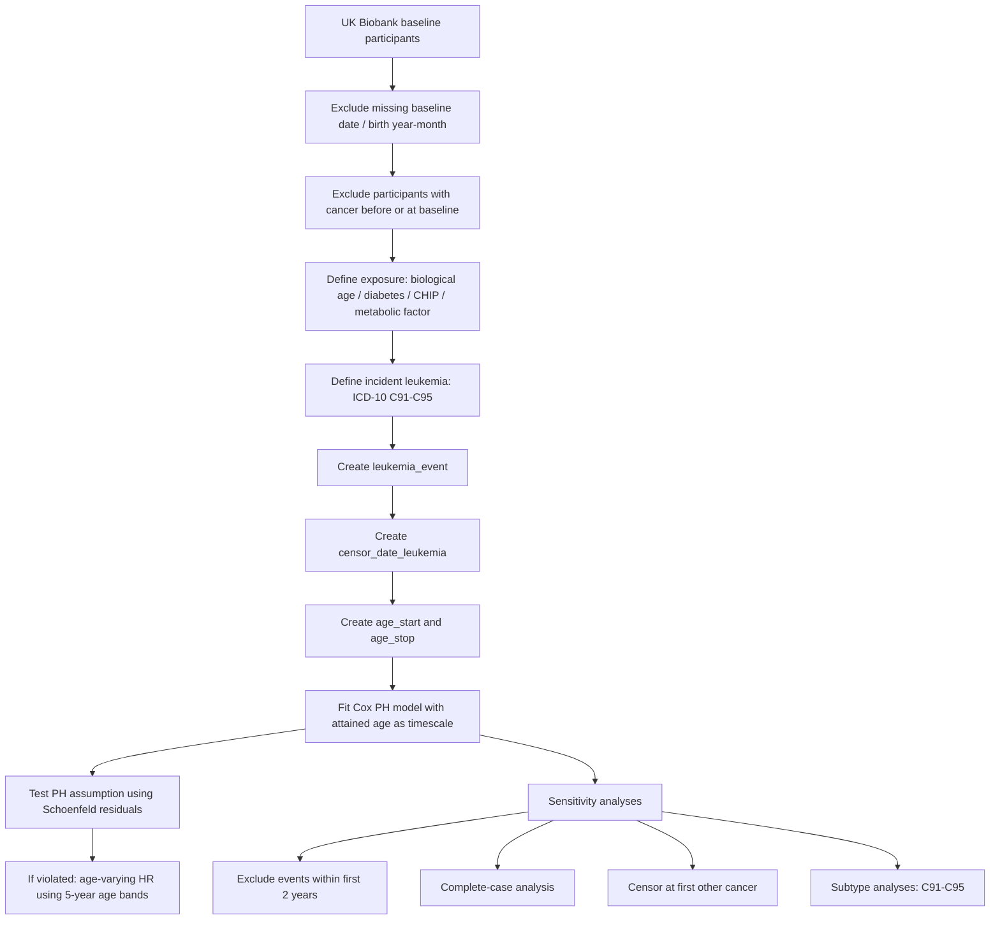

# 基于 Mak et al.（British Journal of Cancer, 2023）框架的 UK Biobank 白血病发生风险研究方案

> 适用目标：将论文 **Clinical biomarker-based biological aging and risk of cancer in the UK Biobank** 的主分析框架迁移到“白血病发生风险”研究中。  
> 核心重点：**event 如何定义、censor 如何处理、使用哪种 Cox 生存模型、时间轴如何构建**。  
> 参考论文：Mak JKL et al. *British Journal of Cancer*, 2023. DOI: 10.1038/s41416-023-02288-w  
> 参考代码仓库：https://github.com/jonathanklmak/UKB_bioage_cancer

---

## 1. 这篇文章的主分析逻辑

这篇文章研究的是 UK Biobank 中生物年龄指标与癌症发生风险之间的关系。其主分析不是 logistic 回归，而是 **time-to-event 生存分析**。

文章纳入基线无癌症史的 UK Biobank 参与者，使用 18 个临床生物标志物构建 3 个生物年龄指标，包括：

1. Klemera-Doubal method residual，简称 KDM residual；
2. PhenoAge residual；
3. Homeostatic dysregulation，简称 HD。

结局为 incident cancer，即随访期间新发癌症。文章原始结局包括：

- any cancer：ICD-10 C00-C97，排除 non-melanoma skin cancer C44；
- breast cancer：C50；
- prostate cancer：C61；
- lung cancer：C33-C34；
- colorectal cancer：C18-C20；
- melanoma：C43。

你的研究如果把结局换成白血病，本质上就是把原文中的某个 site-specific cancer outcome 替换为：

> **incident leukemia：ICD-10 C91-C95**

如果你的 UKB 癌症登记中也有 ICD-9，可作为补充定义：

> ICD-9 204-208

---

## 2. 研究问题设计

### 2.1 推荐研究题目

**Clinical biomarker-based biological aging and risk of incident leukemia in the UK Biobank**

中文可写为：

**基于临床生物标志物的生物年龄加速与 UK Biobank 队列中新发白血病风险的前瞻性关联研究**

如果你的暴露不是生物年龄，而是糖尿病、高血糖、高血脂或 CHIP，也可以把题目改成：

**Association of [exposure] with incident leukemia in the UK Biobank using an attained-age Cox model**

---

## 3. 研究对象

### 3.1 数据来源

使用 UK Biobank 前瞻性队列数据。基线评估时间通常为 2006-2010 年。

### 3.2 纳入标准

纳入满足以下条件的参与者：

1. 具有基线评估日期；
2. 具有出生年份和出生月份，可构建出生日期；
3. 具有主要暴露变量；
4. 具有白血病结局随访信息；
5. 基线时无癌症史。

如果完全模仿 Mak et al.，对于生物年龄研究，还需要：

1. 具有构建生物年龄所需的临床生物标志物；
2. 主要生物年龄指标无缺失；
3. 排除生物年龄极端异常值，例如 ±5 SD 之外。

### 3.3 排除标准

主分析建议排除：

1. 基线前或基线当天已经有任何癌症诊断者；
2. 基线前或基线当天已经有白血病诊断者；
3. 基线日期缺失者；
4. 出生年月缺失者；
5. 暴露变量缺失且无法处理者；
6. event date 或 death date 明显早于出生日期、晚于合理随访截止日期等异常记录。

注意：Mak et al. 的代码中是排除 **基线前已有任何癌症诊断者**，且 any cancer 排除了非黑色素瘤皮肤癌 C44。因此，如果要严格复刻这篇文章，建议主分析也排除基线前任何恶性肿瘤，但可不把 C44 作为排除条件。

---

## 4. 白血病 event 定义

### 4.1 主结局

主结局定义为：

> 随访期间首次发生白血病。

白血病 ICD-10 建议定义为：

| 结局 | ICD-10 代码 |
|---|---|
| Leukemia | C91-C95 |
| Lymphoid leukemia | C91 |
| Myeloid leukemia | C92 |
| Monocytic leukemia | C93 |
| Other leukemias of specified cell type | C94 |
| Leukemia of unspecified cell type | C95 |

如果研究需要更细分，可以进一步做亚型分析：

| 白血病亚型 | ICD-10 |
|---|---|
| 淋巴细胞白血病 | C91 |
| 髓系白血病 | C92 |
| 单核细胞白血病 | C93 |
| 其他明确细胞类型白血病 | C94 |
| 未特指白血病 | C95 |

### 4.2 event = 1 的条件

设：

- `baseline_date` = UKB 基线评估日期；
- `date_leukemia_first` = 癌症登记中首次白血病诊断日期；
- `admin_censor_date` = 癌症登记随访截止日期；
- `death_date` = 死亡日期。

主分析中：

```text
event = 1
当且仅当：
date_leukemia_first > baseline_date
且 date_leukemia_first <= admin_censor_date
```

即：

> 只有基线后、癌症随访截止日前首次发生白血病，才算白血病 event。

### 4.3 event = 0 的条件

以下情况 event = 0：

1. 随访期间没有白血病；
2. 白血病诊断日期在行政随访截止日期之后；
3. 死亡发生在白血病之前；
4. 到随访截止日期仍未发生白血病；
5. 失访或数据终止前未发生白血病。

---

## 5. censor 规则：这是最关键部分

### 5.1 Mak et al. 的处理方式

Mak et al. 的文章方法写道：参与者从基线开始随访，到癌症诊断、死亡或随访结束中最早者为止。

但结合其公开代码，需要特别注意：

- 对 **any cancer** 分析：event 是首次任何癌症，censor date 是首次任何癌症日期、死亡日期或行政截止日期。
- 对 **site-specific cancer** 分析：event 是对应癌种的首次诊断日期；死亡早于该癌种时 censor；否则到行政截止日期 censor。代码中没有把“先发生其他癌症”作为 site-specific cancer 主分析的 censor 条件。

因此，你如果研究 **白血病**，它属于 site-specific cancer outcome。若严格模仿这篇文章，主分析应采用：

```text
白血病 event：首次白血病诊断
censor：
1. 死亡日期，如果死亡早于白血病且早于行政随访截止；
2. 行政随访截止日期，如果未发生白血病且未死亡；
3. 白血病诊断日期，如果发生白血病。
```

也就是说，主分析不强制在“其他癌症发生日期” censor。

这一点和你上一版模仿 JNCI 糖尿病-癌症文章的处理不同。上一版更接近“目标癌症之前若先发生任何其他恶性肿瘤，则 censor”。而这篇 Mak et al. 的公开代码更像是：

> 对白血病这种 site-specific outcome，只关心白血病发生；其他癌症不是主分析中的 censor event。

### 5.2 推荐主分析 censor 规则

设定：

```text
admin_censor_date = 癌症登记随访截止日期
```

如果严格复刻 Mak et al.，可使用：

```text
admin_censor_date = 2020-02-29
```

但如果你手中 UKB 数据版本更新，可以使用你当前 release 中对应的癌症登记截止日期。注意在论文方法中说明清楚。

白血病 censor date：

```text
censor_date_leukemia = admin_censor_date

如果 leukemia_event == 1：
    censor_date_leukemia = date_leukemia_first

如果 death_date < censor_date_leukemia 且 leukemia_event == 0：
    censor_date_leukemia = death_date
```

对应逻辑：

| 情况 | leukemia_event | censor_date_leukemia |
|---|---:|---|
| 基线后发生白血病，且在截止日前 | 1 | 白血病首次诊断日期 |
| 未发生白血病，随访中死亡 | 0 | 死亡日期 |
| 未发生白血病，未死亡 | 0 | 癌症随访截止日期 |
| 白血病发生在截止日期之后 | 0 | 死亡日期或随访截止日期 |
| 先发生其他癌症，后未发生白血病 | 0 | 死亡日期或随访截止日期 |
| 先发生其他癌症，后发生白血病 | 1 | 白血病首次诊断日期，除非死亡先于白血病 |

### 5.3 建议敏感性分析中的替代 censor 规则

为了更严谨，可以做一个敏感性分析：

> 在首次任何非白血病恶性肿瘤发生时 censor。

规则：

```text
如果其他癌症日期 < 白血病日期：
    censor_date = 其他癌症日期
    leukemia_event = 0
```

这可以作为补充分析，不建议作为主分析，因为如果老师要求换成 Mak et al.，主分析应优先贴近 Mak et al. 的公开代码。

---

## 6. 时间轴：使用 attained age 作为 underlying timescale

### 6.1 为什么不用普通随访时间

Mak et al. 的 Cox 模型使用：

> attained age as the underlying timescale

也就是说，模型的时间轴不是简单的“随访了几年”，而是每个人的实际年龄。

普通写法：

```r
Surv(follow_up_time, leukemia_event)
```

而 Mak et al. 的写法是：

```r
Surv(age_at_baseline, age_at_exit, leukemia_event)
```

这相当于使用 counting process 格式的 Cox 模型。

### 6.2 出生日期构建

UKB 通常有出生年份和出生月份，但没有精确到日的出生日期。Mak et al. 的代码假设每个人出生于出生月份的第 15 天：

```stata
gen birth_date = mdy(birth_month, 15, birth_year)
```

你可以采用同样方法：

```text
birth_date = 出生年份 + 出生月份 + 15日
```

### 6.3 年龄时间轴变量

构建：

```text
age_start = (baseline_date - birth_date) / 365.25
age_stop  = (censor_date_leukemia - birth_date) / 365.25
```

Cox 模型的生存对象：

```r
Surv(age_start, age_stop, leukemia_event)
```

这才是最贴近该文的写法。

---

## 7. 主 Cox 模型

### 7.1 主模型类型

主分析使用：

> Cox proportional hazards model with attained age as the underlying timescale

中文写法：

> 采用以实际年龄为基础时间轴的 Cox 比例风险模型，评估暴露因素与新发白血病风险之间的前瞻性关联。

### 7.2 如果暴露是生物年龄

如果你完全模仿 Mak et al.，主要暴露为：

1. KDM residual，标准化为 z-score；
2. PhenoAge residual，标准化为 z-score；
3. HD，log 转换后标准化为 z-score。

模型解释为：

> 每增加 1 SD 生物年龄加速，对应白血病发生风险的 HR。

模型形式：

```r
coxph(
  Surv(age_start, age_stop, leukemia_event) ~
    bioage_z + birth_year_cat + sex + assessment_center +
    bmi_cat + ethnicity + smoking + alcohol + physical_activity +
    education + deprivation_index,
  data = df
)
```

结果报告：

```text
HR per 1-SD increase in biological age measure
```

### 7.3 如果暴露是糖尿病、高血糖、高血脂或 CHIP

如果你的真实暴露是糖尿病、高血糖、高血脂或 CHIP，可以仍然使用该文的生存模型框架。

例如暴露为糖尿病：

```r
coxph(
  Surv(age_start, age_stop, leukemia_event) ~
    diabetes + birth_year_cat + sex + assessment_center +
    bmi_cat + ethnicity + smoking + alcohol + physical_activity +
    education + deprivation_index,
  data = df
)
```

如果暴露为 CHIP：

```r
coxph(
  Surv(age_start, age_stop, leukemia_event) ~
    CHIP + birth_year_cat + sex + assessment_center +
    bmi_cat + ethnicity + smoking + alcohol + physical_activity +
    education + deprivation_index,
  data = df
)
```

如果暴露为连续变量，例如 HbA1c、glucose、LDL-C、triglycerides：

```r
coxph(
  Surv(age_start, age_stop, leukemia_event) ~
    exposure_z + birth_year_cat + sex + assessment_center +
    bmi_cat + ethnicity + smoking + alcohol + physical_activity +
    education + deprivation_index,
  data = df
)
```

其中：

```text
exposure_z = 标准化后的暴露变量
```

结果解释：

> 每增加 1 SD 暴露水平，对应白血病发生风险的 HR。

---

## 8. 为什么模型中不用再线性调整 baseline age

因为主模型已经使用实际年龄作为时间轴：

```r
Surv(age_at_baseline, age_at_exit, event)
```

这相当于非常强地控制了年龄。此时不建议再简单加入 baseline age 作为普通线性协变量，否则容易造成模型解释混乱。

但 Mak et al. 仍然加入了 birth year category，用于控制出生队列效应。你可以保留：

```text
birth_year_cat
```

例如：

| 出生年份分组 |
|---|
| 1930-1939 |
| 1940-1949 |
| 1950-1959 |
| ≥1960 |

---

## 9. 比例风险假设检验

Mak et al. 使用 Schoenfeld residuals 检验比例风险假设，对应 R 代码：

```r
cox.zph(fit)
```

你的主分析也应做：

```r
ph_test <- cox.zph(fit)
print(ph_test)
```

重点看暴露变量的 P 值。

### 9.1 如果比例风险假设不违反

如果暴露变量的 Schoenfeld 检验：

```text
P >= 0.05
```

则保留普通 Cox PH 模型。

### 9.2 如果比例风险假设违反

如果暴露变量的 Schoenfeld 检验：

```text
P < 0.05
```

Mak et al. 的处理是构建 time-varying model，把暴露与年龄时间段做交互，并按照 5 年年龄区间估计不同年龄段的 HR。

你可以写为：

> 当暴露变量不满足比例风险假设时，将实际年龄划分为 5 年区间，并加入暴露与年龄区间的交互项，估计年龄变化的 HR。

示意代码：

```r
df <- df |>
  dplyr::mutate(
    age_band = cut(
      age_stop,
      breaks = seq(40, 90, by = 5),
      right = FALSE
    )
  )

fit_tv <- coxph(
  Surv(age_start, age_stop, leukemia_event) ~
    exposure * age_band + birth_year_cat + sex + assessment_center +
    bmi_cat + ethnicity + smoking + alcohol + physical_activity +
    education + deprivation_index,
  data = df
)
```

更标准的实现可以使用 `survSplit()` 把每个人随访拆成多个年龄区间，再拟合分段 Cox 模型。

---

## 10. 非线性分析

Mak et al. 还比较了 restricted cubic spline model 和 linear model，用 likelihood ratio test 判断是否存在非线性。

你的分析可以加入：

```r
library(splines)

fit_linear <- coxph(
  Surv(age_start, age_stop, leukemia_event) ~ exposure_z + covariates,
  data = df
)

fit_spline <- coxph(
  Surv(age_start, age_stop, leukemia_event) ~ ns(exposure_z, df = 3) + covariates,
  data = df
)

anova(fit_linear, fit_spline, test = "LRT")
```

若 LRT 的 P < 0.05，则提示暴露与白血病风险之间可能存在非线性关系。

---

## 11. 反向因果敏感性分析

Mak et al. 做了一个重要敏感性分析：

> 排除随访前 2 年发生癌症者，以降低基线时已经存在未诊断癌症导致反向因果的可能性。

迁移到白血病研究中：

```text
排除 baseline_date 后 2 年内发生白血病的参与者
```

规则：

```r
df_sens_2y <- df |>
  dplyr::filter(
    leukemia_event == 0 |
    date_leukemia_first > baseline_date + 365.25 * 2
  )
```

然后重新构建 Cox 模型。

建议把这项作为关键敏感性分析，因为白血病、血液系统异常和临床生物标志物之间可能存在反向因果。

---

## 12. 缺失值处理

Mak et al. 对协变量缺失采用 missing indicator，即把缺失值编码为“missing”类别；同时又做 complete-case analysis 作为敏感性分析。

建议你也采用：

### 主分析

分类变量缺失值设为：

```text
missing / unknown
```

### 敏感性分析

排除任何主要协变量缺失者，做 complete-case analysis。

---

## 13. 多重检验

如果只研究一个主结局：白血病，则主暴露的 P 值可以按常规：

```text
two-sided P < 0.05
```

如果你同时研究多个白血病亚型，例如 C91、C92、C93、C94、C95，建议进行多重校正：

```text
Bonferroni: 0.05 / 亚型数量
```

例如 5 个亚型：

```text
P < 0.01
```

如果同时研究多个暴露和多个白血病亚型，也可使用 FDR。

---

## 14. 推荐主分析流程图



---

## 15. 主分析 R 代码骨架

```r
library(dplyr)
library(survival)

# 1. 构建出生日期
df <- df %>%
  mutate(
    birth_date = as.Date(paste0(birth_year, "-", birth_month, "-15")),
    baseline_date = as.Date(baseline_date),
    death_date = as.Date(death_date),
    date_leukemia_first = as.Date(date_leukemia_first)
  )

# 2. 设置行政随访截止日期
admin_censor_date <- as.Date("2020-02-29")

# 3. 排除基线前或基线当天已有任何癌症者
df_main <- df %>%
  filter(is.na(date_any_cancer_first) | date_any_cancer_first > baseline_date)

# 4. 定义白血病 event
df_main <- df_main %>%
  mutate(
    leukemia_event = ifelse(
      !is.na(date_leukemia_first) &
        date_leukemia_first > baseline_date &
        date_leukemia_first <= admin_censor_date,
      1, 0
    )
  )

# 5. 定义白血病 censor date
df_main <- df_main %>%
  mutate(
    censor_date_leukemia = admin_censor_date,
    censor_date_leukemia = ifelse(
      leukemia_event == 1,
      date_leukemia_first,
      censor_date_leukemia
    ),
    censor_date_leukemia = as.Date(censor_date_leukemia, origin = "1970-01-01"),
    censor_date_leukemia = ifelse(
      leukemia_event == 0 &
        !is.na(death_date) &
        death_date < censor_date_leukemia,
      death_date,
      censor_date_leukemia
    ),
    censor_date_leukemia = as.Date(censor_date_leukemia, origin = "1970-01-01")
  )

# 6. 构建 attained-age time scale
df_main <- df_main %>%
  mutate(
    age_start = as.numeric(baseline_date - birth_date) / 365.25,
    age_stop  = as.numeric(censor_date_leukemia - birth_date) / 365.25
  ) %>%
  filter(age_stop > age_start)

# 7. Cox 主模型
fit <- coxph(
  Surv(age_start, age_stop, leukemia_event) ~
    exposure + birth_year_cat + sex + assessment_center +
    bmi_cat + ethnicity + smoking + alcohol + physical_activity +
    education + deprivation_index,
  data = df_main
)

summary(fit)

# 8. 比例风险假设检验
cox.zph(fit)
```

---

## 16. 如果你使用 Stata，模型骨架如下

```stata
* 构建出生日期：假设出生在出生月份第15天
gen birth_date = mdy(birth_month, 15, birth_year)
format birth_date %td

* 行政随访截止日期
gen admin_censor_date = date("20200229", "YMD")
format admin_censor_date %td

* 排除基线前任何癌症
drop if date_any_cancer_first <= baseline_date & date_any_cancer_first != .

* 定义白血病 event
gen leukemia_event = 0
replace leukemia_event = 1 if date_leukemia_first > baseline_date ///
    & date_leukemia_first <= admin_censor_date ///
    & date_leukemia_first != .

* 定义 censor date
gen censor_date_leukemia = admin_censor_date
replace censor_date_leukemia = date_leukemia_first if leukemia_event == 1
replace censor_date_leukemia = death_date if leukemia_event == 0 ///
    & death_date < censor_date_leukemia ///
    & death_date != .

format censor_date_leukemia %td

* 构建年龄时间轴
gen age_start = (baseline_date - birth_date) / 365.25
gen age_stop  = (censor_date_leukemia - birth_date) / 365.25

drop if age_stop <= age_start

* Cox模型：以年龄作为时间轴
stset age_stop, enter(time age_start) failure(leukemia_event)

stcox exposure i.birth_year_cat i.sex i.assessment_center ///
    i.bmi_cat i.ethnicity i.smoking i.alcohol ///
    i.physical_activity i.education i.deprivation_index
```

---

## 17. 结果表建议

### 表 1：基线特征

按暴露分组展示：

| 变量 | 暴露阴性 | 暴露阳性 | 总体 |
|---|---:|---:|---:|
| N | | | |
| 年龄 | | | |
| 性别 | | | |
| BMI | | | |
| 吸烟 | | | |
| 饮酒 | | | |
| 白血病事件数 | | | |
| 随访时间 | | | |

### 表 2：主 Cox 模型

| 暴露 | 模型 | HR | 95% CI | P |
|---|---|---:|---:|---:|
| exposure | 基础模型 | | | |
| exposure | 多变量模型 | | | |

### 表 3：敏感性分析

| 分析 | HR | 95% CI | P |
|---|---:|---:|---:|
| 主分析 | | | |
| 排除前 2 年白血病 | | | |
| complete-case analysis | | | |
| censor at first other cancer | | | |
| Fine-Gray 竞争风险补充分析 | | | |

### 表 4：白血病亚型分析

| 亚型 | ICD-10 | HR | 95% CI | P |
|---|---|---:|---:|---:|
| Lymphoid leukemia | C91 | | | |
| Myeloid leukemia | C92 | | | |
| Monocytic leukemia | C93 | | | |
| Other specified leukemia | C94 | | | |
| Unspecified leukemia | C95 | | | |

---

## 18. 论文方法部分可直接改写的中文描述

本研究采用 UK Biobank 前瞻性队列数据。基线时存在任何恶性肿瘤诊断记录者被排除。白血病事件通过癌症登记数据识别，定义为随访期间首次出现 ICD-10 C91-C95 诊断。随访从基线评估日期开始，至首次白血病诊断、死亡或癌症登记随访截止日期中最早者结束。若白血病诊断发生在随访截止日期之后，则不计为事件。对于未发生白血病的参与者，若其在随访期间死亡，则在死亡日期截尾；否则在癌症登记随访截止日期截尾。

采用 Cox 比例风险模型评估暴露因素与新发白血病风险之间的关联，并以实际年龄作为基础时间轴。具体而言，进入时间定义为基线年龄，退出时间定义为事件或截尾时年龄。模型报告风险比及其 95% 置信区间。比例风险假设通过 Schoenfeld 残差进行检验；若暴露变量不满足比例风险假设，则进一步构建包含暴露与 5 年年龄区间交互项的时间变化模型。为降低潜在反向因果影响，进一步排除基线后 2 年内发生白血病的参与者进行敏感性分析。

---

## 19. 最终建议

如果老师明确要求换成这篇 Mak et al.，你的主分析应改成：

```text
基线无癌队列
+
白血病 ICD-10 C91-C95 作为 site-specific incident cancer event
+
死亡 / 行政随访截止作为 censor
+
不在主分析中因其他癌症发生而 censor
+
使用 attained age 作为 underlying timescale 的 Cox proportional hazards model
+
Schoenfeld 残差检验 PH 假设
+
必要时做年龄分段 time-varying HR
+
排除前 2 年事件作为关键敏感性分析
```

一句话总结：

> 这篇文章的白血病复刻版主分析不是 logistic，也不是 Fine-Gray，而是 **以实际年龄为时间轴的 Cox 比例风险模型**；白血病 event 是基线后首次 C91-C95，死亡和随访截止为 censor，其他癌症不作为主分析 censor，除非作为敏感性分析。
