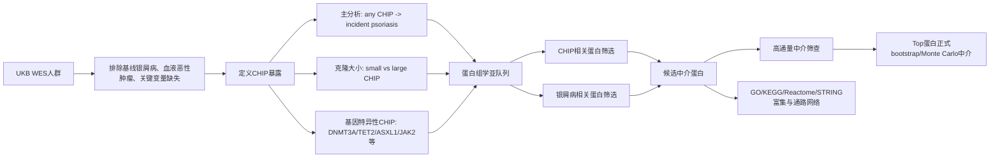

# CHIP 与银屑病关联及蛋白组学中介分析研究方案

> 适用场景：UK Biobank / 类 UKB 队列；暴露为 CHIP，结局为 incident psoriasis，机制层面使用 Olink 蛋白组学数据。  
> 核心研究问题：  
> 1. CHIP 与银屑病发生风险是否相关？  
> 2. 小克隆 CHIP 与大克隆 CHIP 是否存在剂量-反应关系？  
> 3. 特定 CHIP 驱动基因/突变类别是否与银屑病风险相关？  
> 4. 血浆蛋白是否中介 CHIP 与银屑病之间的关联？显著蛋白富集到哪些炎症、免疫和皮肤相关通路？

---

## 一、研究假设与总体设计

### 1.1 研究假设

CHIP 代表造血干/祖细胞中获得性体细胞突变克隆扩增。CHIP 可能通过免疫衰老、髓系炎症增强、IL-1β/NLRP3、TNF、IL-6、JAK-STAT、补体和中性粒细胞相关通路，增加银屑病发生风险。若大克隆 CHIP 或特定基因型 CHIP，例如 TET2、JAK2、ASXL1、DNMT3A、spliceosome genes，与银屑病风险更强相关，则支持“克隆负荷/突变类型决定免疫炎症效应”的机制假设。

### 1.2 研究类型

前瞻性队列研究。

- 主队列：有全外显子测序或可用于 CHIP calling 的 UK Biobank 参与者。
- 蛋白组学亚队列：同时具有 CHIP 数据、Olink 血浆蛋白数据和银屑病随访信息的参与者。
- 主要分析对象：基线无银屑病者。
- 主要结局：随访期间新发银屑病。
- 主要暴露：基线 CHIP 状态。

### 1.3 推荐研究主线



---

## 二、研究对象与数据来源

### 2.1 纳入标准

主分析队列建议纳入：

1. 有可用 WES/WGS 体细胞突变 calling 结果；
2. 有基线日期、年龄、性别、种族、BMI、吸烟、饮酒、社会经济状态等协变量；
3. 基线时无银屑病；
4. 无基线血液恶性肿瘤，建议额外排除 MDS、AML、MPN、CLL 等；
5. 有随访结局信息。

蛋白中介分析亚队列进一步要求：

1. 有 Olink NPX 蛋白表达数据；
2. 蛋白 QC 后保留；
3. 有 CHIP 与银屑病随访信息；
4. 有蛋白组学批次、plate、array、sample cohort 等技术变量。

### 2.2 排除标准

建议依次排除：

1. 撤回知情同意者；
2. 基线前或基线当天已有银屑病者；
3. 基线前已有血液系统恶性肿瘤或骨髓增殖性疾病者；
4. CHIP calling 质量不合格者；
5. 关键变量缺失者，或进入多重插补流程；
6. 蛋白组学中 NPX 缺失严重、assay warning、QC warning 或明显离群样本。

### 2.3 队列流程图

推荐绘制 **STROBE flow diagram**：初始 WES 人群 → 排除撤回者 → 排除基线银屑病 → 排除血液恶性肿瘤 → 排除关键变量缺失 → 主分析队列 → Olink 蛋白组学亚队列 → 蛋白中介分析队列。

---

## 三、暴露定义：CHIP、小克隆/大克隆和特定 CHIP

### 3.1 any CHIP

主暴露：

```text
any CHIP = 携带至少一个符合 CHIP driver mutation 标准的体细胞突变，且 VAF ≥ 2%
```

同时需排除已知血液恶性肿瘤，以符合 CHIP 定义。

### 3.2 小克隆 CHIP 与大克隆 CHIP

推荐三分类：

| 暴露组 | 定义 | Cox 模型参考组 |
|---|---|---|
| No CHIP | 未检出 CHIP driver mutation | 参考组 |
| Small CHIP | 2% ≤ 最大 VAF < 10% | 与 No CHIP 比较 |
| Large CHIP | 最大 VAF ≥ 10% | 与 No CHIP 比较 |

若同一受试者有多个 CHIP mutation，建议使用 **最大 VAF** 定义克隆大小。也可以在敏感性分析中使用 clone 数量、总 VAF 或最大 VAF 连续变量。

### 3.3 特定 CHIP

推荐分三层分析。

第一层：主要基因：DNMT3A、TET2、ASXL1、JAK2、TP53、PPM1D、SF3B1、SRSF2、U2AF1。

第二层：功能类别：

| 类别 | 基因示例 | 生物学意义 |
|---|---|---|
| DTA CHIP | DNMT3A, TET2, ASXL1 | 表观遗传调控、免疫衰老 |
| JAK2 CHIP | JAK2 | JAK-STAT、髓系炎症、血栓炎症倾向 |
| Spliceosome CHIP | SF3B1, SRSF2, U2AF1 | RNA 剪接、炎症和免疫异常 |
| DNA damage response CHIP | TP53, PPM1D | DNA 损伤应答、治疗/炎症选择压力 |
| Other CHIP | IDH1/2, GNB1, CBL 等 | 视样本量决定是否合并 |

第三层：突变数量：单一 CHIP mutation；多个 CHIP mutations；多克隆 vs 单克隆。

### 3.4 特定 CHIP 分析注意事项

基因特异性分析很容易受样本量限制，尤其是 JAK2、SRSF2、U2AF1、TP53 等。建议设定：

```text
若某基因 CHIP 携带者 < 50，或银屑病事件数 < 10，则不单独报告主结果，只做探索性分析或并入功能类别。
```

可视化：CHIP 基因组成条形图、不同基因 VAF 分布小提琴图、基因特异性 HR 森林图、small/large CHIP 森林图、VAF restricted cubic spline 曲线。

---

## 四、结局定义：银屑病

### 4.1 主结局

主要结局定义为 **incident psoriasis**，即基线后首次发生银屑病。

建议使用：

- ICD-10：L40.x；
- ICD-9：696.1；
- 自报疾病：UKB field 20002 code 1453 可用于识别基线既往银屑病；
- primary care 记录：若可用，纳入 Read code / clinical code；
- death register：一般用于随访终止。

### 4.2 基线银屑病排除

基线前或基线当天满足以下任一条件者，作为 prevalent psoriasis 排除：自报银屑病；住院 ICD 记录早于或等于基线日期；primary care 诊断早于或等于基线日期；algorithmically-defined outcome 中提示基线前已患病。

### 4.3 随访时间

```text
time_start = baseline assessment date
time_end = first psoriasis diagnosis date / death date / loss to follow-up date / record censoring date
event = 1 if incident psoriasis occurred before censoring
```

### 4.4 结局定义敏感性分析

| 定义 | 内容 | 目的 |
|---|---|---|
| 宽松定义 | 自报 + hospital + primary care | 提高病例捕获率 |
| 严格定义 | hospital + primary care，不含单纯自报 | 提高特异性 |
| 重复诊断定义 | 至少两次 psoriasis 相关记录 | 降低误分类 |

可视化：银屑病事件累计发生曲线、不同结局定义下 HR 森林图、年龄/性别分层事件率柱状图。

---

## 五、协变量设置

### 5.1 主模型协变量

| 模型 | 协变量 |
|---|---|
| Model 1 | 年龄、性别、种族/遗传 ancestry、评估中心 |
| Model 2 | Model 1 + BMI、吸烟、饮酒、Townsend deprivation index、教育、体力活动 |
| Model 3 | Model 2 + 糖尿病、高血压、心血管疾病、慢性肾病、药物使用等基线共病 |
| Proteomics model | Model 2/3 + proteomics batch、plate、array、sample cohort、fasting time/采血时间，如可用 |

建议把 **Model 2 作为主模型**，Model 3 作为扩展模型。原因是部分共病可能位于 CHIP 与炎症疾病之间，过度调整可能削弱总效应。

### 5.2 不建议纳入主模型的变量

主效应模型中不建议调整 CRP、白细胞计数、中性粒细胞、血小板、NLR、显著蛋白中介物。这些变量可能位于 CHIP → 炎症 → 银屑病 的因果路径上。若调整，会估计“非炎症路径残余效应”，不是总效应。

### 5.3 可作为敏感性模型调整的变量

可以把 CRP、WBC、NLR、platelet 等加入敏感性模型，观察 HR 是否衰减。若明显衰减，可作为炎症通路参与的支持证据，但不能直接证明中介。

可视化：模型逐步调整森林图、协变量平衡 Love plot、CHIP 与炎症指标的箱线图。

---

## 六、主分析方案

### 6.1 描述性统计

按 CHIP 状态分组：No CHIP vs any CHIP；No CHIP vs small CHIP vs large CHIP；No CHIP vs DNMT3A/TET2/ASXL1/JAK2/其他 CHIP。

连续变量报告均值 ± 标准差或中位数 [IQR]；分类变量报告 n (%)。组间差异优先报告 SMD，而不是只看 P 值。

可视化：Table 1、Love plot、年龄/BMI/吸烟比例分布图、CHIP 随年龄变化的柱状图或折线图。

### 6.2 主分析：any CHIP 与银屑病

使用 Cox proportional hazards model：

```text
Surv(follow-up time, incident psoriasis) ~ any CHIP + covariates
```

报告 HR、95% CI、P 值、事件数、每 1000 人年发病率、Schoenfeld residuals 检验比例风险假设。

推荐主模型：

```text
Model 2: age + sex + ancestry/ethnicity + assessment center + BMI + smoking + alcohol + Townsend index + education + physical activity
```

可视化：Kaplan-Meier 或 cumulative incidence curve、Cox HR 森林图、Schoenfeld residuals 图、分层累积风险曲线。

### 6.3 小克隆与大克隆 CHIP

模型：

```text
Surv(time, event) ~ CHIP_size_group + covariates
CHIP_size_group = No CHIP / Small CHIP / Large CHIP
```

进一步做趋势检验：No CHIP = 0，Small CHIP = 1，Large CHIP = 2。

报告 small CHIP vs no CHIP HR、large CHIP vs no CHIP HR、P for trend。small vs large 的直接比较可在 CHIP 携带者中做补充分析。

可视化：small/large CHIP 森林图、clone size 剂量-反应图、VAF 分布图、事件率按 clone size 的柱状图。

### 6.4 特定 CHIP 与银屑病

建议两种建模方式。

方式 A：每个基因单独比较。

```text
Gene-specific CHIP vs No CHIP
```

例如：TET2 CHIP carriers vs No CHIP；JAK2 CHIP carriers vs No CHIP；DNMT3A CHIP carriers vs No CHIP。可排除其他 CHIP carriers，使参考组更干净。主文建议使用方式 A。

方式 B：多基因同时进入模型。

```text
Surv(time, event) ~ DNMT3A + TET2 + ASXL1 + JAK2 + TP53 + PPM1D + spliceosome + covariates
```

补充材料可使用方式 B，评估不同基因的相对独立效应。

多重检验使用 Benjamini-Hochberg FDR < 0.05。若特定基因数量较少，也可同时报告 nominal P < 0.05 和 FDR 结果，但结论以 FDR 为准。

可视化：gene-specific HR 森林图、gene category HR 森林图、gene-specific CHIP 频率柱状图、gene-specific VAF 分布图、gene × clone size 热图。

---

## 七、敏感性分析

### 7.1 反向因果控制

1. 排除随访前 1 年发生银屑病者；
2. 排除随访前 2 年发生银屑病者；
3. 排除随访前 5 年发生银屑病者。

可视化：washout sensitivity forest plot。

### 7.2 血液疾病与潜在未诊断疾病控制
1. 排除 VAF 极高者，例如 VAF ≥ 30% 或 ≥ 40%；

可视化：不同排除标准下 HR 森林图。
### 7.3 竞争风险

由于老年队列中死亡会竞争银屑病发生，建议补充 Fine-Gray competing risk model。

事件：银屑病。竞争事件：死亡。

可视化：cause-specific Cox 与 Fine-Gray HR 对比森林图。

### 7.4 倾向评分方法

用于验证主结果稳健性：PSM。协变量包括 age、sex、BMI、smoking、alcohol、Townsend、education、physical activity、assessment center、ancestry PCs。

可视化：PSM/IPTW 前后 Love plot、加权后 HR 森林图、倾向评分分布图。


### 7.5 亚组分析

建议亚组：年龄 <60 / ≥60；性别；吸烟；BMI；European-only vs all ancestry；基线 CRP 高低；有无代谢综合征；有无自身免疫病既往史。

模型中加入交互项：

```text
CHIP × subgroup
```

报告 P for interaction。

可视化：subgroup forest plot ，interaction heatmap。

---

## 八、蛋白组学数据处理

### 8.1 蛋白数据来源

UKB-PPP 使用 Olink Explore 3072 平台，在约 5.4 万名 UKB 参与者中测量近 3000 个血浆蛋白。常见可用数据为 NPX 值。

### 8.2 蛋白 QC

建议流程：
1. 删除缺失比例 >20% 的蛋白；
2. 删除缺失比例 >20% 的样本；
3. 对剩余缺失值进行低比例插补；
4. winsorization：1% 和 99% 分位数缩尾；
5. 标准化：每个蛋白转化为 z-score；

绘制蛋白类型图
![[Pasted image 20260611152357.png]]


![[Pasted image 20260611152416.png]]

---

## 九、蛋白关联分析

### 9.1 CHIP 相关蛋白筛选：a 路径

每个蛋白分别建模：

```text
Protein_z ~ CHIP + covariates + proteomics technical covariates
```

输出 beta_a、SE_a、P_a、FDR_a。

可视化：CHIP-protein volcano plot、top proteins forest plot、Manhattan-like protein plot、top protein boxplot。

![[Pasted image 20260611152428.png]]
![[Pasted image 20260611152551.png]]
### 9.2 银屑病相关蛋白筛选：b 路径

每个蛋白分别建 Cox：

```text
Surv(time, incident psoriasis) ~ Protein_z + CHIP + covariates + technical covariates
```

输出 beta_b、HR per 1 SD protein、SE_b、P_b、FDR_b。建议同时做不调整 CHIP 的模型，用于观察蛋白总疾病关联；正式中介筛选以调整 CHIP 的 b 路径为准。

可视化：psoriasis-protein volcano plot、top proteins forest plot、top proteins heatmap、蛋白 HR 与 CHIP beta 的散点图。
![[Pasted image 20260611152439.png]]
![[Pasted image 20260611152601.png]]
### 9.3 候选中介蛋白定义

主定义：

```text
FDR_a < 0.05 且 FDR_b < 0.05 且 beta_a * beta_b 方向合理
```

宽松探索定义：FDR_a < 0.10 且 FDR_b < 0.10。严格定义：Bonferroni_a < 0.05 且 Bonferroni_b < 0.05。
![[Pasted image 20260611152500.png]]

可视化：UpSet plot、四象限散点图、候选蛋白热图、候选蛋白相关矩阵图。

---

## 十、两千多个蛋白高效中介分析策略

### 10.1 不建议的做法

不建议对 2000–3000 个蛋白逐一运行 1000 次 bootstrap formal mediation。原因是计算量极大、Cox 模型重复拟合时间长、蛋白高度相关、FDR 后有效信号少、服务器容易中断。

### 10.2 推荐三阶段策略

#### 阶段 1：全蛋白快速筛查

对所有蛋白执行：

```text
a path: Protein ~ CHIP + covariates
b path: Psoriasis ~ Protein + CHIP + covariates
indirect effect ≈ beta_a × beta_b
```


#### 阶段 2：候选蛋白精细中介

对阶段 1 中筛出的交集蛋白做正式中介。

方法选择：

1. 非参数 bootstrap = 1000 或 2000；
2. Monte Carlo mediation，利用 beta_a、beta_b 及其方差协方差抽样；

推荐输出：natural indirect effect、natural direct effect、total effect、mediated proportion、bootstrap 95% CI、FDR-corrected P。

---

## 十一、富集分析与通路分析

### 11.1 输入蛋白集

建议至少做 4 套 enrichment：CHIP-associated proteins、Psoriasis-associated proteins、Candidate mediator proteins、

### 11.2 背景集选择

背景集必须使用：

用全基因组作为背景

### 11.3 推荐数据库

GO BP/CC/MF、KEGG、Reactome、MSigDB Hallmark、WikiPathways、STRING PPI network、Human Protein Atlas tissue enrichment、ImmuneSigDB。


### 11.5 富集结果报告

报告 term/pathway name、input proteins、overlap count、gene ratio、background ratio、enrichment P、FDR、leading proteins、database source。

可视化：dot plot、bar plot、enrichment map、cnetplot、ridgeplot、STRING PPI network、pathway heatmap、chord diagram。

---

## 十二、推荐图表总清单

| 研究步骤 | 推荐图表 | 目的 |
|---|---|---|
| 队列构建 | STROBE flow diagram | 展示样本筛选 |
| CHIP 分布 | 年龄分层柱状图 | 展示 CHIP 与年龄关系 |
| 基线特征 | Table 1 + Love plot | 展示组间平衡 |
| any CHIP 主分析 | KM/cumulative incidence + forest plot | 展示总关联 |
| 小/大克隆分析 | dose-response forest plot | 展示克隆大小效应 |
| VAF 连续分析 | restricted cubic spline | 展示非线性关系 |
| gene-specific CHIP | gene-specific forest plot | 展示特异突变效应 |
| 亚组分析 | subgroup forest plot | 展示效应修饰 |
| 敏感性分析 | robustness forest plot | 展示稳健性 |
| 蛋白 QC | PCA plot + missingness heatmap | 展示蛋白质量控制 |
| CHIP-protein | volcano plot | 筛选 a 路径蛋白 |
| protein-psoriasis | volcano plot | 筛选 b 路径蛋白 |
| 候选中介 | UpSet plot | 展示重叠蛋白 |
| 中介分析 | mediation volcano + bubble plot | 展示间接效应 |
| top 中介蛋白 | mediation forest plot | 展示中介比例 |
| 富集分析 | dot plot / cnetplot | 展示通路 |
| PPI 网络 | STRING network | 展示蛋白互作 |
| 最终机制 | graphical abstract | 总结 CHIP → proteins → psoriasis |

---

## 十三、结果解释框架

### 13.1 若 any CHIP 显著

说明 CHIP 携带者未来银屑病风险更高。若加入炎症指标后 HR 衰减，支持炎症相关机制。

### 13.2 若 large CHIP 比 small CHIP 更强

说明克隆负荷可能影响免疫炎症程度，支持剂量-反应关系。此时 VAF spline 和 P for trend 很重要。

### 13.3 若 TET2/JAK2 等特定基因显著

说明不同 CHIP 驱动基因可能通过不同炎症通路影响银屑病。JAK2 可重点联系 JAK-STAT、髓系炎症、血小板/中性粒细胞；TET2 可联系 NLRP3、IL-1β、单核/巨噬细胞炎症；DNMT3A 可联系免疫衰老和表观遗传调控。

### 13.4 若蛋白中介显著

应区分统计中介、生物机制和临床价值。统计上需满足 a 路径、b 路径、间接效应显著；生物上看蛋白是否属于银屑病已知炎症轴；临床上看蛋白是否可作为药物靶点、风险分层标志物或机制解释。

---

## 十四、建议主文结构

### 题目建议

**Clonal hematopoiesis of indeterminate potential, clone size, driver mutations, and risk of incident psoriasis: a prospective cohort and plasma proteomic mediation analysis in UK Biobank**

### 摘要结构

1. Background：CHIP 与免疫衰老、慢性炎症相关，但其与银屑病及蛋白机制尚不清楚。
2. Methods：UKB WES 队列；Cox；clone size；gene-specific CHIP；Olink protein mediation；pathway enrichment。
3. Results：报告 HR、clone size 梯度、gene-specific signal、mediating proteins、enriched pathways。
4. Conclusions：CHIP 可能通过炎症/免疫蛋白通路增加银屑病风险。

### 主文 Results 顺序

1. Study population；
2. Baseline characteristics；
3. Association of any CHIP with incident psoriasis；
4. Clone size analysis；
5. Gene-specific CHIP analysis；
6. Proteomic association analysis；
7. Mediation analysis；
8. Enrichment and pathway analysis；
9. Sensitivity analyses。

---

## 十五、最推荐的最终分析包

如果时间有限，建议至少完成以下内容：

1. 主队列 any CHIP → incident psoriasis Cox；
2. small/large CHIP 三分类 Cox；
3. gene-specific CHIP forest plot；
4. 3–5 个敏感性分析；
5. 蛋白亚队列重复总效应；
6. CHIP-protein 全蛋白线性回归；
7. protein-psoriasis 全蛋白 Cox；
8. top 50 候选蛋白中介 bootstrap/Monte Carlo；
9. 候选中介蛋白 enrichment；
10. 最终机制图。

---
